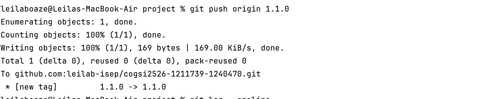
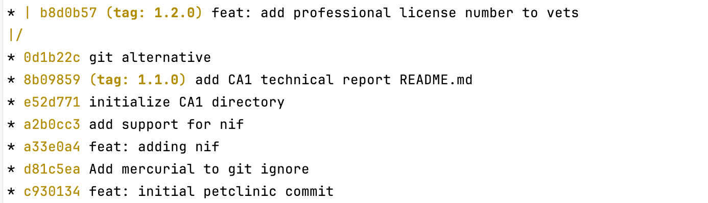

# CA1 Technical Report

Students:
- Student 1: Délcio Monjane, 1211739
- Student 2: Leila Boaze, 1240470

## Part 1: Git Version Control
In the first part of this assignment, we set up the Spring Petclinic application in our repository and learned how to work with commits and tags in Git. We used only the main branch without creating any additional branches.

### Change to the project directory
First we created a directory named CA1 and copied the Spring Petclinic project into it. Then we changed to the project directory:
``` bash
mkdir CA1;
```

Then, we copied all the **Spring Petclinic** project codebase that was cloned and altered in CA0 into this folder.
The only thing we did not copy was the .git folder, since it contains all the version control information of the project.
The structure of the project now looks like this:

```
📁 spring-petclinic/
 ├── 📁 CA1/
 │    ├── pom.xml
 │    ├── src/
 │    ├── README.md
 │    └── ...
 ├── .git/
 ├── src/
 ├── README.md
 └── ...
```

### Commit the changes, tag the version, and push to GitHub
Now that we have the project in place, we need to track and push it to GitHub:
``` bash
git add .
git commit -m "Initial petclinic commit"
git push origin main
```
After committing the changes, we tagged the current version as 1.1.0 and pushed the tags to the remote repository:

Note: The git tag command opens a text editor to enter the tag message. We wrote "Initial version" saved and closed the editor to complete the tagging process.

Finally, we pushed the tags to the remote repository:



### Log changes
To view the commit history, we used the `git log --oneline` command, but there are other useful options to visualize the log, such as `--graph` and `--all`.:


### Develop a new feature to add a new field to the application
In this part, we added the veterinarian’s professional registration number to
the Vet class (`professionalLicenseNumber`). See the image below for reference:


Then again, after making the changes, we committed and pushed them to the remote repository.
Then, we tagged the current version as 1.2.0 and also pushed the tags to the remote repository.


### Revert changes to a specific commit
To revert the changes we made a commit with some errors in tests, then we used the `git revert` command followed by the commit hash. This command creates a new commit that undoes the changes introduced by the specified commit.


Then, we decided to clear the commit history and return to the state of the repository before the erroneous commit. But we also wanted to keep locally the changes made in that commit.
To do this, we used the `git reset --soft` command followed by the commit hash before the erroneous commit. This command moves the HEAD pointer to the specified commit and keeps the changes in the working directory and staging area.


### Main Branch Log
As seen in the image below, the default branch is the main branch, and it contains all the commits we made so far.

Bellow is the log of the main branch after reverting and resetting the commits:


## Part 2: Branches

###  Create a branch named email-field

Create a branch to add support for an email field for a vet:

The command git branch is used to list, create, or delete branches in Git

``` bash
git branch email-field
```


### Switch to the email-field branch
Switch to the newly created branch to start working on it.

``` bash
git checkout email-field
```
output:
``` 
PS C:\cogsi2526-1211739-1240470\CA1> git branch email-field
PS C:\cogsi2526-1211739-1240470\CA1> git checkout email-field
M       CA1/README.md
Switched to branch 'email-field'

````

### Commit changes to the email-field branch

The command git add -A is used to stage all changes in your working directory for the next commit. This includes new files, modified files, and deleted files. In other words, it ensures that every change in your repository is prepared to be committed. The -A flag stands for “all,” making it a convenient way to include every update at once.
```
PS C:\cogsi2526-1211739-1240470\CA1> git add -A
PS C:\cogsi2526-1211739-1240470\CA1> git commit -m "Create a branch named emailField" 
[email-field 13191e7] Create a branch named emailField
 12 files changed, 74 insertions(+), 33 deletions(-)

```
Pull changes to generate conflicts

```
PS C:\cogsi2526-1211739-1240470\CA1> git checkout main            
Switched to branch 'main'
Your branch is up to date with 'origin/main'.
PS C:\Users\delci\Documents\ISEP\MEI\2oAno\COGSI\Projects\cogsi2526-1211739-1240470\CA1> git pull
remote: Enumerating objects: 85, done.
remote: Counting objects: 100% (84/84), done.
remote: Compressing objects: 100% (25/25), done.
remote: Total 49 (delta 29), reused 34 (delta 19), pack-reused 0 (from 0)
Unpacking objects: 100% (49/49), 8.74 KiB | 38.00 KiB/s, done.
From https://github.com/leilab-isep/cogsi2526-1211739-1240470
   0d1b22c..b8d0b57  main       -> origin/main
 * [new branch]      dependabot/maven/hibernate.version-7.1.1.Final -> origin/dependabot/maven/hibernate.version-7.1.1.Final
 * [new branch]      dependabot/maven/jakarta.activation-jakarta.activation-api-2.1.4 -> origin/dependabot/maven/jakarta.activation-jakarta.activation-api-2.1.4
 * [new branch]      dependabot/maven/org.hibernate.validator-hibernate-validator-9.0.1.Final -> origin/dependabot/maven/org.hibernate.validator-hibernate-validator-9.0.1.Final
 * [new branch]      dependabot/maven/org.postgresql-postgresql-42.7.8 -> origin/dependabot/maven/org.postgresql-postgresql-42.7.8
 * [new branch]      dependabot/maven/tomcat.version-11.0.11 -> origin/dependabot/maven/tomcat.version-11.0.11
Updating 0d1b22c..b8d0b57
Fast-forward
 .../org/springframework/samples/petclinic/model/Vet.java | 16 ++++++++++------
 .../petclinic/repository/jdbc/JdbcVetRepositoryImpl.java |  2 +-
 CA1/src/main/resources/db/h2/data.sql                    | 12 ++++++------
 CA1/src/main/resources/db/h2/schema.sql                  |  3 ++-
 CA1/src/main/resources/db/hsqldb/data.sql                | 12 ++++++------
 CA1/src/main/resources/db/hsqldb/schema.sql              |  3 ++-
 CA1/src/main/resources/db/mysql/data.sql                 | 12 ++++++------
 CA1/src/main/resources/db/mysql/schema.sql               |  1 +
 CA1/src/main/resources/db/postgresql/data.sql            | 12 ++++++------
 CA1/src/main/resources/db/postgresql/schema.sql          |  1 +
 CA1/src/main/webapp/WEB-INF/jsp/vets/vetList.jsp         |  4 ++++
 11 files changed, 45 insertions(+), 33 deletions(-)
 
PS C:\cogsi2526-1211739-1240470\CA1> git checkout email-field                          
Switched to branch 'email-field'

```

### Branch Tracking
Connect the local branch to track the remote branch and push changes

ChatGPT said:

The command git push --set-upstream origin email-field is used to push a new local branch to a remote repository for the first time and establish a connection between them.
In this case, origin refers to the default remote repository, and email-field is the name of the branch you are pushing. 

By using the --set-upstream flag, we tell Git to remember that the local email-field branch should track the remote branch origin/email-field.
This means that after running this command once, we can simply use git push or git pull in the future without specifying the branch name, as Git will automatically know which remote branch to synchronize with. 

```
PS C:\cogsi2526-1211739-1240470\CA1>  git push --set-upstream origin email-field
Enumerating objects: 73, done.
Counting objects: 100% (73/73), done.
Delta compression using up to 16 threads
Compressing objects: 100% (34/34), done.
Writing objects: 100% (39/39), 3.71 KiB | 948.00 KiB/s, done.
Total 39 (delta 23), reused 0 (delta 0), pack-reused 0 (from 0)
remote: Resolving deltas: 100% (23/23), completed with 20 local objects.
remote: 
remote: Create a pull request for 'email-field' on GitHub by visiting:
remote:      https://github.com/leilab-isep/cogsi2526-1211739-1240470/pull/new/email-field
remote:
To https://github.com/leilab-isep/cogsi2526-1211739-1240470.git
 * [new branch]      email-field -> email-field
branch 'email-field' set up to track 'origin/email-field'.

PS C:\COGSI\Projects\cogsi2526-1211739-1240470\CA1> git push                                   
Everything up-to-date
```
This command is commonly used right after creating a new local branch and committing your changes, allowing you to start collaborating or backing up your work on the remote repository.

### Merge Conflicts
Create conflicting edits on the two branches so Git reports
merge conflicts

The command git merge is used to combine the changes from the branch email-field into the main branch.
```
PS C:\cogsi2526-1211739-1240470\CA1> git checkout main                          
Switched to branch 'main'
Your branch is up to date with 'origin/main'.

PS C:\cogsi2526-1211739-1240470\CA1> git merge email-field
Auto-merging CA1/src/main/java/org/springframework/samples/petclinic/model/Vet.java
CONFLICT (content): Merge conflict in CA1/src/main/java/org/springframework/samples/petclinic/model/Vet.java
Auto-merging CA1/src/main/java/org/springframework/samples/petclinic/repository/jdbc/JdbcVetRepositoryImpl.java
CONFLICT (content): Merge conflict in CA1/src/main/java/org/springframework/samples/petclinic/repository/jdbc/JdbcVetRepositoryImpl.java
Auto-merging CA1/src/main/resources/db/h2/data.sql
CONFLICT (content): Merge conflict in CA1/src/main/resources/db/h2/data.sql
Auto-merging CA1/src/main/resources/db/h2/schema.sql
CONFLICT (content): Merge conflict in CA1/src/main/resources/db/h2/schema.sql
Auto-merging CA1/src/main/resources/db/hsqldb/data.sql
CONFLICT (content): Merge conflict in CA1/src/main/resources/db/hsqldb/data.sql
Auto-merging CA1/src/main/resources/db/hsqldb/schema.sql
CONFLICT (content): Merge conflict in CA1/src/main/resources/db/hsqldb/schema.sql
Auto-merging CA1/src/main/resources/db/mysql/data.sql
CONFLICT (content): Merge conflict in CA1/src/main/resources/db/mysql/data.sql
Auto-merging CA1/src/main/resources/db/mysql/schema.sql
CONFLICT (content): Merge conflict in CA1/src/main/resources/db/mysql/schema.sql
Auto-merging CA1/src/main/resources/db/postgresql/data.sql
CONFLICT (content): Merge conflict in CA1/src/main/resources/db/postgresql/data.sql
Auto-merging CA1/src/main/resources/db/postgresql/schema.sql
CONFLICT (content): Merge conflict in CA1/src/main/resources/db/postgresql/schema.sql
Auto-merging CA1/src/main/webapp/WEB-INF/jsp/vets/vetList.jsp
CONFLICT (content): Merge conflict in CA1/src/main/webapp/WEB-INF/jsp/vets/vetList.jsp
Automatic merge failed; fix conflicts and then commit the result.
```
Git will apply all the commits from email-field to the main branch, creating a new merge commit if necessary.
If there are no conflicting changes, the merge completes automatically. 
However, if both branches modified the same lines of code, Git will report a merge conflict, and you’ll need to manually resolve those conflicts before completing the merge.

Open the files with conflicts and resolve them.
```
PS C:\cogsi2526-1211739-1240470\CA1> notepad "C:\cogsi2526-1211739-1240470\CA1\src\main\resources\db\h2\data.sql"


<<<<<<< HEAD
INSERT INTO vets VALUES (default, 'James', 'Carter', '123456789');
INSERT INTO vets VALUES (default, 'Helen', 'Leary', '987654321');
INSERT INTO vets VALUES (default, 'Linda', 'Douglas', '456789123');
INSERT INTO vets VALUES (default, 'Rafael', 'Ortega', '789123456');
INSERT INTO vets VALUES (default, 'Henry', 'Stevens', '321654987');
INSERT INTO vets VALUES (default, 'Sharon', 'Jenkins', '654987321');
=======
INSERT INTO vets VALUES (default, 'James', 'Carter','JamesCarter@email.com');
INSERT INTO vets VALUES (default, 'Helen', 'Leary','HelenLeary@email.com');
INSERT INTO vets VALUES (default, 'Linda', 'Douglas','LindaDouglas@email.com');
INSERT INTO vets VALUES (default, 'Rafael', 'Ortega','RafaelOrtega@email.com');
INSERT INTO vets VALUES (default, 'Henry', 'Stevens','HenryStevens@email.com');
INSERT INTO vets VALUES (default, 'Sharon', 'Jenkins','SharonJenkins@email.com');
>>>>>>> email-field

```

Resolve all the conflicts and commit the changes

```
PS C:\COGSI\Projects\cogsi2526-1211739-1240470\CA1> git add -A
PS C:\cogsi2526-1211739-1240470\CA1> git commit -m "resolving merge conflicts"
[main 49cf2b0] resolving merge conflicts

PS C:\cogsi2526-1211739-1240470\CA1> git push
Enumerating objects: 103, done.
Counting objects: 100% (103/103), done.
Delta compression using up to 16 threads
Compressing objects: 100% (30/30), done.
Writing objects: 100% (35/35), 5.61 KiB | 359.00 KiB/s, done.
Total 35 (delta 19), reused 0 (delta 0), pack-reused 0 (from 0)
remote: Resolving deltas: 100% (19/19), completed with 19 local objects.
To https://github.com/leilab-isep/cogsi2526-1211739-1240470.git
   b8d0b57..49cf2b0  main -> main
   
 ```

Log changes:
``` 
PS C:\cogsi2526-1211739-1240470\CA1> git log --graph 
*   commit 49cf2b08e0dd3861af53ae5d4282c9f58e290377 (HEAD -> main, origin/main)
|\  Merge: b8d0b57 4b2e795
| | Author: delci <1211739@isep.ipp.pt>
| | Date:   Wed Oct 1 21:51:53 2025 +0100
| |
| |     resolving merge conflicts
| |
| * commit 4b2e7952b8d856bebc04680536ed2b77c498df32 (origin/email-field, email-field)
| | Author: delci <1211739@isep.ipp.pt>
| | Date:   Tue Sep 30 22:24:42 2025 +0100
| |
| |     update readme
| |
| * commit 13191e7ac248a13ff13d40df6a480e4b2b6f008e
| | Author: delci <1211739@isep.ipp.pt>
| | Date:   Tue Sep 30 22:21:30 2025 +0100
| |
| |     Create a branch named emailField
| |
* | commit b8d0b57e619ba4005db4d6e15967b1b243c18ca7
|/  Author: leilaboaze <1240470@isep.ipp.pt>
|   Date:   Tue Sep 30 21:25:26 2025 +0100
|
|       feat: add professional license number to vets
|
* commit 0d1b22c6102b8d87251b3d0ff07317358819f5a5
| Author: delci <1211739@isep.ipp.pt>
| Date:   Mon Sep 29 20:19:03 2025 +0100
|
|     git alternative
|
* commit 8b09859765b2e9556e93827a46d00b12b818bf30 (tag: 1.1.0)
:


```

###  Tagging
Tag the current version as v1.3.0 and push the tags to the remote repository

```
PS C:\cogsi2526-1211739-1240470\CA1> git tag -a 1.3.0 -m "Tag v1.3.0"
PS C:\cogsi2526-1211739-1240470\CA1> git push origin --tags                   
Enumerating objects: 1, done.
Counting objects: 100% (1/1), done.
Writing objects: 100% (1/1), 156 bytes | 78.00 KiB/s, done.
Total 1 (delta 0), reused 0 (delta 0), pack-reused 0 (from 0)
To https://github.com/leilab-isep/cogsi2526-1211739-1240470.git
 * [new tag]         1.3.0 -> 1.3.0

```

## GIT  Alternative

### Mercurial Version Control
Mercurial is a distributed revision control tool designed for software developers. 
It was initially released on April 19, 2005, and is supported on various operating systems, including Microsoft Windows, Linux, and macOS.

Mercurial's primary goals include high performance, scalability, decentralization, and robust handling of both plain text and binary files. 
It also offers advanced branching and merging capabilities while maintaining conceptual simplicity.

### 1. Setup and Installation

To install Mercurial, follow the instructions below based on your operating system:

#### Windows
``` bash
winget install Mercurial.Mercurial -e
```

#### Linux
``` bash 
apt install mercurial
```

### 2. Prepare Mercurial
Setting up developer's name on Mercurial. 
For that open the file ~/.hgrc (or mercurial.ini in your home directory for Windows) with a text-editor and add the ui section (user interaction) with your username:

``` 
[ui]
username = Mr. Johnson <johnson@smith.com>
````

### 3. Initialize the project
Now add the working directory to the repository:

``` bash
hg init project
```

### 4. Add files and track them
To add files to the repository, use the `hg add` command:

``` bash
hg add
````

### 5. Commit changes
To commit changes to the repository, use the `hg commit` command with a descriptive message:

``` bash

hg commit -m "Initial commit"
```
Just like Git, Mercurial uses a commit message to describe the changes made in that commit.
### 6. View commit history
To view the commit history, use the `hg log` command:

``` bash
hg log
```
### 7. Create and switch branches
To create a new branch, use the `hg branch` command followed by the branch name:

``` bash
hg branch new-feature
```
To switch to an existing branch, use the `hg update` command followed by the branch name:

``` bash
hg update new-feature
```
### 8. Merge branches
To merge changes from one branch into another, first switch to the target branch and then use the `hg merge` command followed by the source branch name:

``` bash
hg update main
hg merge new-feature
```
### 9. Push changes to a remote repository
To push changes to a remote repository, use the `hg push` command:

``` bash
hg push
```
### 10. Pull changes from a remote repository
To pull changes from a remote repository, use the `hg pull` command:

``` bash
hg pull
```
### Conclusion
Mercurial is a powerful and flexible version control system that offers many features similar to Git.


