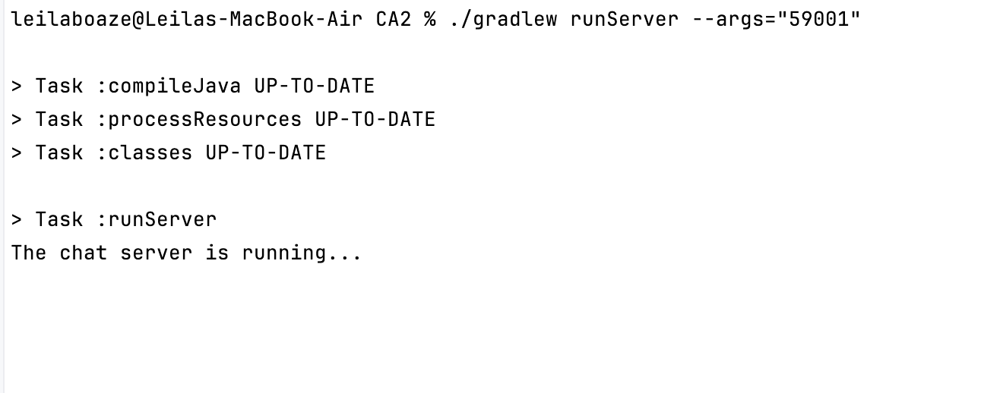

Gradle Basic Demo
===================

This is a demo application that implements a basic multithreaded chat room server.

The server supports several simultaneous clients through multithreading. When a client connects the server requests a screen name, and keeps requesting a name until a unique one is received. After a client submits a unique name, the server acknowledges it. Then all messages from that client will be broadcast to all other clients that have submitted a unique screen name. A simple "chat protocol" is used for managing a user's registration/leaving and message broadcast.


Prerequisites
-------------

 * Java JDK 17
 * Apache Log4J 2
 * Gradle 8.9 (if you do not use the gradle wrapper in the project)
   

Build
-----

To build a .jar file with the application:

    % ./gradlew build 

Run the server
--------------

Open a terminal and execute the following command from the project's root directory:

    % java -cp build/libs/basic_demo-0.1.0.jar basic_demo.ChatServerApp <server port>

Substitute <server port> by a valid por number, e.g. 59001

Run a client
------------

Open another terminal and execute the following gradle task from the project's root directory:

    % ./gradlew runClient

The above task assumes the chat server's IP is "localhost" and its port is "59001". If you whish to use other parameters please edit the runClient task in the "build.gradle" file in the project's root directory.

To run several clients, you just need to open more terminals and repeat the invocation of the runClient gradle task


# CA1 Technical Report

## Part 1: Build Tools

### Adding and Executing the `runServer` Task in Gradle

In this activity, we configured a new Gradle task named **`runServer`** that will call the ChatServerApp class.
It will allow the chat server to be executed directly from the command line instead of running the Java class manually each time.
The task was added to the `build.gradle` file of the project as follows:


```groovy
    task runServer(type:JavaExec, dependsOn: classes){
        group = "DevOps"
        description = "Launches a chat server that connects to a server on localhost:59001 "
    
        classpath = sourceSets.main.runtimeClasspath
    
        mainClass = 'basic_demo.ChatServerApp'
    
        args 'localhost', '59001'
    }
```

To run the task, we executed the `./gradlew runServer --args="59001"` command from the terminal:



Then, by running the `./gradlew runClient` command from another terminal, 'John' was able to connect to the server:

As shown in the image, the server requested a screen name, and kept requesting a name until a unique one was received. After 'John' submitted a unique name, the server acknowledged it.

And then 'Leila' connected to the server from another terminal. The server was notified everytime a new client joined and left the chat room.


### Run unit tests

First, we create a small test suite. Create a file named "AllTests.java" in the "src/test/java/basic_demo" directory with the following content:

```java

    @Test
    @DisplayName("Constructor should initialize GUI components correctly")
    void testConstructorInitializesComponents() throws Exception {
        // Access private fields using reflection
        Field textFieldField = ChatClient.class.getDeclaredField("textField");
        Field messageAreaField = ChatClient.class.getDeclaredField("messageArea");
        Field frameField = ChatClient.class.getDeclaredField("frame");

        textFieldField.setAccessible(true);
        messageAreaField.setAccessible(true );
        frameField.setAccessible(true);

        JTextField textField = (JTextField) textFieldField.get(client);
        JTextArea messageArea = (JTextArea) messageAreaField.get(client);
        JFrame frame = (JFrame) frameField.get(client);

        assertNotNull(textField, "Text field should be initialized");
        assertNotNull(messageArea, "Message area should be initialized");
        assertNotNull(frame, "Frame should be initialized");

        assertFalse(textField.isEditable(), "Text field should not be editable initially");
        assertFalse(messageArea.isEditable(), "Message area should not be editable");
        assertTrue(frame.isVisible(), "Frame should be visible after creation");
    }

```

To run the unit tests:

    % ./gradlew test

### Task of type Copy to backup source files

To create a new task that copies the contents of the `src` folder to a `backup` folder, we added the following code to the `build.gradle` file:

```groovy
task backupSources(type: Copy) {
    group = "Backup"
    description = "Copies the contents of src to backup folder"
    from 'src'
    into 'backup'
}
```
To execute the task, we ran the command `./gradlew backupSources` from the terminal:


And as shown in the image below, the contents of the `src` folder were successfully copied to the `backup` folder:


### Task of type Zip to be used to make an archive 
We use the key word `dependsOn` to make the `zipBackup` task depend on the `backupSources` task, ensuring that the backup is created before the ZIP archive is generated.
And task type Zip was added to the `build.gradle` file as follows:

````groovy

task zipBackup(type: Zip, dependsOn: backupSources) {
    group = 'Backup'
    description = 'Creates a timestamped ZIP archive of the backup folder'

    from 'backup'
    archiveFileName = "backup.zip"
    destinationDirectory = file("/archives")

}

````

### How does  the Gradle Wrapper and the JDK Toolchain ensure the correct versions of Gradle and the Java Development Kit are used without requiring manual installation?

The **Gradle Wrapper** ensures that every developer uses the exact same Gradle version by automatically downloading and running the version defined in the project’s configuration, without requiring a manual installation.
Similarly, the **JDK Toolchain** allows Gradle to automatically detect or download the correct Java Development Kit version specified in the build file (for example, Java 17), ensuring the project is compiled and executed with the right JDK even if different versions are installed on the system.

To verify which toolchains are available, we ran the following command from the project root:

```bash
./gradlew javaToolchains
```
The output was:
```bash

> Task :javaToolchains

 + Options
     | Auto-detection:     Enabled
     | Auto-download:      Enabled

 + Amazon Corretto JDK 1.8.0_422-b05
     | Location:           /Users/leilaboaze/.sdkman/candidates/java/8.0.422-amzn
     | Language Version:   8
     | Vendor:             Amazon Corretto
     | Architecture:       aarch64
     | Is JDK:             true
     | Detected by:        SDKMAN!

 + Amazon Corretto JDK 11.0.25+9-LTS
     | Location:           /Users/leilaboaze/.sdkman/candidates/java/11.0.25-amzn
     | Language Version:   11
     | Vendor:             Amazon Corretto
     | Architecture:       aarch64
     | Is JDK:             true
     | Detected by:        SDKMAN!

 + Amazon Corretto JDK 17.0.12+7-LTS
     | Location:           /Users/leilaboaze/.sdkman/candidates/java/17.0.12-amzn
     | Language Version:   17
     | Vendor:             Amazon Corretto
     | Architecture:       aarch64
     | Is JDK:             true
     | Detected by:        SDKMAN!

 + Amazon Corretto JDK 21.0.5+11-LTS
     | Location:           /Users/leilaboaze/.sdkman/candidates/java/21.0.5-amzn
     | Language Version:   21
     | Vendor:             Amazon Corretto
     | Architecture:       aarch64
     | Is JDK:             true
     | Detected by:        Current JVM


BUILD SUCCESSFUL in 351ms
1 actionable task: 1 executed

```

This output lists all JDK versions that Gradle detected on the system.
It shows that auto-detection and auto-download are **enabled**, which means Gradle can automatically find or retrieve the required JDK version.

The system has several Amazon Corretto JDK versions installed:

* JDK 8
* JDK 11
* JDK 17
* JDK 21 (the current active JDK)

Since the project specifies JDK **17** in the toolchain configuration, Gradle will select that version automatically when compiling and running the application.
This ensures that the build always uses the expected Java version, even if other versions (like 21) are available.

## Part 2: Convert a Spring Boot application to Gradle (instead of Maven)
In this part, we converted a simple Spring Boot application from Maven to Gradle.
The application is a Payroll System and can be found in the directory `CA2_Part2` in the root of this repository.
We converted the `pom.xml` file to a `build.gradle` file and ensured that all dependencies and plugins were correctly translated.

To run the Spring Boot application using Gradle, we used the following command:

```bash
./gradlew bootRun
```
This command starts the Spring Boot application, allowing us to verify that the conversion from Maven to Gradle was successful and that the application runs as expected.


The application is now accessible at `http://localhost:8080` and this is the output of the GET /employees endpoint:


### Create a custom task named deployToDev

We created a custom Gradle task called **`deployToDev`** that automates the process of preparing a development deployment package. It executes several steps in sequence:

1. **Clean Deployment Directory**

    * A `Delete` task (`cleanDeployment`) removes the existing `build/deployment/dev` directory to ensure a fresh start for each deployment.

2. **Copy Main Application Artifact**

    * A `Copy` task (`copyAppJar`) depends on `bootJar` and moves the generated application JAR file into the `deployment` directory.

3. **Copy Runtime Dependencies**

    * Another `Copy` task (`copyRuntimeDeps`) gathers only the runtime dependencies (JARs required to run the app) from `configurations.runtimeClasspath` and places them into `build/deployment/dev/lib`.

4. **Copy and Filter Configuration Files**

    * A final `Copy` task (`copyConfig`) copies `.properties` files from `src/main/resources` into the deployment directory.
    * It uses the built-in `ReplaceTokens` filter to dynamically inject properties such as the **project version** and the **current build timestamp** into the configuration files.

The **`deployToDev`** task depends on these steps in order, ensuring a clean, structured, and versioned deployment layout ready for development testing.

To run the `deployToDev` task, we executed the following command from the terminal:

```bash
./gradlew deployToDev
```
And the resulting structure is:

The content of the lib folder is:


### Create a custom task that depends on the installDist task

Then we created a custom task named `runDist` that depends on the `installDist` task.


###  Create a custom task that depends on the javadoc task
It should generate the Javadoc for your project, and then package the
generated documentation into a zip file.

`dependsOn javadoc` → ensures Javadoc is built before zipping.

` from javadoc.destinationDir `→ uses the output folder from the existing Javadoc task (build/docs/javadoc).

` archiveBaseName `→ sets the ZIP filename prefix.

`archiveVersion` → appends the project version.

`destinationDirectory` → defines where the ZIP is saved (/distributions).

```groovy

task javadocZip(type: Zip) {
    group = 'Documentation'
    description = 'Generates Javadoc and packages it into a ZIP file.'

    dependsOn javadoc

    from javadoc.destinationDir
    archiveBaseName = 'project-javadoc'
    archiveVersion = version
    destinationDirectory = file("/distributions")
}

```


## Alternative Solution: Using Bazel as a Build Tool

### Bazel
Bazel is a free and open-source software tool used for the automation of building and testing software.

Developed by Google, is a modern and powerful alternative to Gradle. 
It supports multi-language builds (including Java, C++, and Python) and focuses on speed, reproducibility, and scalability.

Bazel uses a declarative build language called Starlark and emphasizes incremental builds, meaning it only rebuilds what’s necessary (syntax like python).
This makes it ideal for large codebases and monorepos where performance and consistency are critical. 
It also integrates well with continuous integration (CI) pipelines.

While Bazel is highly efficient and scalable, it has a steeper learning curve compared to Gradle and may require more initial setup.

Example of a simple Bazel build file (BUILD.bazel):

```

java_binary(
    name = "myapp",
    srcs = ["Main.java"],
    main_class = "com.example.Main",
    deps = [
        "//libs:guava",
    ],
)


```

## Our gradle build in Bazel implementation

We’ll use Bazel’s Java rules (java_binary, java_library, java_test) and repository dependencies to replicate what the Gradle script does.

### Project Structure
Bazel organizes builds around WORKSPACE and BUILD files.

So we create a WORKSPACE file at the root of the project and define the rest of the project files with the same convention as Gradle.

``` 

project-root/
├── WORKSPACE
├── BUILD
├── src/
│   ├── main/java/basic_demo/
│   │   ├── App.java
│   │   ├── ChatClientApp.java
│   │   └── ChatServerApp.java
│   └── test/java/basic_demo/
│       └── AppTest.java
└── backup/        (created by Gradle previously — not needed in Bazel)


```

### WORKSPACE file

This file defines external dependencies — similar to repositories {} and dependencies {} in Gradle.

```bzl

workspace(name = "basic_demo")

load("@bazel_tools//tools/build_defs/repo:http.bzl", "http_archive")

http_archive(
    name = "rules_jvm_external",
    sha256 = "d47b93f5b9a50e6f3b5ea6a662b9a6b859afce91af1f3d31e23c8af3a2b2d9d8",
    strip_prefix = "rules_jvm_external-5.3",
    urls = ["https://github.com/bazelbuild/rules_jvm_external/archive/refs/tags/5.3.zip"],
)

load("@rules_jvm_external//:defs.bzl", "maven_install")

maven_install(
    name = "maven",
    artifacts = [
        "org.apache.logging.log4j:log4j-api:2.11.2",
        "org.apache.logging.log4j:log4j-core:2.11.2",
        "org.junit.jupiter:junit-jupiter:5.7.0",
    ],
    repositories = [
        "https://repo.maven.apache.org/maven2",
    ],
)

````

Bazel doesn’t use mavenCentral() directly. We import rules_jvm_external, which lets us pull Maven dependencies via maven_install().
This replaces Gradle’s repositories and dependencies.

### BUILD file

This file defines how to compile, package, and run your code — similar to tasks in Gradle.

```bzl

load("@rules_jvm_external//:defs.bzl", "artifact")

# Java library for shared code
java_library(
    name = "app_lib",
    srcs = glob(["src/main/java/basic_demo/**/*.java"]),
    deps = [
        artifact("org.apache.logging.log4j:log4j-api"),
        artifact("org.apache.logging.log4j:log4j-core"),
    ],
)

# Main application
java_binary(
    name = "app",
    main_class = "basic_demo.App",
    runtime_deps = [":app_lib"],
)

# Chat Client
java_binary(
    name = "chat_client",
    main_class = "basic_demo.ChatClientApp",
    runtime_deps = [":app_lib"],
    args = ["localhost", "59001"],
)

# Chat Server
java_binary(
    name = "chat_server",
    main_class = "basic_demo.ChatServerApp",
    runtime_deps = [":app_lib"],
    args = ["localhost", "59001"],
)

# JUnit test target
java_test(
    name = "app_test",
    srcs = glob(["src/test/java/**/*.java"]),
    deps = [
        ":app_lib",
        artifact("org.junit.jupiter:junit-jupiter"),
    ],
)


```

This BUILD file defines:
* A `java_library` target for shared code (like Gradle’s sourceSets).
* `java_binary` targets for the main app, chat client, and chat server (like Gradle’s application plugin tasks).
* A `java_test` target for unit tests (like Gradle’s test task).
* Dependencies are pulled in using artifact() from the maven_install() in the WORKSPACE file.
* Arguments for the chat client and server are specified in the args attribute.


| Task       | Gradle Command     | Bazel Command              |
| ---------- | ------------------ | -------------------------- |
| Compile    | `gradle build`     | `bazel build //:app`       |
| Run App    | `gradle run`       | `bazel run //:app`         |
| Run Server | `gradle runServer` | `bazel run //:chat_server` |
| Run Client | `gradle runClient` | `bazel run //:chat_client` |
| Test       | `gradle test`      | `bazel test //:app_test`   |

Bazel doesn’t use Gradle-style custom tasks.
Instead it uses genrule() for file operations (like backup or zip) and java_doc() rule from community extensions for Javadoc

```bzl

genrule(
name = "backup_sources",
srcs = glob(["src/**"]),
outs = ["backup.zip"],
cmd = "zip -r $@ $(SRCS)",
)

genrule(
    name = "generate_javadoc",
    srcs = glob(["src/main/java/**/*.java"]),
    outs = ["javadoc.zip"],
    cmd = """
        mkdir -p $(@D)/javadoc && \
        javadoc -d $(@D)/javadoc -sourcepath src/main/java $(SRCS) && \
        cd $(@D) && \
        zip -r javadoc.zip javadoc
    """,
    tools = [],
    local = True,
    message = "Generating and packaging Javadoc...",
)

```

This creates two genrule() targets:
* `backup_sources` zips the src folder into backup.zip.
* `generate_javadoc` generates Javadoc and packages it into javadoc.zip.

### Summary
By defining a WORKSPACE file for dependencies and a BUILD file for build targets, we replicated the Gradle build using Bazel.
Bazel’s declarative approach and focus on performance make it a strong alternative for large, complex projects needing reproducible builds.

