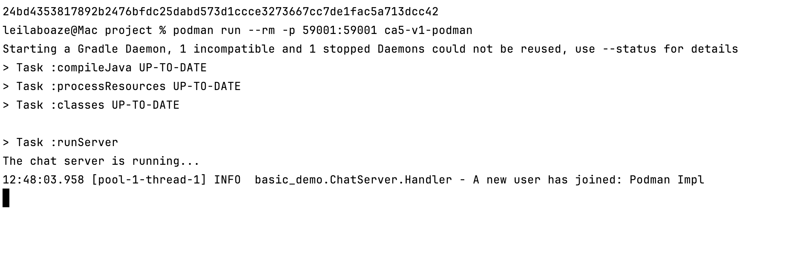
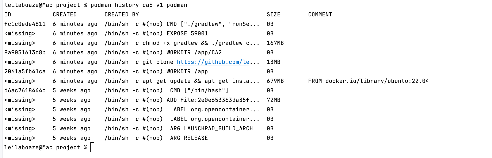

# CA5 Technical Report

## Part 1: Create Docker Images and Containers

For this part we based our image on ubuntu:22.04, following the example used in the lecture slides. Ubuntu provides an
easy package manager (apt-get) for installing Git and OpenJDK. 

The goal is to comparatively analyze two approaches to building and running the CA2 chat application inside a Docker container.
The Version 1 builds the application inside the Docker container, while Version 2 builds the application on the 
host machine and only runs it inside the container.

The CA2 application consists of:

- a Chat Server (`ChatServerApp`) running on TCP port 59001
- a Chat Client (`ChatClientApp`) which connects to that server

Gradle provides custom tasks:

- `./gradlew runServer --args='59001'`→ starts the chat server on port 59001
- `./gradlew runClient` → starts a chat client that connects to the server in the address localhost:59001


### Version1

In this version, the Docker image:

1. Install dependencies: git + JDK + basic tools
2. Clones the repository and goes into the CA2 folder
3. Build inside the container, but SKIP TESTS (ChatClientTest needs GUI)
4. runs the server using the `runServer` Gradle task

```dockerfile
# syntax=docker/dockerfile:1
FROM ubuntu:22.04

RUN apt-get update && apt-get install -y \
    git \
    openjdk-17-jdk \
    curl \
    && rm -rf /var/lib/apt/lists/*

# Workdir for the repo
WORKDIR /app

# Clone your repo
RUN git clone https://github.com/leilab-isep/cogsi2526-1211739-1240470.git .

WORKDIR /app/CA2

RUN chmod +x gradlew && ./gradlew clean build -x test

# The chat server listens on TCP 59001
EXPOSE 59001

# When the container starts, launch the chat server
CMD ["./gradlew", "runServer", "--args='59001'"]
```

We build the image using the following command:

```bash

docker build -t ca5-v1 -f CA5/Version1/Dockerfile .  
```
It ran for 56.7s and produced the following output:

And if we run the command `docker image ls` we can see the image created:


We then run the container using the command:

```bash
 docker run -p 59001:59001 --name chat-server-v1 ca5-v1
```

And this is the output we got:

Now our chat server is listening on:
- inside container: localhost:59001
- on host: localhost:59001 (because of -p 59001:59001)

And if we go to the CA2 folder and run `./gradlew runClient` to connect a chat client to localhost:59001 we can 
see the following output on the container terminal:


### Version 2:
Build the Server JAR on Host Machine
First, we need to build the application using Gradle. Compiling the code and package it into a runnable JAR file.

Inside CA2 folder run the gradle tasks:

```bash
    
    .\gradlew clean build -x test

    
```

This will create the JAR file in the build/libs directory.

Then we create a new Dockerfile to define the steps to build the Docker image.

```dockerfile


# syntax=docker/dockerfile:1
FROM ubuntu:22.04

RUN apt-get update && apt-get install -y \
    openjdk-17-jre-headless \
    && rm -rf /var/lib/apt/lists/* \
    
# Set the working directory inside the container
WORKDIR /app

COPY CA2/build/libs/basic_demo-0.1.0.jar app.jar

# Expose the port the server will listen on
EXPOSE 59001

# Command to run the server application when the container starts
CMD ["java", "-cp", "app.jar", "basic_demo.ChatServerApp", "59001"]


````

* FROM *ubuntu:22.04 : This starts the Dockerfile by specifying the base image. We use Ubuntu 22.04 as the base operating system for our container. 
So, this time we only install the JRE (Java Runtime Environment) since we only need to run the application, not build it.

* WORKDIR /app : This sets the default directory inside the container to /app. All subsequent commands (COPY, CMD) will be run from this location.

* COPY build/libs/basic_demo-0.1.0.jar app.jar  : This is the key step. It copies the JAR built on the host machine from build/libs/basic_demo-0.1.0.jar into the container's /app directory and renames it to app.jar for simplicity.

* EXPOSE 59001: This informs Docker that the container will listen on port 59001 at runtime. 

* CMD ["java", "-cp", "app.jar", "basic_demo.ChatServerApp", "59001"] : This is the command that will execute when the container starts.


Next we run this command to build the image
```bash

    docker build -t ca5-v2 -f CA5/Version2/Dockerfile .
    
```

* -t chat-server: Tags the image as chat-server.
* -f CA5/Version2/Dockerfile: Specifies the path to the Dockerfile.
* .: Sets the build context to the current directory (the project root), which allows the COPY CA2/build/... command to work correctly.

It ran for 19.3s and produced the following output:
````bash 

PS C:\Users\delci\Documents\ISEP\MEI\2oAno\COGSI\Projects\cogsi2526-1211739-1240470> docker build -t ca5-v2 -f CA5/Version2/Dockerfile .
[+] Building 19.3s (12/12) FINISHED                                                                                                                   docker:desktop-linux
 => [internal] load build definition from Dockerfile                                                                                                                  0.0s
 => => transferring dockerfile: 540B                                                                                                                                  0.0s
 => resolve image config for docker-image://docker.io/docker/dockerfile:1                                                                                             1.0s
 => [auth] docker/dockerfile:pull token for registry-1.docker.io                                                                                                      0.0s
 => CACHED docker-image://docker.io/docker/dockerfile:1@sha256:b6afd42430b15f2d2a4c5a02b919e98a525b785b1aaff16747d2f623364e39b6                                       0.0s
 => => resolve docker.io/docker/dockerfile:1@sha256:b6afd42430b15f2d2a4c5a02b919e98a525b785b1aaff16747d2f623364e39b6                                                  0.0s
 => [internal] load metadata for docker.io/library/ubuntu:22.04                                                                                                       0.6s
 => [auth] library/ubuntu:pull token for registry-1.docker.io                                                                                                         0.0s
 => [internal] load .dockerignore                                                                                                                                     0.0s
 => => transferring context: 2B                                                                                                                                       0.0s
 => CACHED [1/3] FROM docker.io/library/ubuntu:22.04@sha256:104ae83764a5119017b8e8d6218fa0832b09df65aae7d5a6de29a85d813da2fb                                          0.0s
 => => resolve docker.io/library/ubuntu:22.04@sha256:104ae83764a5119017b8e8d6218fa0832b09df65aae7d5a6de29a85d813da2fb                                                 0.0s
 => [internal] load build context                                                                                                                                     0.0s
 => => transferring context: 1.88MB                                                                                                                                   0.0s
 => [2/3] RUN apt-get update && apt-get install -y     openjdk-17-jre-headless     && rm -rf /var/lib/apt/lists/* WORKDIR /app                                       11.4s
 => [3/3] COPY CA2/build/libs/basic_demo-0.1.0.jar app.jar                                                                                                            0.0s 
 => exporting to image                                                                                                                                                6.1s 
 => => exporting layers                                                                                                                                               4.7s 
 => => exporting manifest sha256:2ebb76e9f862146d97037a401ce38a23dc771d836029aab081cfb9ff458f5ace                                                                     0.0s 
 => => exporting config sha256:d3780c7dc77a5449d3d607bd547954da55bca07a27c52758719e5bb1d842552d                                                                       0.0s
 => => exporting attestation manifest sha256:b2434e90ec2622127c8b2044b43cf9e4bc9aa87dfd8140bc64e4918dcfe22a92                                                         0.0s
 => => exporting manifest list sha256:825b6df0d1fd86fa9f901ca616f315a59ada045299509a588f85ca46a48d5c83                                                                0.0s
 => => naming to docker.io/library/ca5-v1:latest                                                                                                                      0.0s
 => => unpacking to docker.io/library/ca5-v1:latest                                                                                                                   1.3s

View build details: docker-desktop://dashboard/build/desktop-linux/desktop-linux/og4y0vtc0w76y5q4e0amlw08l

 1 warning found (use docker --debug to expand):
 - NoEmptyContinuation: Empty continuation line (line 9)

What's next:
    View a summary of image vulnerabilities and recommendations → docker scout quickview 


````

we then run the nex command to run the container:

```bash
docker run -p 59001:59001 --name my-chat-server ca5-v2
    
```

that gave the following output:
```bash
PS C:\Users\delci\Documents\ISEP\MEI\2oAno\COGSI\Projects\cogsi2526-1211739-1240470> docker run -p 59001:59001 --name my-chat-server ca5-v2
Starting a Gradle Daemon, 1 incompatible and 1 stopped Daemons could not be reused, use --status for details
> Task :compileJava UP-TO-DATE
> Task :processResources UP-TO-DATE
> Task :classes UP-TO-DATE

> Task :runServer
The chat server is running...
10:55:24.531 [pool-1-thread-1] INFO  basic_demo.ChatServer.Handler - A new user has joined: Johanna
10:55:56.885 [pool-1-thread-1] INFO  basic_demo.ChatServer.Handler - Johanna has left the chat


```

### Image analysis with `docker history`

We compared the images **ca5-v1** and **ca5-v2** using `docker history` and got the following results:
CA5-v1:


This image:
* A **very large layer (710MB)** for installing build tools (JDK, Git, Curl).
* A **layer containing the cloned Git repository** (~9.57MB).
* A **layer containing Gradle’s build output and dependency cache** (~168MB).
* Final layers (EXPOSE, CMD) add **no size**.

Because this image builds the application inside the container:

* it contains **all development tools**
* it stores **all source code + intermediate build files**
* it is the **largest image**
* it behaves like a **development environment**

CA5-v2:


This image:
* Only a **JRE (runtime)** is installed (264MB)
  → no compiler, no Gradle, no Git.
* The only application-specific layer is the **1.88MB JAR file**.
* No source code, no build cache, no repository content.

Because this image uses the **artifact built on the host**:

* it contains **only runtime dependencies**
* it has very **few layers**
* its total size is **much smaller**
* it starts faster
* it is appropriate for **deployment**

> Using `docker history` clearly shows how the build strategy affects both image size and layer composition.
> The `ca5-v1` image includes the full build toolchain (JDK, Git, Gradle) and the source code, creating many large layers.
> In contrast, `ca5-v2` contains only the final JAR and the JRE, resulting in a much smaller and cleaner runtime image.
> This demonstrates that moving the build **outside** the container significantly reduces image size and avoids storing unnecessary development layers inside the final image.

---
### Multi-Stage Build
This version uses two stages:

* **builder stage** → clone repo + build JAR
* **runtime stage** → run only the JAR inside a clean image

```dockerfile
# syntax=docker/dockerfile:1

########## Stage 1 – Builder ##########
FROM ubuntu:22.04 AS builder

RUN apt-get update && apt-get install -y \
    git \
    openjdk-17-jdk \
    && rm -rf /var/lib/apt/lists/*

WORKDIR /src

# Clone the repository
RUN git clone https://github.com/leilab-isep/cogsi2526-1211739-1240470.git .

WORKDIR /src/CA2

# Build JAR (skip GUI tests)
RUN chmod +x gradlew && ./gradlew clean build -x test


########## Stage 2 – Runtime ##########
FROM ubuntu:22.04

RUN apt-get update && apt-get install -y \
    openjdk-17-jre-headless \
    && rm -rf /var/lib/apt/lists/*

WORKDIR /app

# Copy only the final JAR
COPY --from=builder /src/CA2/build/libs/*.jar app.jar

EXPOSE 59001

CMD ["java", "-cp", "app.jar", "basic_demo.ChatServerApp", "59001"]

```
To build the multi-stage image we run the command:

```bash
docker build -t ca5-multi-stage -f CA5/multi-stage/Dockerfile .
```
It ran for 46.0s and produced the following output:


Then we run the container using the command:

```bash
 docker run -p 59001:59001 --name chat-server-multi-stage ca5-multi-stage
```
And this is the output we got:


We then compared the multi-stage image using `docker history` and got the following results:


We effectively have three “families” of images:

* **Version 1 (ca5-v1)** – single-stage “build inside Dockerfile”

    * Includes: JDK, Git, Gradle, repo clone, build cache, plus runtime
    * Very large image (hundreds of MB of tools + cache)

* **Version 2 (ca5-v2)** – single-stage “build on host, copy JAR”

    * Includes: Ubuntu base + JRE + JAR
    * Much smaller than ca5-v1

* **Multi-stage (ca5-multi-stage)** – “build in builder stage, copy JAR into clean runtime stage”

    * Includes: *exactly the same runtime stack as ca5-v2*: Ubuntu base + JRE + JAR
    * Final image size is **similar or identical** to ca5-v2
    * Still much smaller than ca5-v1

So, in this Ubuntu setup:

* The **multi-stage image is dramatically smaller than Version 1 (build inside)**
* The **multi-stage image is roughly the same size as Version 2 (host-built JAR)**, because both contain the same runtime components (Ubuntu + JRE + JAR).

If we switched the runtime stage to **Alpine**, then the multi-stage image would become even smaller, but even with Ubuntu we already see a big gain compared to Version 1.

---


### Monitorization

In order To Monitor the container resource usage in real time, observing CPU, memory, network, and disk I/O activity while the container runs we use the command:

```bash

docker stats my-chat-server

```

that gave the following output:

````bash 

S C:\Users\delci\Documents\ISEP\MEI\2oAno\COGSI\Projects\cogsi2526-1211739-1240470\CA2>     docker stats my-chat-server
CONTAINER ID   NAME             CPU %     MEM USAGE / LIMIT    MEM %     NET I/O       BLOCK I/O   PIDS
57f320406648   my-chat-server   0.30%     64.2MiB / 6.698GiB   0.94%     1.21kB / 0B   0B / 0B     20
CONTAINER ID   NAME             CPU %     MEM USAGE / LIMIT    MEM %     NET I/O       BLOCK I/O   PIDS
57f320406648   my-chat-server   0.19%     64.2MiB / 6.698GiB   0.94%     1.21kB / 0B   0B / 0B     20
CONTAINER ID   NAME             CPU %     MEM USAGE / LIMIT    MEM %     NET I/O       BLOCK I/O   PIDS
57f320406648   my-chat-server   0.19%     64.2MiB / 6.698GiB   0.94%     1.21kB / 0B   0B / 0B     20
CONTAINER ID   NAME             CPU %     MEM USAGE / LIMIT    MEM %     NET I/O       BLOCK I/O   PIDS
57f320406648   my-chat-server   0.19%     64.2MiB / 6.698GiB   0.94%     1.21kB / 0B   0B / 0B     20
CONTAINER ID   NAME             CPU %     MEM USAGE / LIMIT    MEM %     NET I/O       BLOCK I/O   PIDS
57f320406648   my-chat-server   0.17%     64.2MiB / 6.698GiB   0.94%     1.21kB / 0B   0B / 0B     20
CONTAINER ID   NAME             CPU %     MEM USAGE / LIMIT    MEM %     NET I/O       BLOCK I/O   PIDS
57f320406648   my-chat-server   0.17%     64.2MiB / 6.698GiB   0.94%     1.21kB / 0B   0B / 0B     20
CONTAINER ID   NAME             CPU %     MEM USAGE / LIMIT    MEM %     NET I/O       BLOCK I/O   PIDS
57f320406648   my-chat-server   0.17%     64.2MiB / 6.698GiB   0.94%     1.21kB / 0B   0B / 0B     20
CONTAINER ID   NAME             CPU %     MEM USAGE / LIMIT    MEM %     NET I/O       BLOCK I/O   PIDS
57f320406648   my-chat-server   0.17%     64.2MiB / 6.698GiB   0.94%     1.21kB / 0B   0B / 0B     20
CONTAINER ID   NAME             CPU %     MEM USAGE / LIMIT    MEM %     NET I/O       BLOCK I/O   PIDS
57f320406648   my-chat-server   0.20%     64.2MiB / 6.698GiB   0.94%     1.21kB / 0B   0B / 0B     20
CONTAINER ID   NAME             CPU %     MEM USAGE / LIMIT    MEM %     NET I/O       BLOCK I/O   PIDS
57f320406648   my-chat-server   0.20%     64.2MiB / 6.698GiB   0.94%     1.21kB / 0B   0B / 0B     20
CONTAINER ID   NAME             CPU %     MEM USAGE / LIMIT    MEM %     NET I/O       BLOCK I/O   PIDS
57f320406648   my-chat-server   0.17%     64.2MiB / 6.698GiB   0.94%     1.21kB / 0B   0B / 0B     20
CONTAINER ID   NAME             CPU %     MEM USAGE / LIMIT   MEM %     NET I/O   BLOCK I/O   PIDS
57f320406648   my-chat-server   --        -- / --             --        --        --          --
CONTAINER ID   NAME             CPU %     MEM USAGE / LIMIT   MEM %     NET I/O   BLOCK I/O   PIDS
57f320406648   my-chat-server   --        -- / --             --        --        --          --
CONTAINER ID   NAME             CPU %     MEM USAGE / LIMIT   MEM %     NET I/O   BLOCK I/O   PIDS
57f320406648   my-chat-server   --        -- / --             --        --        --          --
CONTAINER ID   NAME             CPU %     MEM USAGE / LIMIT   MEM %     NET I/O   BLOCK I/O   PIDS
57f320406648   my-chat-server   --        -- / --             --        --        --          --

got 3 SIGTERM/SIGINTs, forcefully exiting
PS C:\Users\delci\Documents\ISEP\MEI\2oAno\COGSI\Projects\cogsi2526-1211739-1240470\CA2> 


````

* CONTAINER ID / NAME: The ID and name of your container (my-chat-server).
* CPU %: The percentage of the host machine's CPU that the container is currently using. 
* MEM USAGE / LIMIT: Shows how much memory the container is actively using versus the total amount of memory it is allowed to use from your host machine.
* MEM %: The memory usage as a percentage of the total limit.
* NET I/O: Network activity. It shows the total amount of data the container has received (left) and sent (right) over the network. Changes can be seen as clients connect and chat.
* BLOCK I/O: Disk I/O activity. This shows the total amount of data the container has read from and written to the host's hard drive. 
* PIDS: The number of processes or threads running inside the container.


### Tagging and Upload to Docker Hub

In order to publish the images to docker hub we have to be authenticated on the Docker Hub. 

````bash

docker login

````
And then insert our login credentials.

Docker Hub requires images to be tagged in a specific format: <your-dockerhub-username>/<repository-name>:<tag>.

so we run the followin command:

````bash

docker tag ca5-v1 <username>/ca5-v1:latest
docker tag ca5-v2 <username>/ca5-v1:latest
docker tag ca5-multi-stage <username>/ca5-multi-stage:latest

````

* docker tag: The command to create a new tag for an image.
* chat-server: The source image to be tagged.
* •<username>/chat-server:1.0: The new, fully-qualified tag.


With the image correctly tagged, we can push it to Docker Hub repository.

````bash

docker push <username>/ca5-v1:latest
docker push <username>/ca5-v2:latest
docker push <username>/ca5-multi-stage:latest


````

The images are now available on Docker Hub under leilaboaze account.


---

## Alternative Container Tool: Podman


### Motivation for choosing Podman

Although Podman is CLI-compatible with Docker, the **internal architecture and security model of Podman are fundamentally
different**. These differences matter in production, in DevOps workflows, in system design, and in compliance environments.

Because this CA5 assignment focuses on **container management**, Podman provides an alternative approach that is 
not just syntactic, but **architecturally distinct** from Docker.

---

#### Architectural Differences: Podman vs Docker

##### Docker Architecture — Daemon-Based

Docker follows a **client–server architecture**:

```
docker CLI → Docker daemon (dockerd) → containers
```

* The **daemon** runs continuously in the background.
* The daemon requires **root privileges** or root-equivalent (`docker.sock`).
* All containers become children of the **dockerd process**, not the user.
* A crash of the Docker daemon kills or freezes all containers.

Implications:

* Central point of failure
* Larger attack surface
* Needs privileged access
* Harder to integrate with systemd
* Containers cannot easily run rootless

---

##### Podman Architecture — Daemonless, Rootless

Podman removes the daemon entirely:

```
podman CLI → container runtime (runc/crun) → containers
```

Key differences:

* **No background daemon**
* **No root privileges required**
* Each container is a **child process of the user**, not of a daemon
* Direct integration with **systemd** (`podman generate systemd`)
* Rootless containers work “out of the box”

Advantages:

* Smaller attack surface
* No central service that can fail
* Eliminates root daemon security risks
* Better isolation of processes
* More Kubernetes-aligned (pods, CRI-O)

---

#### Security Model Comparison

| Feature                     | Docker                      | Podman                                          |
| --------------------------- | --------------------------- | ----------------------------------------------- |
| Runs a privileged daemon    | **Yes** (dockerd)           | **No**                                          |
| Rootless containers         | Partial                     | **Full rootless by design**                     |
| Attack surface              | Larger (daemon + API)       | Minimal (per-process)                           |
| Container process ownership | Owned by dockerd            | Owned by the user                               |
| SELinux / AppArmor          | Supported                   | **Native SELinux integration** (Red Hat/Fedora) |
| CVE impact                  | High if dockerd compromised | Lower (no central privileged process)           |

##### Critical takeaway:

Podman is fundamentally more secure because **there is no daemon with root privileges** that can be attacked or misconfigured.

---

#### Image Storage & Compatibility Differences

##### Docker

* Uses **containerd** + overlay2 storage
* Requires root for many storage operations

##### Podman

* Uses **containers/storage** library (shared with CRI-O)
* Fully OCI-compliant
* Rootless storage works seamlessly under the user’s home directory

##### Compatibility:

* Podman can pull Docker Hub images directly
* Docker can also run images built by Podman
* But Podman has native support for **pods** (group of containers sharing namespaces), inspired by Kubernetes.

---

##### Integration Differences

###### Docker

* Integrates with Docker Desktop
* Swarm mode
* Docker Compose
* daemon-based logging + networking

###### Podman

* Native **systemd** integration:

  ```bash
  podman generate systemd --new
  ```
* Native **pods** like Kubernetes
* Rootless networking
* Can use **podman-compose** (not 100% compatible but sufficient)

These integration differences impact real deployments in servers, CI, and Kubernetes-focused environments.

---

##### How Podman Would Solve the Same Assignment Tasks
Fist we need to install Podman. After the installation, we need to run `podman machine init` and then `podman machine start`

###### Step 1 — Build images

Podman uses the same Dockerfiles:

```bash
podman build -t ca5-v1-podman -f CA5/Version1/Dockerfile .
podman build -t ca5-v2-podman -f  CA5/Version2/Dockerfile .
podman build -t ca5-multi-stage-podman -f  CA5/multi-stage/Dockerfile .
```
The output is diffent from docker and it took a bit longer because Podman builds images in rootless mode by default:

```bash
leilaboaze@Mac project % podman build -t ca5-v1-podman -f CA5/Version1/Dockerfile .

STEP 1/8: FROM ubuntu:22.04
Resolved "ubuntu" as an alias (/etc/containers/registries.conf.d/000-shortnames.conf)
Trying to pull docker.io/library/ubuntu:22.04...
Getting image source signatures
Copying blob sha256:0ec3d86457676c7af7a3b6d29565e0e8b30ed98afe5d606e00e565101f812623
Copying config sha256:d6ac7618444cfadbf3b2bb153f781b725d4be3ce52b5afdfbd2df777c06b2267
Writing manifest to image destination
STEP 2/8: RUN apt-get update && apt-get install -y     git     openjdk-17-jdk     curl     && rm -rf /var/lib/apt/lists/*
Get:1 http://ports.ubuntu.com/ubuntu-ports jammy InRelease [270 kB]
Get:2 http://ports.ubuntu.com/ubuntu-ports jammy-updates InRelease [128 kB]
Get:3 http://ports.ubuntu.com/ubuntu-ports jammy-backports InRelease [127 kB]
Get:4 http://ports.ubuntu.com/ubuntu-ports jammy-security InRelease [129 kB]
Get:5 http://ports.ubuntu.com/ubuntu-ports jammy/restricted arm64 Packages [24.2 kB]
Get:6 http://ports.ubuntu.com/ubuntu-ports jammy/main arm64 Packages [1758 kB]
Get:7 http://ports.ubuntu.com/ubuntu-ports jammy/multiverse arm64 Packages [224 kB]
Get:8 http://ports.ubuntu.com/ubuntu-ports jammy/universe arm64 Packages [17.2 MB]
Get:9 http://ports.ubuntu.com/ubuntu-ports jammy-updates/main arm64 Packages [3625 kB]
Get:10 http://ports.ubuntu.com/ubuntu-ports jammy-updates/universe arm64 Packages [1620 kB]
Get:11 http://ports.ubuntu.com/ubuntu-ports jammy-updates/multiverse arm64 Packages [46.0 kB]
Get:12 http://ports.ubuntu.com/ubuntu-ports jammy-updates/restricted arm64 Packages [5855 kB]
Get:13 http://ports.ubuntu.com/ubuntu-ports jammy-backports/universe arm64 Packages [33.3 kB]
Get:14 http://ports.ubuntu.com/ubuntu-ports jammy-backports/main arm64 Packages [83.5 kB]
Get:15 http://ports.ubuntu.com/ubuntu-ports jammy-security/main arm64 Packages [3287 kB]
Get:16 http://ports.ubuntu.com/ubuntu-ports jammy-security/universe arm64 Packages [1322 kB]
Get:17 http://ports.ubuntu.com/ubuntu-ports jammy-security/multiverse arm64 Packages [39.5 kB]
Get:18 http://ports.ubuntu.com/ubuntu-ports jammy-security/restricted arm64 Packages [5605 kB]
Fetched 41.4 MB in 2s (18.9 MB/s)
Reading package lists...
Reading package lists...
Building dependency tree...
Reading state information...
The following additional packages will be installed:
  adwaita-icon-theme alsa-topology-conf alsa-ucm-conf at-spi2-core
  ca-certificates ca-certificates-java dbus dbus-user-session
  dconf-gsettings-backend dconf-service dmsetup fontconfig fontconfig-config
  fonts-dejavu-core fonts-dejavu-extra gir1.2-glib-2.0 git-man
  gsettings-desktop-schemas gtk-update-icon-cache hicolor-icon-theme
  humanity-icon-theme java-common less libapparmor1 libargon2-1 libasound2
  libasound2-data libatk-bridge2.0-0 libatk-wrapper-java
  libatk-wrapper-java-jni libatk1.0-0 libatk1.0-data libatspi2.0-0
  libavahi-client3 libavahi-common-data libavahi-common3 libbrotli1 libbsd0
  libcairo-gobject2 libcairo2 libcbor0.8 libcryptsetup12 libcups2
  libcurl3-gnutls libcurl4 libdatrie1 libdbus-1-3 libdconf1 libdeflate0
  libdevmapper1.02.1 libdrm-amdgpu1 libdrm-common libdrm-nouveau2
  libdrm-radeon1 libdrm2 libedit2 libelf1 liberror-perl libexpat1 libfido2-1
  libfontconfig1 libfontenc1 libfreetype6 libfribidi0 libgail-common libgail18
  libgdbm-compat4 libgdbm6 libgdk-pixbuf-2.0-0 libgdk-pixbuf2.0-bin
  libgdk-pixbuf2.0-common libgif7 libgirepository-1.0-1 libgl1
  libgl1-amber-dri libgl1-mesa-dri libglapi-mesa libglib2.0-0 libglib2.0-data
  libglvnd0 libglx-mesa0 libglx0 libgraphite2-3 libgtk2.0-0 libgtk2.0-bin
  libgtk2.0-common libharfbuzz0b libice-dev libice6 libicu70 libip4tc2
  libjbig0 libjpeg-turbo8 libjpeg8 libjson-c5 libkmod2 liblcms2-2
  libldap-2.5-0 libldap-common libllvm15 libmd0 libmpdec3 libnghttp2-14
  libnspr4 libnss-systemd libnss3 libpam-systemd libpango-1.0-0
  libpangocairo-1.0-0 libpangoft2-1.0-0 libpcsclite1 libperl5.34 libpixman-1-0
  libpng16-16 libpsl5 libpthread-stubs0-dev libpython3-stdlib
  libpython3.10-minimal libpython3.10-stdlib libreadline8 librsvg2-2
  librsvg2-common librtmp1 libsasl2-2 libsasl2-modules libsasl2-modules-db
  libsensors-config libsensors5 libsm-dev libsm6 libsqlite3-0 libssh-4
  libthai-data libthai0 libtiff5 libwebp7 libx11-6 libx11-data libx11-dev
  libx11-xcb1 libxau-dev libxau6 libxaw7 libxcb-dri2-0 libxcb-dri3-0
  libxcb-glx0 libxcb-present0 libxcb-randr0 libxcb-render0 libxcb-shape0
  libxcb-shm0 libxcb-sync1 libxcb-xfixes0 libxcb1 libxcb1-dev libxcomposite1
  libxcursor1 libxdamage1 libxdmcp-dev libxdmcp6 libxext6 libxfixes3 libxft2
  libxi6 libxinerama1 libxkbfile1 libxml2 libxmu6 libxmuu1 libxpm4 libxrandr2
  libxrender1 libxshmfence1 libxt-dev libxt6 libxtst6 libxv1 libxxf86dga1
  libxxf86vm1 media-types netbase networkd-dispatcher openjdk-17-jdk-headless
  openjdk-17-jre openjdk-17-jre-headless openssh-client openssl patch perl
  perl-modules-5.34 publicsuffix python3 python3-dbus python3-gi
  python3-minimal python3.10 python3.10-minimal readline-common
  session-migration shared-mime-info systemd systemd-sysv systemd-timesyncd
  ubuntu-mono ucf x11-common x11-utils x11proto-dev xauth xdg-user-dirs
  xorg-sgml-doctools xtrans-dev
Suggested packages:
  gettext-base git-daemon-run | git-daemon-sysvinit git-doc git-email git-gui
  gitk gitweb git-cvs git-mediawiki git-svn default-jre libasound2-plugins
  alsa-utils cups-common gdbm-l10n gvfs libice-doc liblcms2-utils pcscd
  librsvg2-bin libsasl2-modules-gssapi-mit | libsasl2-modules-gssapi-heimdal
  libsasl2-modules-ldap libsasl2-modules-otp libsasl2-modules-sql lm-sensors
  libsm-doc libx11-doc libxcb-doc libxt-doc iw | wireless-tools
  openjdk-17-demo openjdk-17-source visualvm libnss-mdns fonts-ipafont-gothic
  fonts-ipafont-mincho fonts-wqy-microhei | fonts-wqy-zenhei fonts-indic
  keychain libpam-ssh monkeysphere ssh-askpass ed diffutils-doc perl-doc
  libterm-readline-gnu-perl | libterm-readline-perl-perl make
  libtap-harness-archive-perl python3-doc python3-tk python3-venv
  python-dbus-doc python3.10-venv python3.10-doc binutils binfmt-support
  readline-doc systemd-container libtss2-esys-3.0.2-0 libtss2-mu0 libtss2-rc0
  policykit-1 mesa-utils
The following NEW packages will be installed:
  adwaita-icon-theme alsa-topology-conf alsa-ucm-conf at-spi2-core
  ca-certificates ca-certificates-java curl dbus dbus-user-session
  dconf-gsettings-backend dconf-service dmsetup fontconfig fontconfig-config
  fonts-dejavu-core fonts-dejavu-extra gir1.2-glib-2.0 git git-man
  gsettings-desktop-schemas gtk-update-icon-cache hicolor-icon-theme
  humanity-icon-theme java-common less libapparmor1 libargon2-1 libasound2
  libasound2-data libatk-bridge2.0-0 libatk-wrapper-java
  libatk-wrapper-java-jni libatk1.0-0 libatk1.0-data libatspi2.0-0
  libavahi-client3 libavahi-common-data libavahi-common3 libbrotli1 libbsd0
  libcairo-gobject2 libcairo2 libcbor0.8 libcryptsetup12 libcups2
  libcurl3-gnutls libcurl4 libdatrie1 libdbus-1-3 libdconf1 libdeflate0
  libdevmapper1.02.1 libdrm-amdgpu1 libdrm-common libdrm-nouveau2
  libdrm-radeon1 libdrm2 libedit2 libelf1 liberror-perl libexpat1 libfido2-1
  libfontconfig1 libfontenc1 libfreetype6 libfribidi0 libgail-common libgail18
  libgdbm-compat4 libgdbm6 libgdk-pixbuf-2.0-0 libgdk-pixbuf2.0-bin
  libgdk-pixbuf2.0-common libgif7 libgirepository-1.0-1 libgl1
  libgl1-amber-dri libgl1-mesa-dri libglapi-mesa libglib2.0-0 libglib2.0-data
  libglvnd0 libglx-mesa0 libglx0 libgraphite2-3 libgtk2.0-0 libgtk2.0-bin
  libgtk2.0-common libharfbuzz0b libice-dev libice6 libicu70 libip4tc2
  libjbig0 libjpeg-turbo8 libjpeg8 libjson-c5 libkmod2 liblcms2-2
  libldap-2.5-0 libldap-common libllvm15 libmd0 libmpdec3 libnghttp2-14
  libnspr4 libnss-systemd libnss3 libpam-systemd libpango-1.0-0
  libpangocairo-1.0-0 libpangoft2-1.0-0 libpcsclite1 libperl5.34 libpixman-1-0
  libpng16-16 libpsl5 libpthread-stubs0-dev libpython3-stdlib
  libpython3.10-minimal libpython3.10-stdlib libreadline8 librsvg2-2
  librsvg2-common librtmp1 libsasl2-2 libsasl2-modules libsasl2-modules-db
  libsensors-config libsensors5 libsm-dev libsm6 libsqlite3-0 libssh-4
  libthai-data libthai0 libtiff5 libwebp7 libx11-6 libx11-data libx11-dev
  libx11-xcb1 libxau-dev libxau6 libxaw7 libxcb-dri2-0 libxcb-dri3-0
  libxcb-glx0 libxcb-present0 libxcb-randr0 libxcb-render0 libxcb-shape0
  libxcb-shm0 libxcb-sync1 libxcb-xfixes0 libxcb1 libxcb1-dev libxcomposite1
  libxcursor1 libxdamage1 libxdmcp-dev libxdmcp6 libxext6 libxfixes3 libxft2
  libxi6 libxinerama1 libxkbfile1 libxml2 libxmu6 libxmuu1 libxpm4 libxrandr2
  libxrender1 libxshmfence1 libxt-dev libxt6 libxtst6 libxv1 libxxf86dga1
  libxxf86vm1 media-types netbase networkd-dispatcher openjdk-17-jdk
  openjdk-17-jdk-headless openjdk-17-jre openjdk-17-jre-headless
  openssh-client openssl patch perl perl-modules-5.34 publicsuffix python3
  python3-dbus python3-gi python3-minimal python3.10 python3.10-minimal
  readline-common session-migration shared-mime-info systemd systemd-sysv
  systemd-timesyncd ubuntu-mono ucf x11-common x11-utils x11proto-dev xauth
  xdg-user-dirs xorg-sgml-doctools xtrans-dev
0 upgraded, 215 newly installed, 0 to remove and 0 not upgraded.
Need to get 221 MB of archives.
After this operation, 686 MB of additional disk space will be used.
Get:1 http://ports.ubuntu.com/ubuntu-ports jammy-updates/main arm64 libpython3.10-minimal arm64 3.10.12-1~22.04.11 [813 kB]
Get:2 http://ports.ubuntu.com/ubuntu-ports jammy-updates/main arm64 libexpat1 arm64 2.4.7-1ubuntu0.6 [77.8 kB]
Get:3 http://ports.ubuntu.com/ubuntu-ports jammy-updates/main arm64 python3.10-minimal arm64 3.10.12-1~22.04.11 [2243 kB]
Get:4 http://ports.ubuntu.com/ubuntu-ports jammy-updates/main arm64 python3-minimal arm64 3.10.6-1~22.04.1 [24.3 kB]
Get:5 http://ports.ubuntu.com/ubuntu-ports jammy/main arm64 media-types all 7.0.0 [25.5 kB]
Get:6 http://ports.ubuntu.com/ubuntu-ports jammy/main arm64 libmpdec3 arm64 2.5.1-2build2 [89.0 kB]
Get:7 http://ports.ubuntu.com/ubuntu-ports jammy/main arm64 readline-common all 8.1.2-1 [53.5 kB]
Get:8 http://ports.ubuntu.com/ubuntu-ports jammy/main arm64 libreadline8 arm64 8.1.2-1 [153 kB]
Get:9 http://ports.ubuntu.com/ubuntu-ports jammy-updates/main arm64 libsqlite3-0 arm64 3.37.2-2ubuntu0.5 [636 kB]
Get:10 http://ports.ubuntu.com/ubuntu-ports jammy-updates/main arm64 libpython3.10-stdlib arm64 3.10.12-1~22.04.11 [1846 kB]
Get:11 http://ports.ubuntu.com/ubuntu-ports jammy-updates/main arm64 python3.10 arm64 3.10.12-1~22.04.11 [508 kB]
Get:12 http://ports.ubuntu.com/ubuntu-ports jammy-updates/main arm64 libpython3-stdlib arm64 3.10.6-1~22.04.1 [6812 B]
Get:13 http://ports.ubuntu.com/ubuntu-ports jammy-updates/main arm64 python3 arm64 3.10.6-1~22.04.1 [22.8 kB]
Get:14 http://ports.ubuntu.com/ubuntu-ports jammy-updates/main arm64 libapparmor1 arm64 3.0.4-2ubuntu2.4 [39.4 kB]
Get:15 http://ports.ubuntu.com/ubuntu-ports jammy/main arm64 libargon2-1 arm64 0~20171227-0.3 [18.6 kB]
Get:16 http://ports.ubuntu.com/ubuntu-ports jammy-updates/main arm64 libdevmapper1.02.1 arm64 2:1.02.175-2.1ubuntu5 [129 kB]
Get:17 http://ports.ubuntu.com/ubuntu-ports jammy-updates/main arm64 libjson-c5 arm64 0.15-3~ubuntu1.22.04.2 [32.7 kB]
Get:18 http://ports.ubuntu.com/ubuntu-ports jammy-updates/main arm64 libcryptsetup12 arm64 2:2.4.3-1ubuntu1.3 [208 kB]
Get:19 http://ports.ubuntu.com/ubuntu-ports jammy-updates/main arm64 libip4tc2 arm64 1.8.7-1ubuntu5.2 [19.9 kB]
Get:20 http://ports.ubuntu.com/ubuntu-ports jammy/main arm64 libkmod2 arm64 29-1ubuntu1 [46.4 kB]
Get:21 http://ports.ubuntu.com/ubuntu-ports jammy-updates/main arm64 systemd arm64 249.11-0ubuntu3.17 [4416 kB]
Get:22 http://ports.ubuntu.com/ubuntu-ports jammy-updates/main arm64 systemd-sysv arm64 249.11-0ubuntu3.17 [10.5 kB]
Get:23 http://ports.ubuntu.com/ubuntu-ports jammy-updates/main arm64 perl-modules-5.34 all 5.34.0-3ubuntu1.5 [2977 kB]
Get:24 http://ports.ubuntu.com/ubuntu-ports jammy/main arm64 libgdbm6 arm64 1.23-1 [34.1 kB]
Get:25 http://ports.ubuntu.com/ubuntu-ports jammy/main arm64 libgdbm-compat4 arm64 1.23-1 [6294 B]
Get:26 http://ports.ubuntu.com/ubuntu-ports jammy-updates/main arm64 libperl5.34 arm64 5.34.0-3ubuntu1.5 [4721 kB]
Get:27 http://ports.ubuntu.com/ubuntu-ports jammy-updates/main arm64 perl arm64 5.34.0-3ubuntu1.5 [232 kB]
Get:28 http://ports.ubuntu.com/ubuntu-ports jammy-updates/main arm64 openssl arm64 3.0.2-0ubuntu1.20 [1162 kB]
Get:29 http://ports.ubuntu.com/ubuntu-ports jammy-updates/main arm64 ca-certificates all 20240203~22.04.1 [162 kB]
Get:30 http://ports.ubuntu.com/ubuntu-ports jammy-updates/main arm64 libdbus-1-3 arm64 1.12.20-2ubuntu4.1 [187 kB]
Get:31 http://ports.ubuntu.com/ubuntu-ports jammy-updates/main arm64 dbus arm64 1.12.20-2ubuntu4.1 [154 kB]
Get:32 http://ports.ubuntu.com/ubuntu-ports jammy-updates/main arm64 dmsetup arm64 2:1.02.175-2.1ubuntu5 [75.8 kB]
Get:33 http://ports.ubuntu.com/ubuntu-ports jammy-updates/main arm64 libglib2.0-0 arm64 2.72.4-0ubuntu2.6 [1435 kB]
Get:34 http://ports.ubuntu.com/ubuntu-ports jammy/main arm64 libgirepository-1.0-1 arm64 1.72.0-1 [53.5 kB]
Get:35 http://ports.ubuntu.com/ubuntu-ports jammy/main arm64 gir1.2-glib-2.0 arm64 1.72.0-1 [165 kB]
Get:36 http://ports.ubuntu.com/ubuntu-ports jammy-updates/main arm64 less arm64 590-1ubuntu0.22.04.3 [141 kB]
Get:37 http://ports.ubuntu.com/ubuntu-ports jammy/main arm64 libmd0 arm64 1.0.4-1build1 [23.8 kB]
Get:38 http://ports.ubuntu.com/ubuntu-ports jammy/main arm64 libbsd0 arm64 0.11.5-1 [43.7 kB]
Get:39 http://ports.ubuntu.com/ubuntu-ports jammy-updates/main arm64 libelf1 arm64 0.186-1ubuntu0.1 [50.8 kB]
Get:40 http://ports.ubuntu.com/ubuntu-ports jammy-updates/main arm64 libfribidi0 arm64 1.0.8-2ubuntu3.1 [26.4 kB]
Get:41 http://ports.ubuntu.com/ubuntu-ports jammy-updates/main arm64 libglib2.0-data all 2.72.4-0ubuntu2.6 [4698 B]
Get:42 http://ports.ubuntu.com/ubuntu-ports jammy/main arm64 libicu70 arm64 70.1-2 [10.5 MB]
Get:43 http://ports.ubuntu.com/ubuntu-ports jammy-updates/main arm64 libnss-systemd arm64 249.11-0ubuntu3.17 [133 kB]
Get:44 http://ports.ubuntu.com/ubuntu-ports jammy-updates/main arm64 libpam-systemd arm64 249.11-0ubuntu3.17 [205 kB]
Get:45 http://ports.ubuntu.com/ubuntu-ports jammy-updates/main arm64 libxml2 arm64 2.9.13+dfsg-1ubuntu0.10 [728 kB]
Get:46 http://ports.ubuntu.com/ubuntu-ports jammy/main arm64 netbase all 6.3 [12.9 kB]
Get:47 http://ports.ubuntu.com/ubuntu-ports jammy/main arm64 python3-dbus arm64 1.2.18-3build1 [98.5 kB]
Get:48 http://ports.ubuntu.com/ubuntu-ports jammy-updates/main arm64 python3-gi arm64 3.42.1-0ubuntu1 [228 kB]
Get:49 http://ports.ubuntu.com/ubuntu-ports jammy-updates/main arm64 networkd-dispatcher all 2.1-2ubuntu0.22.04.2 [15.8 kB]
Get:50 http://ports.ubuntu.com/ubuntu-ports jammy/main arm64 shared-mime-info arm64 2.1-2 [453 kB]
Get:51 http://ports.ubuntu.com/ubuntu-ports jammy-updates/main arm64 systemd-timesyncd arm64 249.11-0ubuntu3.17 [30.0 kB]
Get:52 http://ports.ubuntu.com/ubuntu-ports jammy/main arm64 ucf all 3.0043 [56.1 kB]
Get:53 http://ports.ubuntu.com/ubuntu-ports jammy/main arm64 xdg-user-dirs arm64 0.17-2ubuntu4 [53.5 kB]
Get:54 http://ports.ubuntu.com/ubuntu-ports jammy/main arm64 libcbor0.8 arm64 0.8.0-2ubuntu1 [24.3 kB]
Get:55 http://ports.ubuntu.com/ubuntu-ports jammy-updates/main arm64 libdrm-common all 2.4.113-2~ubuntu0.22.04.1 [5450 B]
Get:56 http://ports.ubuntu.com/ubuntu-ports jammy-updates/main arm64 libdrm2 arm64 2.4.113-2~ubuntu0.22.04.1 [39.1 kB]
Get:57 http://ports.ubuntu.com/ubuntu-ports jammy/main arm64 libedit2 arm64 3.1-20210910-1build1 [96.0 kB]
Get:58 http://ports.ubuntu.com/ubuntu-ports jammy/main arm64 libfido2-1 arm64 1.10.0-1 [81.8 kB]
Get:59 http://ports.ubuntu.com/ubuntu-ports jammy-updates/main arm64 libnghttp2-14 arm64 1.43.0-1ubuntu0.2 [76.0 kB]
Get:60 http://ports.ubuntu.com/ubuntu-ports jammy/main arm64 libpng16-16 arm64 1.6.37-3build5 [189 kB]
Get:61 http://ports.ubuntu.com/ubuntu-ports jammy/main arm64 libpsl5 arm64 0.21.0-1.2build2 [58.3 kB]
Get:62 http://ports.ubuntu.com/ubuntu-ports jammy/main arm64 libxau6 arm64 1:1.0.9-1build5 [7624 B]
Get:63 http://ports.ubuntu.com/ubuntu-ports jammy/main arm64 libxdmcp6 arm64 1:1.1.3-0ubuntu5 [10.8 kB]
Get:64 http://ports.ubuntu.com/ubuntu-ports jammy/main arm64 libxcb1 arm64 1.14-3ubuntu3 [49.0 kB]
Get:65 http://ports.ubuntu.com/ubuntu-ports jammy-updates/main arm64 libx11-data all 2:1.7.5-1ubuntu0.3 [120 kB]
Get:66 http://ports.ubuntu.com/ubuntu-ports jammy-updates/main arm64 libx11-6 arm64 2:1.7.5-1ubuntu0.3 [661 kB]
Get:67 http://ports.ubuntu.com/ubuntu-ports jammy/main arm64 libxext6 arm64 2:1.3.4-1build1 [31.1 kB]
Get:68 http://ports.ubuntu.com/ubuntu-ports jammy/main arm64 libxmuu1 arm64 2:1.1.3-3 [10.4 kB]
Get:69 http://ports.ubuntu.com/ubuntu-ports jammy-updates/main arm64 openssh-client arm64 1:8.9p1-3ubuntu0.13 [861 kB]
Get:70 http://ports.ubuntu.com/ubuntu-ports jammy/main arm64 publicsuffix all 20211207.1025-1 [129 kB]
Get:71 http://ports.ubuntu.com/ubuntu-ports jammy/main arm64 xauth arm64 1:1.1-1build2 [26.8 kB]
Get:72 http://ports.ubuntu.com/ubuntu-ports jammy/main arm64 hicolor-icon-theme all 0.17-2 [9976 B]
Get:73 http://ports.ubuntu.com/ubuntu-ports jammy-updates/main arm64 libgdk-pixbuf2.0-common all 2.42.8+dfsg-1ubuntu0.4 [5546 B]
Get:74 http://ports.ubuntu.com/ubuntu-ports jammy/main arm64 libjpeg-turbo8 arm64 2.1.2-0ubuntu1 [129 kB]
Get:75 http://ports.ubuntu.com/ubuntu-ports jammy/main arm64 libjpeg8 arm64 8c-2ubuntu10 [2264 B]
Get:76 http://ports.ubuntu.com/ubuntu-ports jammy/main arm64 libdeflate0 arm64 1.10-2 [69.1 kB]
Get:77 http://ports.ubuntu.com/ubuntu-ports jammy-updates/main arm64 libjbig0 arm64 2.1-3.1ubuntu0.22.04.1 [29.1 kB]
Get:78 http://ports.ubuntu.com/ubuntu-ports jammy-updates/main arm64 libwebp7 arm64 1.2.2-2ubuntu0.22.04.2 [193 kB]
Get:79 http://ports.ubuntu.com/ubuntu-ports jammy-updates/main arm64 libtiff5 arm64 4.3.0-6ubuntu0.12 [181 kB]
Get:80 http://ports.ubuntu.com/ubuntu-ports jammy-updates/main arm64 libgdk-pixbuf-2.0-0 arm64 2.42.8+dfsg-1ubuntu0.4 [143 kB]
Get:81 http://ports.ubuntu.com/ubuntu-ports jammy-updates/main arm64 gtk-update-icon-cache arm64 3.24.33-1ubuntu2.2 [31.1 kB]
Get:82 http://ports.ubuntu.com/ubuntu-ports jammy/main arm64 humanity-icon-theme all 0.6.16 [1282 kB]
Get:83 http://ports.ubuntu.com/ubuntu-ports jammy/main arm64 ubuntu-mono all 20.10-0ubuntu2 [153 kB]
Get:84 http://ports.ubuntu.com/ubuntu-ports jammy/main arm64 adwaita-icon-theme all 41.0-1ubuntu1 [3444 kB]
Get:85 http://ports.ubuntu.com/ubuntu-ports jammy/main arm64 alsa-topology-conf all 1.2.5.1-2 [15.5 kB]
Get:86 http://ports.ubuntu.com/ubuntu-ports jammy/main arm64 libasound2-data all 1.2.6.1-1ubuntu1 [19.1 kB]
Get:87 http://ports.ubuntu.com/ubuntu-ports jammy/main arm64 libasound2 arm64 1.2.6.1-1ubuntu1 [378 kB]
Get:88 http://ports.ubuntu.com/ubuntu-ports jammy-updates/main arm64 alsa-ucm-conf all 1.2.6.3-1ubuntu1.12 [43.5 kB]
Get:89 http://ports.ubuntu.com/ubuntu-ports jammy/main arm64 libxi6 arm64 2:1.8-1build1 [31.6 kB]
Get:90 http://ports.ubuntu.com/ubuntu-ports jammy/main arm64 libatspi2.0-0 arm64 2.44.0-3 [78.8 kB]
Get:91 http://ports.ubuntu.com/ubuntu-ports jammy/main arm64 x11-common all 1:7.7+23ubuntu2 [23.4 kB]
Get:92 http://ports.ubuntu.com/ubuntu-ports jammy/main arm64 libxtst6 arm64 2:1.2.3-1build4 [13.3 kB]
Get:93 http://ports.ubuntu.com/ubuntu-ports jammy-updates/main arm64 dbus-user-session arm64 1.12.20-2ubuntu4.1 [9442 B]
Get:94 http://ports.ubuntu.com/ubuntu-ports jammy-updates/main arm64 libdconf1 arm64 0.40.0-3ubuntu0.1 [40.2 kB]
Get:95 http://ports.ubuntu.com/ubuntu-ports jammy-updates/main arm64 dconf-service arm64 0.40.0-3ubuntu0.1 [27.0 kB]
Get:96 http://ports.ubuntu.com/ubuntu-ports jammy-updates/main arm64 dconf-gsettings-backend arm64 0.40.0-3ubuntu0.1 [22.2 kB]
Get:97 http://ports.ubuntu.com/ubuntu-ports jammy/main arm64 session-migration arm64 0.3.6 [9512 B]
Get:98 http://ports.ubuntu.com/ubuntu-ports jammy/main arm64 gsettings-desktop-schemas all 42.0-1ubuntu1 [31.1 kB]
Get:99 http://ports.ubuntu.com/ubuntu-ports jammy/main arm64 at-spi2-core arm64 2.44.0-3 [53.1 kB]
Ign:99 http://ports.ubuntu.com/ubuntu-ports jammy/main arm64 at-spi2-core arm64 2.44.0-3
Get:100 http://ports.ubuntu.com/ubuntu-ports jammy/main arm64 java-common all 0.72build2 [6782 B]
Get:101 http://ports.ubuntu.com/ubuntu-ports jammy-updates/main arm64 libavahi-common-data arm64 0.8-5ubuntu5.2 [23.8 kB]
Get:102 http://ports.ubuntu.com/ubuntu-ports jammy-updates/main arm64 libavahi-common3 arm64 0.8-5ubuntu5.2 [23.4 kB]
Get:103 http://ports.ubuntu.com/ubuntu-ports jammy-updates/main arm64 libavahi-client3 arm64 0.8-5ubuntu5.2 [27.4 kB]
Get:104 http://ports.ubuntu.com/ubuntu-ports jammy-updates/main arm64 libcups2 arm64 2.4.1op1-1ubuntu4.12 [267 kB]
Get:105 http://ports.ubuntu.com/ubuntu-ports jammy/main arm64 libbrotli1 arm64 1.0.9-2build6 [314 kB]
Get:106 http://ports.ubuntu.com/ubuntu-ports jammy-updates/main arm64 libfreetype6 arm64 2.11.1+dfsg-1ubuntu0.3 [382 kB]
Get:107 http://ports.ubuntu.com/ubuntu-ports jammy/main arm64 fonts-dejavu-core all 2.37-2build1 [1041 kB]
Get:108 http://ports.ubuntu.com/ubuntu-ports jammy/main arm64 fontconfig-config all 2.13.1-4.2ubuntu5 [29.1 kB]
Get:109 http://ports.ubuntu.com/ubuntu-ports jammy/main arm64 libfontconfig1 arm64 2.13.1-4.2ubuntu5 [135 kB]
Get:110 http://ports.ubuntu.com/ubuntu-ports jammy/main arm64 liblcms2-2 arm64 2.12~rc1-2build2 [157 kB]
Get:111 http://ports.ubuntu.com/ubuntu-ports jammy-updates/main arm64 libnspr4 arm64 2:4.35-0ubuntu0.22.04.1 [116 kB]
Get:112 http://ports.ubuntu.com/ubuntu-ports jammy-updates/main arm64 libnss3 arm64 2:3.98-0ubuntu0.22.04.2 [1239 kB]
Get:113 http://ports.ubuntu.com/ubuntu-ports jammy/main arm64 libgraphite2-3 arm64 1.3.14-1build2 [68.9 kB]
Get:114 http://ports.ubuntu.com/ubuntu-ports jammy-updates/main arm64 libharfbuzz0b arm64 2.7.4-1ubuntu3.2 [353 kB]
Get:115 http://ports.ubuntu.com/ubuntu-ports jammy-updates/main arm64 libpcsclite1 arm64 1.9.5-3ubuntu1 [20.0 kB]
Get:116 http://ports.ubuntu.com/ubuntu-ports jammy-updates/universe arm64 openjdk-17-jre-headless arm64 17.0.16+8~us1-0ubuntu1~22.04.1 [47.7 MB]
Get:117 http://ports.ubuntu.com/ubuntu-ports jammy-updates/main arm64 ca-certificates-java all 20190909ubuntu1.2 [12.1 kB]
Get:118 http://ports.ubuntu.com/ubuntu-ports jammy-updates/main arm64 libsasl2-modules-db arm64 2.1.27+dfsg2-3ubuntu1.2 [21.1 kB]
Get:119 http://ports.ubuntu.com/ubuntu-ports jammy-updates/main arm64 libsasl2-2 arm64 2.1.27+dfsg2-3ubuntu1.2 [55.6 kB]
Get:120 http://ports.ubuntu.com/ubuntu-ports jammy-updates/main arm64 libldap-2.5-0 arm64 2.5.19+dfsg-0ubuntu0.22.04.1 [181 kB]
Get:121 http://ports.ubuntu.com/ubuntu-ports jammy/main arm64 librtmp1 arm64 2.4+20151223.gitfa8646d.1-2build4 [59.2 kB]
Get:122 http://ports.ubuntu.com/ubuntu-ports jammy-updates/main arm64 libssh-4 arm64 0.9.6-2ubuntu0.22.04.5 [185 kB]
Get:123 http://ports.ubuntu.com/ubuntu-ports jammy-updates/main arm64 libcurl4 arm64 7.81.0-1ubuntu1.21 [284 kB]
Get:124 http://ports.ubuntu.com/ubuntu-ports jammy-updates/main arm64 curl arm64 7.81.0-1ubuntu1.21 [190 kB]
Get:125 http://ports.ubuntu.com/ubuntu-ports jammy/main arm64 fontconfig arm64 2.13.1-4.2ubuntu5 [183 kB]
Get:126 http://ports.ubuntu.com/ubuntu-ports jammy/main arm64 fonts-dejavu-extra all 2.37-2build1 [2041 kB]
Get:127 http://ports.ubuntu.com/ubuntu-ports jammy-updates/main arm64 libcurl3-gnutls arm64 7.81.0-1ubuntu1.21 [279 kB]
Get:128 http://ports.ubuntu.com/ubuntu-ports jammy/main arm64 liberror-perl all 0.17029-1 [26.5 kB]
Get:129 http://ports.ubuntu.com/ubuntu-ports jammy-updates/main arm64 git-man all 1:2.34.1-1ubuntu1.15 [955 kB]
Get:130 http://ports.ubuntu.com/ubuntu-ports jammy-updates/main arm64 git arm64 1:2.34.1-1ubuntu1.15 [3224 kB]
Get:131 http://ports.ubuntu.com/ubuntu-ports jammy/main arm64 libatk1.0-data all 2.36.0-3build1 [2824 B]
Get:132 http://ports.ubuntu.com/ubuntu-ports jammy/main arm64 libatk1.0-0 arm64 2.36.0-3build1 [51.0 kB]
Get:133 http://ports.ubuntu.com/ubuntu-ports jammy/main arm64 libatk-bridge2.0-0 arm64 2.38.0-3 [65.7 kB]
Get:134 http://ports.ubuntu.com/ubuntu-ports jammy/main arm64 libfontenc1 arm64 1:1.1.4-1build3 [14.1 kB]
Get:135 http://ports.ubuntu.com/ubuntu-ports jammy/main arm64 libglvnd0 arm64 1.4.0-1 [61.0 kB]
Get:136 http://ports.ubuntu.com/ubuntu-ports jammy-updates/main arm64 libglapi-mesa arm64 23.2.1-1ubuntu3.1~22.04.3 [52.2 kB]
Get:137 http://ports.ubuntu.com/ubuntu-ports jammy-updates/main arm64 libx11-xcb1 arm64 2:1.7.5-1ubuntu0.3 [7822 B]
Get:138 http://ports.ubuntu.com/ubuntu-ports jammy/main arm64 libxcb-dri2-0 arm64 1.14-3ubuntu3 [7242 B]
Get:139 http://ports.ubuntu.com/ubuntu-ports jammy/main arm64 libxcb-dri3-0 arm64 1.14-3ubuntu3 [6922 B]
Get:140 http://ports.ubuntu.com/ubuntu-ports jammy/main arm64 libxcb-glx0 arm64 1.14-3ubuntu3 [26.1 kB]
Get:141 http://ports.ubuntu.com/ubuntu-ports jammy/main arm64 libxcb-present0 arm64 1.14-3ubuntu3 [5724 B]
Get:142 http://ports.ubuntu.com/ubuntu-ports jammy/main arm64 libxcb-randr0 arm64 1.14-3ubuntu3 [18.4 kB]
Get:143 http://ports.ubuntu.com/ubuntu-ports jammy/main arm64 libxcb-shm0 arm64 1.14-3ubuntu3 [5848 B]
Get:144 http://ports.ubuntu.com/ubuntu-ports jammy/main arm64 libxcb-sync1 arm64 1.14-3ubuntu3 [9312 B]
Get:145 http://ports.ubuntu.com/ubuntu-ports jammy/main arm64 libxcb-xfixes0 arm64 1.14-3ubuntu3 [10.0 kB]
Get:146 http://ports.ubuntu.com/ubuntu-ports jammy/main arm64 libxfixes3 arm64 1:6.0.0-1 [11.4 kB]
Get:147 http://ports.ubuntu.com/ubuntu-ports jammy/main arm64 libxshmfence1 arm64 1.3-1build4 [5444 B]
Get:148 http://ports.ubuntu.com/ubuntu-ports jammy/main arm64 libxxf86vm1 arm64 1:1.1.4-1build3 [10.3 kB]
Get:149 http://ports.ubuntu.com/ubuntu-ports jammy-updates/main arm64 libdrm-amdgpu1 arm64 2.4.113-2~ubuntu0.22.04.1 [19.8 kB]
Get:150 http://ports.ubuntu.com/ubuntu-ports jammy-updates/main arm64 libdrm-nouveau2 arm64 2.4.113-2~ubuntu0.22.04.1 [17.5 kB]
Get:151 http://ports.ubuntu.com/ubuntu-ports jammy-updates/main arm64 libdrm-radeon1 arm64 2.4.113-2~ubuntu0.22.04.1 [21.2 kB]
Get:152 http://ports.ubuntu.com/ubuntu-ports jammy-updates/main arm64 libllvm15 arm64 1:15.0.7-0ubuntu0.22.04.3 [24.2 MB]
Get:153 http://ports.ubuntu.com/ubuntu-ports jammy/main arm64 libsensors-config all 1:3.6.0-7ubuntu1 [5274 B]
Get:154 http://ports.ubuntu.com/ubuntu-ports jammy/main arm64 libsensors5 arm64 1:3.6.0-7ubuntu1 [26.1 kB]
Get:155 http://ports.ubuntu.com/ubuntu-ports jammy-updates/main arm64 libgl1-mesa-dri arm64 23.2.1-1ubuntu3.1~22.04.3 [8091 kB]
Get:156 http://ports.ubuntu.com/ubuntu-ports jammy-updates/main arm64 libglx-mesa0 arm64 23.2.1-1ubuntu3.1~22.04.3 [165 kB]
Get:157 http://ports.ubuntu.com/ubuntu-ports jammy/main arm64 libglx0 arm64 1.4.0-1 [37.1 kB]
Get:158 http://ports.ubuntu.com/ubuntu-ports jammy/main arm64 libgl1 arm64 1.4.0-1 [114 kB]
Get:159 http://ports.ubuntu.com/ubuntu-ports jammy/main arm64 libice6 arm64 2:1.0.10-1build2 [41.7 kB]
Get:160 http://ports.ubuntu.com/ubuntu-ports jammy/main arm64 libsm6 arm64 2:1.2.3-1build2 [16.1 kB]
Get:161 http://ports.ubuntu.com/ubuntu-ports jammy/main arm64 libxt6 arm64 1:1.2.1-1 [171 kB]
Get:162 http://ports.ubuntu.com/ubuntu-ports jammy/main arm64 libxmu6 arm64 2:1.1.3-3 [48.9 kB]
Get:163 http://ports.ubuntu.com/ubuntu-ports jammy-updates/main arm64 libxpm4 arm64 1:3.5.12-1ubuntu0.22.04.2 [35.5 kB]
Get:164 http://ports.ubuntu.com/ubuntu-ports jammy/main arm64 libxaw7 arm64 2:1.0.14-1 [184 kB]
Get:165 http://ports.ubuntu.com/ubuntu-ports jammy/main arm64 libxcb-shape0 arm64 1.14-3ubuntu3 [6092 B]
Get:166 http://ports.ubuntu.com/ubuntu-ports jammy/main arm64 libxcomposite1 arm64 1:0.4.5-1build2 [7080 B]
Get:167 http://ports.ubuntu.com/ubuntu-ports jammy/main arm64 libxrender1 arm64 1:0.9.10-1build4 [18.8 kB]
Get:168 http://ports.ubuntu.com/ubuntu-ports jammy/main arm64 libxft2 arm64 2.3.4-1 [40.9 kB]
Get:169 http://ports.ubuntu.com/ubuntu-ports jammy/main arm64 libxinerama1 arm64 2:1.1.4-3 [7056 B]
Get:170 http://ports.ubuntu.com/ubuntu-ports jammy/main arm64 libxkbfile1 arm64 1:1.1.0-1build3 [71.2 kB]
Get:171 http://ports.ubuntu.com/ubuntu-ports jammy/main arm64 libxrandr2 arm64 2:1.5.2-1build1 [19.6 kB]
Get:172 http://ports.ubuntu.com/ubuntu-ports jammy/main arm64 libxv1 arm64 2:1.0.11-1build2 [11.0 kB]
Get:173 http://ports.ubuntu.com/ubuntu-ports jammy/main arm64 libxxf86dga1 arm64 2:1.1.5-0ubuntu3 [12.2 kB]
Get:174 http://ports.ubuntu.com/ubuntu-ports jammy/main arm64 x11-utils arm64 7.7+5build2 [205 kB]
Get:175 http://ports.ubuntu.com/ubuntu-ports jammy/main arm64 libatk-wrapper-java all 0.38.0-5build1 [53.1 kB]
Get:176 http://ports.ubuntu.com/ubuntu-ports jammy/main arm64 libatk-wrapper-java-jni arm64 0.38.0-5build1 [45.5 kB]
Get:177 http://ports.ubuntu.com/ubuntu-ports jammy-updates/main arm64 libpixman-1-0 arm64 0.40.0-1ubuntu0.22.04.1 [160 kB]
Get:178 http://ports.ubuntu.com/ubuntu-ports jammy/main arm64 libxcb-render0 arm64 1.14-3ubuntu3 [16.2 kB]
Get:179 http://ports.ubuntu.com/ubuntu-ports jammy/main arm64 libcairo2 arm64 1.16.0-5ubuntu2 [613 kB]
Get:180 http://ports.ubuntu.com/ubuntu-ports jammy/main arm64 libcairo-gobject2 arm64 1.16.0-5ubuntu2 [19.4 kB]
Get:181 http://ports.ubuntu.com/ubuntu-ports jammy/main arm64 libdatrie1 arm64 0.2.13-2 [19.8 kB]
Get:182 http://ports.ubuntu.com/ubuntu-ports jammy-updates/main arm64 libgtk2.0-common all 2.24.33-2ubuntu2.1 [125 kB]
Get:183 http://ports.ubuntu.com/ubuntu-ports jammy/main arm64 libthai-data all 0.1.29-1build1 [162 kB]
Get:184 http://ports.ubuntu.com/ubuntu-ports jammy/main arm64 libthai0 arm64 0.1.29-1build1 [18.4 kB]
Get:185 http://ports.ubuntu.com/ubuntu-ports jammy-updates/main arm64 libpango-1.0-0 arm64 1.50.6+ds-2ubuntu1 [225 kB]
Get:186 http://ports.ubuntu.com/ubuntu-ports jammy-updates/main arm64 libpangoft2-1.0-0 arm64 1.50.6+ds-2ubuntu1 [52.0 kB]
Get:187 http://ports.ubuntu.com/ubuntu-ports jammy-updates/main arm64 libpangocairo-1.0-0 arm64 1.50.6+ds-2ubuntu1 [37.8 kB]
Get:188 http://ports.ubuntu.com/ubuntu-ports jammy/main arm64 libxcursor1 arm64 1:1.2.0-2build4 [20.9 kB]
Get:189 http://ports.ubuntu.com/ubuntu-ports jammy/main arm64 libxdamage1 arm64 1:1.1.5-2build2 [6950 B]
Get:190 http://ports.ubuntu.com/ubuntu-ports jammy-updates/main arm64 libgtk2.0-0 arm64 2.24.33-2ubuntu2.1 [1981 kB]
Get:191 http://ports.ubuntu.com/ubuntu-ports jammy-updates/main arm64 libgail18 arm64 2.24.33-2ubuntu2.1 [14.8 kB]
Get:192 http://ports.ubuntu.com/ubuntu-ports jammy-updates/main arm64 libgail-common arm64 2.24.33-2ubuntu2.1 [128 kB]
Get:193 http://ports.ubuntu.com/ubuntu-ports jammy-updates/main arm64 libgdk-pixbuf2.0-bin arm64 2.42.8+dfsg-1ubuntu0.4 [14.1 kB]
Get:194 http://ports.ubuntu.com/ubuntu-ports jammy-updates/main arm64 libgif7 arm64 5.1.9-2ubuntu0.1 [34.2 kB]
Get:195 http://ports.ubuntu.com/ubuntu-ports jammy-updates/main arm64 libgl1-amber-dri arm64 21.3.9-0ubuntu1~22.04.1 [1850 kB]
Get:196 http://ports.ubuntu.com/ubuntu-ports jammy-updates/main arm64 libgtk2.0-bin arm64 2.24.33-2ubuntu2.1 [7936 B]
Get:197 http://ports.ubuntu.com/ubuntu-ports jammy/main arm64 xorg-sgml-doctools all 1:1.11-1.1 [10.9 kB]
Get:198 http://ports.ubuntu.com/ubuntu-ports jammy/main arm64 x11proto-dev all 2021.5-1 [604 kB]
Get:199 http://ports.ubuntu.com/ubuntu-ports jammy/main arm64 libice-dev arm64 2:1.0.10-1build2 [52.1 kB]
Get:200 http://ports.ubuntu.com/ubuntu-ports jammy-updates/main arm64 libldap-common all 2.5.19+dfsg-0ubuntu0.22.04.1 [16.1 kB]
Get:201 http://ports.ubuntu.com/ubuntu-ports jammy/main arm64 libpthread-stubs0-dev arm64 0.4-1build2 [5496 B]
Get:202 http://ports.ubuntu.com/ubuntu-ports jammy-updates/main arm64 librsvg2-2 arm64 2.52.5+dfsg-3ubuntu0.2 [2765 kB]
Get:203 http://ports.ubuntu.com/ubuntu-ports jammy-updates/main arm64 librsvg2-common arm64 2.52.5+dfsg-3ubuntu0.2 [17.5 kB]
Get:204 http://ports.ubuntu.com/ubuntu-ports jammy-updates/main arm64 libsasl2-modules arm64 2.1.27+dfsg2-3ubuntu1.2 [68.4 kB]
Get:205 http://ports.ubuntu.com/ubuntu-ports jammy/main arm64 libsm-dev arm64 2:1.2.3-1build2 [18.2 kB]
Get:206 http://ports.ubuntu.com/ubuntu-ports jammy/main arm64 libxau-dev arm64 1:1.0.9-1build5 [10.1 kB]
Get:207 http://ports.ubuntu.com/ubuntu-ports jammy/main arm64 libxdmcp-dev arm64 1:1.1.3-0ubuntu5 [26.4 kB]
Get:208 http://ports.ubuntu.com/ubuntu-ports jammy/main arm64 xtrans-dev all 1.4.0-1 [68.9 kB]
Get:209 http://ports.ubuntu.com/ubuntu-ports jammy/main arm64 libxcb1-dev arm64 1.14-3ubuntu3 [90.6 kB]
Get:210 http://ports.ubuntu.com/ubuntu-ports jammy-updates/main arm64 libx11-dev arm64 2:1.7.5-1ubuntu0.3 [746 kB]
Get:211 http://ports.ubuntu.com/ubuntu-ports jammy/main arm64 libxt-dev arm64 1:1.2.1-1 [403 kB]
Get:212 http://ports.ubuntu.com/ubuntu-ports jammy-updates/universe arm64 openjdk-17-jre arm64 17.0.16+8~us1-0ubuntu1~22.04.1 [231 kB]
Get:213 http://ports.ubuntu.com/ubuntu-ports jammy-updates/universe arm64 openjdk-17-jdk-headless arm64 17.0.16+8~us1-0ubuntu1~22.04.1 [70.6 MB]
Get:214 http://ports.ubuntu.com/ubuntu-ports jammy-updates/universe arm64 openjdk-17-jdk arm64 17.0.16+8~us1-0ubuntu1~22.04.1 [1526 kB]
Get:215 http://ports.ubuntu.com/ubuntu-ports jammy/main arm64 patch arm64 2.7.6-7build2 [105 kB]
Get:99 http://ports.ubuntu.com/ubuntu-ports jammy/main arm64 at-spi2-core arm64 2.44.0-3 [53.1 kB]
debconf: delaying package configuration, since apt-utils is not installed
Fetched 221 MB in 9s (25.3 MB/s)
Selecting previously unselected package libpython3.10-minimal:arm64.
(Reading database ... 4387 files and directories currently installed.)
Preparing to unpack .../libpython3.10-minimal_3.10.12-1~22.04.11_arm64.deb ...
Unpacking libpython3.10-minimal:arm64 (3.10.12-1~22.04.11) ...
Selecting previously unselected package libexpat1:arm64.
Preparing to unpack .../libexpat1_2.4.7-1ubuntu0.6_arm64.deb ...
Unpacking libexpat1:arm64 (2.4.7-1ubuntu0.6) ...
Selecting previously unselected package python3.10-minimal.
Preparing to unpack .../python3.10-minimal_3.10.12-1~22.04.11_arm64.deb ...
Unpacking python3.10-minimal (3.10.12-1~22.04.11) ...
Setting up libpython3.10-minimal:arm64 (3.10.12-1~22.04.11) ...
Setting up libexpat1:arm64 (2.4.7-1ubuntu0.6) ...
Setting up python3.10-minimal (3.10.12-1~22.04.11) ...
Selecting previously unselected package python3-minimal.
(Reading database ... 4691 files and directories currently installed.)
Preparing to unpack .../0-python3-minimal_3.10.6-1~22.04.1_arm64.deb ...
Unpacking python3-minimal (3.10.6-1~22.04.1) ...
Selecting previously unselected package media-types.
Preparing to unpack .../1-media-types_7.0.0_all.deb ...
Unpacking media-types (7.0.0) ...
Selecting previously unselected package libmpdec3:arm64.
Preparing to unpack .../2-libmpdec3_2.5.1-2build2_arm64.deb ...
Unpacking libmpdec3:arm64 (2.5.1-2build2) ...
Selecting previously unselected package readline-common.
Preparing to unpack .../3-readline-common_8.1.2-1_all.deb ...
Unpacking readline-common (8.1.2-1) ...
Selecting previously unselected package libreadline8:arm64.
Preparing to unpack .../4-libreadline8_8.1.2-1_arm64.deb ...
Unpacking libreadline8:arm64 (8.1.2-1) ...
Selecting previously unselected package libsqlite3-0:arm64.
Preparing to unpack .../5-libsqlite3-0_3.37.2-2ubuntu0.5_arm64.deb ...
Unpacking libsqlite3-0:arm64 (3.37.2-2ubuntu0.5) ...
Selecting previously unselected package libpython3.10-stdlib:arm64.
Preparing to unpack .../6-libpython3.10-stdlib_3.10.12-1~22.04.11_arm64.deb ...
Unpacking libpython3.10-stdlib:arm64 (3.10.12-1~22.04.11) ...
Selecting previously unselected package python3.10.
Preparing to unpack .../7-python3.10_3.10.12-1~22.04.11_arm64.deb ...
Unpacking python3.10 (3.10.12-1~22.04.11) ...
Selecting previously unselected package libpython3-stdlib:arm64.
Preparing to unpack .../8-libpython3-stdlib_3.10.6-1~22.04.1_arm64.deb ...
Unpacking libpython3-stdlib:arm64 (3.10.6-1~22.04.1) ...
Setting up python3-minimal (3.10.6-1~22.04.1) ...
Selecting previously unselected package python3.
(Reading database ... 5121 files and directories currently installed.)
Preparing to unpack .../0-python3_3.10.6-1~22.04.1_arm64.deb ...
Unpacking python3 (3.10.6-1~22.04.1) ...
Selecting previously unselected package libapparmor1:arm64.
Preparing to unpack .../1-libapparmor1_3.0.4-2ubuntu2.4_arm64.deb ...
Unpacking libapparmor1:arm64 (3.0.4-2ubuntu2.4) ...
Selecting previously unselected package libargon2-1:arm64.
Preparing to unpack .../2-libargon2-1_0~20171227-0.3_arm64.deb ...
Unpacking libargon2-1:arm64 (0~20171227-0.3) ...
Selecting previously unselected package libdevmapper1.02.1:arm64.
Preparing to unpack .../3-libdevmapper1.02.1_2%3a1.02.175-2.1ubuntu5_arm64.deb ...
Unpacking libdevmapper1.02.1:arm64 (2:1.02.175-2.1ubuntu5) ...
Selecting previously unselected package libjson-c5:arm64.
Preparing to unpack .../4-libjson-c5_0.15-3~ubuntu1.22.04.2_arm64.deb ...
Unpacking libjson-c5:arm64 (0.15-3~ubuntu1.22.04.2) ...
Selecting previously unselected package libcryptsetup12:arm64.
Preparing to unpack .../5-libcryptsetup12_2%3a2.4.3-1ubuntu1.3_arm64.deb ...
Unpacking libcryptsetup12:arm64 (2:2.4.3-1ubuntu1.3) ...
Selecting previously unselected package libip4tc2:arm64.
Preparing to unpack .../6-libip4tc2_1.8.7-1ubuntu5.2_arm64.deb ...
Unpacking libip4tc2:arm64 (1.8.7-1ubuntu5.2) ...
Selecting previously unselected package libkmod2:arm64.
Preparing to unpack .../7-libkmod2_29-1ubuntu1_arm64.deb ...
Unpacking libkmod2:arm64 (29-1ubuntu1) ...
Selecting previously unselected package systemd.
Preparing to unpack .../8-systemd_249.11-0ubuntu3.17_arm64.deb ...
Unpacking systemd (249.11-0ubuntu3.17) ...
Setting up libapparmor1:arm64 (3.0.4-2ubuntu2.4) ...
Setting up libargon2-1:arm64 (0~20171227-0.3) ...
Setting up libdevmapper1.02.1:arm64 (2:1.02.175-2.1ubuntu5) ...
Setting up libjson-c5:arm64 (0.15-3~ubuntu1.22.04.2) ...
Setting up libcryptsetup12:arm64 (2:2.4.3-1ubuntu1.3) ...
Setting up libip4tc2:arm64 (1.8.7-1ubuntu5.2) ...
Setting up libkmod2:arm64 (29-1ubuntu1) ...
Setting up systemd (249.11-0ubuntu3.17) ...
Created symlink /etc/systemd/system/getty.target.wants/getty@tty1.service → /lib/systemd/system/getty@.service.
Created symlink /etc/systemd/system/multi-user.target.wants/remote-fs.target → /lib/systemd/system/remote-fs.target.
Created symlink /etc/systemd/system/dbus-org.freedesktop.resolve1.service → /lib/systemd/system/systemd-resolved.service.
Created symlink /etc/systemd/system/multi-user.target.wants/systemd-resolved.service → /lib/systemd/system/systemd-resolved.service.
ln: failed to create symbolic link '/etc/resolv.conf': Device or resource busy
Created symlink /etc/systemd/system/sysinit.target.wants/systemd-pstore.service → /lib/systemd/system/systemd-pstore.service.
Initializing machine ID from random generator.
Selecting previously unselected package systemd-sysv.
(Reading database ... 5960 files and directories currently installed.)
Preparing to unpack .../000-systemd-sysv_249.11-0ubuntu3.17_arm64.deb ...
Unpacking systemd-sysv (249.11-0ubuntu3.17) ...
Selecting previously unselected package perl-modules-5.34.
Preparing to unpack .../001-perl-modules-5.34_5.34.0-3ubuntu1.5_all.deb ...
Unpacking perl-modules-5.34 (5.34.0-3ubuntu1.5) ...
Selecting previously unselected package libgdbm6:arm64.
Preparing to unpack .../002-libgdbm6_1.23-1_arm64.deb ...
Unpacking libgdbm6:arm64 (1.23-1) ...
Selecting previously unselected package libgdbm-compat4:arm64.
Preparing to unpack .../003-libgdbm-compat4_1.23-1_arm64.deb ...
Unpacking libgdbm-compat4:arm64 (1.23-1) ...
Selecting previously unselected package libperl5.34:arm64.
Preparing to unpack .../004-libperl5.34_5.34.0-3ubuntu1.5_arm64.deb ...
Unpacking libperl5.34:arm64 (5.34.0-3ubuntu1.5) ...
Selecting previously unselected package perl.
Preparing to unpack .../005-perl_5.34.0-3ubuntu1.5_arm64.deb ...
Unpacking perl (5.34.0-3ubuntu1.5) ...
Selecting previously unselected package openssl.
Preparing to unpack .../006-openssl_3.0.2-0ubuntu1.20_arm64.deb ...
Unpacking openssl (3.0.2-0ubuntu1.20) ...
Selecting previously unselected package ca-certificates.
Preparing to unpack .../007-ca-certificates_20240203~22.04.1_all.deb ...
Unpacking ca-certificates (20240203~22.04.1) ...
Selecting previously unselected package libdbus-1-3:arm64.
Preparing to unpack .../008-libdbus-1-3_1.12.20-2ubuntu4.1_arm64.deb ...
Unpacking libdbus-1-3:arm64 (1.12.20-2ubuntu4.1) ...
Selecting previously unselected package dbus.
Preparing to unpack .../009-dbus_1.12.20-2ubuntu4.1_arm64.deb ...
Unpacking dbus (1.12.20-2ubuntu4.1) ...
Selecting previously unselected package dmsetup.
Preparing to unpack .../010-dmsetup_2%3a1.02.175-2.1ubuntu5_arm64.deb ...
Unpacking dmsetup (2:1.02.175-2.1ubuntu5) ...
Selecting previously unselected package libglib2.0-0:arm64.
Preparing to unpack .../011-libglib2.0-0_2.72.4-0ubuntu2.6_arm64.deb ...
Unpacking libglib2.0-0:arm64 (2.72.4-0ubuntu2.6) ...
Selecting previously unselected package libgirepository-1.0-1:arm64.
Preparing to unpack .../012-libgirepository-1.0-1_1.72.0-1_arm64.deb ...
Unpacking libgirepository-1.0-1:arm64 (1.72.0-1) ...
Selecting previously unselected package gir1.2-glib-2.0:arm64.
Preparing to unpack .../013-gir1.2-glib-2.0_1.72.0-1_arm64.deb ...
Unpacking gir1.2-glib-2.0:arm64 (1.72.0-1) ...
Selecting previously unselected package less.
Preparing to unpack .../014-less_590-1ubuntu0.22.04.3_arm64.deb ...
Unpacking less (590-1ubuntu0.22.04.3) ...
Selecting previously unselected package libmd0:arm64.
Preparing to unpack .../015-libmd0_1.0.4-1build1_arm64.deb ...
Unpacking libmd0:arm64 (1.0.4-1build1) ...
Selecting previously unselected package libbsd0:arm64.
Preparing to unpack .../016-libbsd0_0.11.5-1_arm64.deb ...
Unpacking libbsd0:arm64 (0.11.5-1) ...
Selecting previously unselected package libelf1:arm64.
Preparing to unpack .../017-libelf1_0.186-1ubuntu0.1_arm64.deb ...
Unpacking libelf1:arm64 (0.186-1ubuntu0.1) ...
Selecting previously unselected package libfribidi0:arm64.
Preparing to unpack .../018-libfribidi0_1.0.8-2ubuntu3.1_arm64.deb ...
Unpacking libfribidi0:arm64 (1.0.8-2ubuntu3.1) ...
Selecting previously unselected package libglib2.0-data.
Preparing to unpack .../019-libglib2.0-data_2.72.4-0ubuntu2.6_all.deb ...
Unpacking libglib2.0-data (2.72.4-0ubuntu2.6) ...
Selecting previously unselected package libicu70:arm64.
Preparing to unpack .../020-libicu70_70.1-2_arm64.deb ...
Unpacking libicu70:arm64 (70.1-2) ...
Selecting previously unselected package libnss-systemd:arm64.
Preparing to unpack .../021-libnss-systemd_249.11-0ubuntu3.17_arm64.deb ...
Unpacking libnss-systemd:arm64 (249.11-0ubuntu3.17) ...
Selecting previously unselected package libpam-systemd:arm64.
Preparing to unpack .../022-libpam-systemd_249.11-0ubuntu3.17_arm64.deb ...
Unpacking libpam-systemd:arm64 (249.11-0ubuntu3.17) ...
Selecting previously unselected package libxml2:arm64.
Preparing to unpack .../023-libxml2_2.9.13+dfsg-1ubuntu0.10_arm64.deb ...
Unpacking libxml2:arm64 (2.9.13+dfsg-1ubuntu0.10) ...
Selecting previously unselected package netbase.
Preparing to unpack .../024-netbase_6.3_all.deb ...
Unpacking netbase (6.3) ...
Selecting previously unselected package python3-dbus.
Preparing to unpack .../025-python3-dbus_1.2.18-3build1_arm64.deb ...
Unpacking python3-dbus (1.2.18-3build1) ...
Selecting previously unselected package python3-gi.
Preparing to unpack .../026-python3-gi_3.42.1-0ubuntu1_arm64.deb ...
Unpacking python3-gi (3.42.1-0ubuntu1) ...
Selecting previously unselected package networkd-dispatcher.
Preparing to unpack .../027-networkd-dispatcher_2.1-2ubuntu0.22.04.2_all.deb ...
Unpacking networkd-dispatcher (2.1-2ubuntu0.22.04.2) ...
Selecting previously unselected package shared-mime-info.
Preparing to unpack .../028-shared-mime-info_2.1-2_arm64.deb ...
Unpacking shared-mime-info (2.1-2) ...
Selecting previously unselected package systemd-timesyncd.
Preparing to unpack .../029-systemd-timesyncd_249.11-0ubuntu3.17_arm64.deb ...
Unpacking systemd-timesyncd (249.11-0ubuntu3.17) ...
Selecting previously unselected package ucf.
Preparing to unpack .../030-ucf_3.0043_all.deb ...
Moving old data out of the way
Unpacking ucf (3.0043) ...
Selecting previously unselected package xdg-user-dirs.
Preparing to unpack .../031-xdg-user-dirs_0.17-2ubuntu4_arm64.deb ...
Unpacking xdg-user-dirs (0.17-2ubuntu4) ...
Selecting previously unselected package libcbor0.8:arm64.
Preparing to unpack .../032-libcbor0.8_0.8.0-2ubuntu1_arm64.deb ...
Unpacking libcbor0.8:arm64 (0.8.0-2ubuntu1) ...
Selecting previously unselected package libdrm-common.
Preparing to unpack .../033-libdrm-common_2.4.113-2~ubuntu0.22.04.1_all.deb ...
Unpacking libdrm-common (2.4.113-2~ubuntu0.22.04.1) ...
Selecting previously unselected package libdrm2:arm64.
Preparing to unpack .../034-libdrm2_2.4.113-2~ubuntu0.22.04.1_arm64.deb ...
Unpacking libdrm2:arm64 (2.4.113-2~ubuntu0.22.04.1) ...
Selecting previously unselected package libedit2:arm64.
Preparing to unpack .../035-libedit2_3.1-20210910-1build1_arm64.deb ...
Unpacking libedit2:arm64 (3.1-20210910-1build1) ...
Selecting previously unselected package libfido2-1:arm64.
Preparing to unpack .../036-libfido2-1_1.10.0-1_arm64.deb ...
Unpacking libfido2-1:arm64 (1.10.0-1) ...
Selecting previously unselected package libnghttp2-14:arm64.
Preparing to unpack .../037-libnghttp2-14_1.43.0-1ubuntu0.2_arm64.deb ...
Unpacking libnghttp2-14:arm64 (1.43.0-1ubuntu0.2) ...
Selecting previously unselected package libpng16-16:arm64.
Preparing to unpack .../038-libpng16-16_1.6.37-3build5_arm64.deb ...
Unpacking libpng16-16:arm64 (1.6.37-3build5) ...
Selecting previously unselected package libpsl5:arm64.
Preparing to unpack .../039-libpsl5_0.21.0-1.2build2_arm64.deb ...
Unpacking libpsl5:arm64 (0.21.0-1.2build2) ...
Selecting previously unselected package libxau6:arm64.
Preparing to unpack .../040-libxau6_1%3a1.0.9-1build5_arm64.deb ...
Unpacking libxau6:arm64 (1:1.0.9-1build5) ...
Selecting previously unselected package libxdmcp6:arm64.
Preparing to unpack .../041-libxdmcp6_1%3a1.1.3-0ubuntu5_arm64.deb ...
Unpacking libxdmcp6:arm64 (1:1.1.3-0ubuntu5) ...
Selecting previously unselected package libxcb1:arm64.
Preparing to unpack .../042-libxcb1_1.14-3ubuntu3_arm64.deb ...
Unpacking libxcb1:arm64 (1.14-3ubuntu3) ...
Selecting previously unselected package libx11-data.
Preparing to unpack .../043-libx11-data_2%3a1.7.5-1ubuntu0.3_all.deb ...
Unpacking libx11-data (2:1.7.5-1ubuntu0.3) ...
Selecting previously unselected package libx11-6:arm64.
Preparing to unpack .../044-libx11-6_2%3a1.7.5-1ubuntu0.3_arm64.deb ...
Unpacking libx11-6:arm64 (2:1.7.5-1ubuntu0.3) ...
Selecting previously unselected package libxext6:arm64.
Preparing to unpack .../045-libxext6_2%3a1.3.4-1build1_arm64.deb ...
Unpacking libxext6:arm64 (2:1.3.4-1build1) ...
Selecting previously unselected package libxmuu1:arm64.
Preparing to unpack .../046-libxmuu1_2%3a1.1.3-3_arm64.deb ...
Unpacking libxmuu1:arm64 (2:1.1.3-3) ...
Selecting previously unselected package openssh-client.
Preparing to unpack .../047-openssh-client_1%3a8.9p1-3ubuntu0.13_arm64.deb ...
Unpacking openssh-client (1:8.9p1-3ubuntu0.13) ...
Selecting previously unselected package publicsuffix.
Preparing to unpack .../048-publicsuffix_20211207.1025-1_all.deb ...
Unpacking publicsuffix (20211207.1025-1) ...
Selecting previously unselected package xauth.
Preparing to unpack .../049-xauth_1%3a1.1-1build2_arm64.deb ...
Unpacking xauth (1:1.1-1build2) ...
Selecting previously unselected package hicolor-icon-theme.
Preparing to unpack .../050-hicolor-icon-theme_0.17-2_all.deb ...
Unpacking hicolor-icon-theme (0.17-2) ...
Selecting previously unselected package libgdk-pixbuf2.0-common.
Preparing to unpack .../051-libgdk-pixbuf2.0-common_2.42.8+dfsg-1ubuntu0.4_all.deb ...
Unpacking libgdk-pixbuf2.0-common (2.42.8+dfsg-1ubuntu0.4) ...
Selecting previously unselected package libjpeg-turbo8:arm64.
Preparing to unpack .../052-libjpeg-turbo8_2.1.2-0ubuntu1_arm64.deb ...
Unpacking libjpeg-turbo8:arm64 (2.1.2-0ubuntu1) ...
Selecting previously unselected package libjpeg8:arm64.
Preparing to unpack .../053-libjpeg8_8c-2ubuntu10_arm64.deb ...
Unpacking libjpeg8:arm64 (8c-2ubuntu10) ...
Selecting previously unselected package libdeflate0:arm64.
Preparing to unpack .../054-libdeflate0_1.10-2_arm64.deb ...
Unpacking libdeflate0:arm64 (1.10-2) ...
Selecting previously unselected package libjbig0:arm64.
Preparing to unpack .../055-libjbig0_2.1-3.1ubuntu0.22.04.1_arm64.deb ...
Unpacking libjbig0:arm64 (2.1-3.1ubuntu0.22.04.1) ...
Selecting previously unselected package libwebp7:arm64.
Preparing to unpack .../056-libwebp7_1.2.2-2ubuntu0.22.04.2_arm64.deb ...
Unpacking libwebp7:arm64 (1.2.2-2ubuntu0.22.04.2) ...
Selecting previously unselected package libtiff5:arm64.
Preparing to unpack .../057-libtiff5_4.3.0-6ubuntu0.12_arm64.deb ...
Unpacking libtiff5:arm64 (4.3.0-6ubuntu0.12) ...
Selecting previously unselected package libgdk-pixbuf-2.0-0:arm64.
Preparing to unpack .../058-libgdk-pixbuf-2.0-0_2.42.8+dfsg-1ubuntu0.4_arm64.deb ...
Unpacking libgdk-pixbuf-2.0-0:arm64 (2.42.8+dfsg-1ubuntu0.4) ...
Selecting previously unselected package gtk-update-icon-cache.
Preparing to unpack .../059-gtk-update-icon-cache_3.24.33-1ubuntu2.2_arm64.deb ...
Unpacking gtk-update-icon-cache (3.24.33-1ubuntu2.2) ...
Selecting previously unselected package humanity-icon-theme.
Preparing to unpack .../060-humanity-icon-theme_0.6.16_all.deb ...
Unpacking humanity-icon-theme (0.6.16) ...
Selecting previously unselected package ubuntu-mono.
Preparing to unpack .../061-ubuntu-mono_20.10-0ubuntu2_all.deb ...
Unpacking ubuntu-mono (20.10-0ubuntu2) ...
Selecting previously unselected package adwaita-icon-theme.
Preparing to unpack .../062-adwaita-icon-theme_41.0-1ubuntu1_all.deb ...
Unpacking adwaita-icon-theme (41.0-1ubuntu1) ...
Selecting previously unselected package alsa-topology-conf.
Preparing to unpack .../063-alsa-topology-conf_1.2.5.1-2_all.deb ...
Unpacking alsa-topology-conf (1.2.5.1-2) ...
Selecting previously unselected package libasound2-data.
Preparing to unpack .../064-libasound2-data_1.2.6.1-1ubuntu1_all.deb ...
Unpacking libasound2-data (1.2.6.1-1ubuntu1) ...
Selecting previously unselected package libasound2:arm64.
Preparing to unpack .../065-libasound2_1.2.6.1-1ubuntu1_arm64.deb ...
Unpacking libasound2:arm64 (1.2.6.1-1ubuntu1) ...
Selecting previously unselected package alsa-ucm-conf.
Preparing to unpack .../066-alsa-ucm-conf_1.2.6.3-1ubuntu1.12_all.deb ...
Unpacking alsa-ucm-conf (1.2.6.3-1ubuntu1.12) ...
Selecting previously unselected package libxi6:arm64.
Preparing to unpack .../067-libxi6_2%3a1.8-1build1_arm64.deb ...
Unpacking libxi6:arm64 (2:1.8-1build1) ...
Selecting previously unselected package libatspi2.0-0:arm64.
Preparing to unpack .../068-libatspi2.0-0_2.44.0-3_arm64.deb ...
Unpacking libatspi2.0-0:arm64 (2.44.0-3) ...
Selecting previously unselected package x11-common.
Preparing to unpack .../069-x11-common_1%3a7.7+23ubuntu2_all.deb ...
Unpacking x11-common (1:7.7+23ubuntu2) ...
Selecting previously unselected package libxtst6:arm64.
Preparing to unpack .../070-libxtst6_2%3a1.2.3-1build4_arm64.deb ...
Unpacking libxtst6:arm64 (2:1.2.3-1build4) ...
Selecting previously unselected package dbus-user-session.
Preparing to unpack .../071-dbus-user-session_1.12.20-2ubuntu4.1_arm64.deb ...
Unpacking dbus-user-session (1.12.20-2ubuntu4.1) ...
Selecting previously unselected package libdconf1:arm64.
Preparing to unpack .../072-libdconf1_0.40.0-3ubuntu0.1_arm64.deb ...
Unpacking libdconf1:arm64 (0.40.0-3ubuntu0.1) ...
Selecting previously unselected package dconf-service.
Preparing to unpack .../073-dconf-service_0.40.0-3ubuntu0.1_arm64.deb ...
Unpacking dconf-service (0.40.0-3ubuntu0.1) ...
Selecting previously unselected package dconf-gsettings-backend:arm64.
Preparing to unpack .../074-dconf-gsettings-backend_0.40.0-3ubuntu0.1_arm64.deb ...
Unpacking dconf-gsettings-backend:arm64 (0.40.0-3ubuntu0.1) ...
Selecting previously unselected package session-migration.
Preparing to unpack .../075-session-migration_0.3.6_arm64.deb ...
Unpacking session-migration (0.3.6) ...
Selecting previously unselected package gsettings-desktop-schemas.
Preparing to unpack .../076-gsettings-desktop-schemas_42.0-1ubuntu1_all.deb ...
Unpacking gsettings-desktop-schemas (42.0-1ubuntu1) ...
Selecting previously unselected package at-spi2-core.
Preparing to unpack .../077-at-spi2-core_2.44.0-3_arm64.deb ...
Unpacking at-spi2-core (2.44.0-3) ...
Selecting previously unselected package java-common.
Preparing to unpack .../078-java-common_0.72build2_all.deb ...
Unpacking java-common (0.72build2) ...
Selecting previously unselected package libavahi-common-data:arm64.
Preparing to unpack .../079-libavahi-common-data_0.8-5ubuntu5.2_arm64.deb ...
Unpacking libavahi-common-data:arm64 (0.8-5ubuntu5.2) ...
Selecting previously unselected package libavahi-common3:arm64.
Preparing to unpack .../080-libavahi-common3_0.8-5ubuntu5.2_arm64.deb ...
Unpacking libavahi-common3:arm64 (0.8-5ubuntu5.2) ...
Selecting previously unselected package libavahi-client3:arm64.
Preparing to unpack .../081-libavahi-client3_0.8-5ubuntu5.2_arm64.deb ...
Unpacking libavahi-client3:arm64 (0.8-5ubuntu5.2) ...
Selecting previously unselected package libcups2:arm64.
Preparing to unpack .../082-libcups2_2.4.1op1-1ubuntu4.12_arm64.deb ...
Unpacking libcups2:arm64 (2.4.1op1-1ubuntu4.12) ...
Selecting previously unselected package libbrotli1:arm64.
Preparing to unpack .../083-libbrotli1_1.0.9-2build6_arm64.deb ...
Unpacking libbrotli1:arm64 (1.0.9-2build6) ...
Selecting previously unselected package libfreetype6:arm64.
Preparing to unpack .../084-libfreetype6_2.11.1+dfsg-1ubuntu0.3_arm64.deb ...
Unpacking libfreetype6:arm64 (2.11.1+dfsg-1ubuntu0.3) ...
Selecting previously unselected package fonts-dejavu-core.
Preparing to unpack .../085-fonts-dejavu-core_2.37-2build1_all.deb ...
Unpacking fonts-dejavu-core (2.37-2build1) ...
Selecting previously unselected package fontconfig-config.
Preparing to unpack .../086-fontconfig-config_2.13.1-4.2ubuntu5_all.deb ...
Unpacking fontconfig-config (2.13.1-4.2ubuntu5) ...
Selecting previously unselected package libfontconfig1:arm64.
Preparing to unpack .../087-libfontconfig1_2.13.1-4.2ubuntu5_arm64.deb ...
Unpacking libfontconfig1:arm64 (2.13.1-4.2ubuntu5) ...
Selecting previously unselected package liblcms2-2:arm64.
Preparing to unpack .../088-liblcms2-2_2.12~rc1-2build2_arm64.deb ...
Unpacking liblcms2-2:arm64 (2.12~rc1-2build2) ...
Selecting previously unselected package libnspr4:arm64.
Preparing to unpack .../089-libnspr4_2%3a4.35-0ubuntu0.22.04.1_arm64.deb ...
Unpacking libnspr4:arm64 (2:4.35-0ubuntu0.22.04.1) ...
Selecting previously unselected package libnss3:arm64.
Preparing to unpack .../090-libnss3_2%3a3.98-0ubuntu0.22.04.2_arm64.deb ...
Unpacking libnss3:arm64 (2:3.98-0ubuntu0.22.04.2) ...
Selecting previously unselected package libgraphite2-3:arm64.
Preparing to unpack .../091-libgraphite2-3_1.3.14-1build2_arm64.deb ...
Unpacking libgraphite2-3:arm64 (1.3.14-1build2) ...
Selecting previously unselected package libharfbuzz0b:arm64.
Preparing to unpack .../092-libharfbuzz0b_2.7.4-1ubuntu3.2_arm64.deb ...
Unpacking libharfbuzz0b:arm64 (2.7.4-1ubuntu3.2) ...
Selecting previously unselected package libpcsclite1:arm64.
Preparing to unpack .../093-libpcsclite1_1.9.5-3ubuntu1_arm64.deb ...
Unpacking libpcsclite1:arm64 (1.9.5-3ubuntu1) ...
Selecting previously unselected package openjdk-17-jre-headless:arm64.
Preparing to unpack .../094-openjdk-17-jre-headless_17.0.16+8~us1-0ubuntu1~22.04.1_arm64.deb ...
Unpacking openjdk-17-jre-headless:arm64 (17.0.16+8~us1-0ubuntu1~22.04.1) ...
Selecting previously unselected package ca-certificates-java.
Preparing to unpack .../095-ca-certificates-java_20190909ubuntu1.2_all.deb ...
Unpacking ca-certificates-java (20190909ubuntu1.2) ...
Selecting previously unselected package libsasl2-modules-db:arm64.
Preparing to unpack .../096-libsasl2-modules-db_2.1.27+dfsg2-3ubuntu1.2_arm64.deb ...
Unpacking libsasl2-modules-db:arm64 (2.1.27+dfsg2-3ubuntu1.2) ...
Selecting previously unselected package libsasl2-2:arm64.
Preparing to unpack .../097-libsasl2-2_2.1.27+dfsg2-3ubuntu1.2_arm64.deb ...
Unpacking libsasl2-2:arm64 (2.1.27+dfsg2-3ubuntu1.2) ...
Selecting previously unselected package libldap-2.5-0:arm64.
Preparing to unpack .../098-libldap-2.5-0_2.5.19+dfsg-0ubuntu0.22.04.1_arm64.deb ...
Unpacking libldap-2.5-0:arm64 (2.5.19+dfsg-0ubuntu0.22.04.1) ...
Selecting previously unselected package librtmp1:arm64.
Preparing to unpack .../099-librtmp1_2.4+20151223.gitfa8646d.1-2build4_arm64.deb ...
Unpacking librtmp1:arm64 (2.4+20151223.gitfa8646d.1-2build4) ...
Selecting previously unselected package libssh-4:arm64.
Preparing to unpack .../100-libssh-4_0.9.6-2ubuntu0.22.04.5_arm64.deb ...
Unpacking libssh-4:arm64 (0.9.6-2ubuntu0.22.04.5) ...
Selecting previously unselected package libcurl4:arm64.
Preparing to unpack .../101-libcurl4_7.81.0-1ubuntu1.21_arm64.deb ...
Unpacking libcurl4:arm64 (7.81.0-1ubuntu1.21) ...
Selecting previously unselected package curl.
Preparing to unpack .../102-curl_7.81.0-1ubuntu1.21_arm64.deb ...
Unpacking curl (7.81.0-1ubuntu1.21) ...
Selecting previously unselected package fontconfig.
Preparing to unpack .../103-fontconfig_2.13.1-4.2ubuntu5_arm64.deb ...
Unpacking fontconfig (2.13.1-4.2ubuntu5) ...
Selecting previously unselected package fonts-dejavu-extra.
Preparing to unpack .../104-fonts-dejavu-extra_2.37-2build1_all.deb ...
Unpacking fonts-dejavu-extra (2.37-2build1) ...
Selecting previously unselected package libcurl3-gnutls:arm64.
Preparing to unpack .../105-libcurl3-gnutls_7.81.0-1ubuntu1.21_arm64.deb ...
Unpacking libcurl3-gnutls:arm64 (7.81.0-1ubuntu1.21) ...
Selecting previously unselected package liberror-perl.
Preparing to unpack .../106-liberror-perl_0.17029-1_all.deb ...
Unpacking liberror-perl (0.17029-1) ...
Selecting previously unselected package git-man.
Preparing to unpack .../107-git-man_1%3a2.34.1-1ubuntu1.15_all.deb ...
Unpacking git-man (1:2.34.1-1ubuntu1.15) ...
Selecting previously unselected package git.
Preparing to unpack .../108-git_1%3a2.34.1-1ubuntu1.15_arm64.deb ...
Unpacking git (1:2.34.1-1ubuntu1.15) ...
Selecting previously unselected package libatk1.0-data.
Preparing to unpack .../109-libatk1.0-data_2.36.0-3build1_all.deb ...
Unpacking libatk1.0-data (2.36.0-3build1) ...
Selecting previously unselected package libatk1.0-0:arm64.
Preparing to unpack .../110-libatk1.0-0_2.36.0-3build1_arm64.deb ...
Unpacking libatk1.0-0:arm64 (2.36.0-3build1) ...
Selecting previously unselected package libatk-bridge2.0-0:arm64.
Preparing to unpack .../111-libatk-bridge2.0-0_2.38.0-3_arm64.deb ...
Unpacking libatk-bridge2.0-0:arm64 (2.38.0-3) ...
Selecting previously unselected package libfontenc1:arm64.
Preparing to unpack .../112-libfontenc1_1%3a1.1.4-1build3_arm64.deb ...
Unpacking libfontenc1:arm64 (1:1.1.4-1build3) ...
Selecting previously unselected package libglvnd0:arm64.
Preparing to unpack .../113-libglvnd0_1.4.0-1_arm64.deb ...
Unpacking libglvnd0:arm64 (1.4.0-1) ...
Selecting previously unselected package libglapi-mesa:arm64.
Preparing to unpack .../114-libglapi-mesa_23.2.1-1ubuntu3.1~22.04.3_arm64.deb ...
Unpacking libglapi-mesa:arm64 (23.2.1-1ubuntu3.1~22.04.3) ...
Selecting previously unselected package libx11-xcb1:arm64.
Preparing to unpack .../115-libx11-xcb1_2%3a1.7.5-1ubuntu0.3_arm64.deb ...
Unpacking libx11-xcb1:arm64 (2:1.7.5-1ubuntu0.3) ...
Selecting previously unselected package libxcb-dri2-0:arm64.
Preparing to unpack .../116-libxcb-dri2-0_1.14-3ubuntu3_arm64.deb ...
Unpacking libxcb-dri2-0:arm64 (1.14-3ubuntu3) ...
Selecting previously unselected package libxcb-dri3-0:arm64.
Preparing to unpack .../117-libxcb-dri3-0_1.14-3ubuntu3_arm64.deb ...
Unpacking libxcb-dri3-0:arm64 (1.14-3ubuntu3) ...
Selecting previously unselected package libxcb-glx0:arm64.
Preparing to unpack .../118-libxcb-glx0_1.14-3ubuntu3_arm64.deb ...
Unpacking libxcb-glx0:arm64 (1.14-3ubuntu3) ...
Selecting previously unselected package libxcb-present0:arm64.
Preparing to unpack .../119-libxcb-present0_1.14-3ubuntu3_arm64.deb ...
Unpacking libxcb-present0:arm64 (1.14-3ubuntu3) ...
Selecting previously unselected package libxcb-randr0:arm64.
Preparing to unpack .../120-libxcb-randr0_1.14-3ubuntu3_arm64.deb ...
Unpacking libxcb-randr0:arm64 (1.14-3ubuntu3) ...
Selecting previously unselected package libxcb-shm0:arm64.
Preparing to unpack .../121-libxcb-shm0_1.14-3ubuntu3_arm64.deb ...
Unpacking libxcb-shm0:arm64 (1.14-3ubuntu3) ...
Selecting previously unselected package libxcb-sync1:arm64.
Preparing to unpack .../122-libxcb-sync1_1.14-3ubuntu3_arm64.deb ...
Unpacking libxcb-sync1:arm64 (1.14-3ubuntu3) ...
Selecting previously unselected package libxcb-xfixes0:arm64.
Preparing to unpack .../123-libxcb-xfixes0_1.14-3ubuntu3_arm64.deb ...
Unpacking libxcb-xfixes0:arm64 (1.14-3ubuntu3) ...
Selecting previously unselected package libxfixes3:arm64.
Preparing to unpack .../124-libxfixes3_1%3a6.0.0-1_arm64.deb ...
Unpacking libxfixes3:arm64 (1:6.0.0-1) ...
Selecting previously unselected package libxshmfence1:arm64.
Preparing to unpack .../125-libxshmfence1_1.3-1build4_arm64.deb ...
Unpacking libxshmfence1:arm64 (1.3-1build4) ...
Selecting previously unselected package libxxf86vm1:arm64.
Preparing to unpack .../126-libxxf86vm1_1%3a1.1.4-1build3_arm64.deb ...
Unpacking libxxf86vm1:arm64 (1:1.1.4-1build3) ...
Selecting previously unselected package libdrm-amdgpu1:arm64.
Preparing to unpack .../127-libdrm-amdgpu1_2.4.113-2~ubuntu0.22.04.1_arm64.deb ...
Unpacking libdrm-amdgpu1:arm64 (2.4.113-2~ubuntu0.22.04.1) ...
Selecting previously unselected package libdrm-nouveau2:arm64.
Preparing to unpack .../128-libdrm-nouveau2_2.4.113-2~ubuntu0.22.04.1_arm64.deb ...
Unpacking libdrm-nouveau2:arm64 (2.4.113-2~ubuntu0.22.04.1) ...
Selecting previously unselected package libdrm-radeon1:arm64.
Preparing to unpack .../129-libdrm-radeon1_2.4.113-2~ubuntu0.22.04.1_arm64.deb ...
Unpacking libdrm-radeon1:arm64 (2.4.113-2~ubuntu0.22.04.1) ...
Selecting previously unselected package libllvm15:arm64.
Preparing to unpack .../130-libllvm15_1%3a15.0.7-0ubuntu0.22.04.3_arm64.deb ...
Unpacking libllvm15:arm64 (1:15.0.7-0ubuntu0.22.04.3) ...
Selecting previously unselected package libsensors-config.
Preparing to unpack .../131-libsensors-config_1%3a3.6.0-7ubuntu1_all.deb ...
Unpacking libsensors-config (1:3.6.0-7ubuntu1) ...
Selecting previously unselected package libsensors5:arm64.
Preparing to unpack .../132-libsensors5_1%3a3.6.0-7ubuntu1_arm64.deb ...
Unpacking libsensors5:arm64 (1:3.6.0-7ubuntu1) ...
Selecting previously unselected package libgl1-mesa-dri:arm64.
Preparing to unpack .../133-libgl1-mesa-dri_23.2.1-1ubuntu3.1~22.04.3_arm64.deb ...
Unpacking libgl1-mesa-dri:arm64 (23.2.1-1ubuntu3.1~22.04.3) ...
Selecting previously unselected package libglx-mesa0:arm64.
Preparing to unpack .../134-libglx-mesa0_23.2.1-1ubuntu3.1~22.04.3_arm64.deb ...
Unpacking libglx-mesa0:arm64 (23.2.1-1ubuntu3.1~22.04.3) ...
Selecting previously unselected package libglx0:arm64.
Preparing to unpack .../135-libglx0_1.4.0-1_arm64.deb ...
Unpacking libglx0:arm64 (1.4.0-1) ...
Selecting previously unselected package libgl1:arm64.
Preparing to unpack .../136-libgl1_1.4.0-1_arm64.deb ...
Unpacking libgl1:arm64 (1.4.0-1) ...
Selecting previously unselected package libice6:arm64.
Preparing to unpack .../137-libice6_2%3a1.0.10-1build2_arm64.deb ...
Unpacking libice6:arm64 (2:1.0.10-1build2) ...
Selecting previously unselected package libsm6:arm64.
Preparing to unpack .../138-libsm6_2%3a1.2.3-1build2_arm64.deb ...
Unpacking libsm6:arm64 (2:1.2.3-1build2) ...
Selecting previously unselected package libxt6:arm64.
Preparing to unpack .../139-libxt6_1%3a1.2.1-1_arm64.deb ...
Unpacking libxt6:arm64 (1:1.2.1-1) ...
Selecting previously unselected package libxmu6:arm64.
Preparing to unpack .../140-libxmu6_2%3a1.1.3-3_arm64.deb ...
Unpacking libxmu6:arm64 (2:1.1.3-3) ...
Selecting previously unselected package libxpm4:arm64.
Preparing to unpack .../141-libxpm4_1%3a3.5.12-1ubuntu0.22.04.2_arm64.deb ...
Unpacking libxpm4:arm64 (1:3.5.12-1ubuntu0.22.04.2) ...
Selecting previously unselected package libxaw7:arm64.
Preparing to unpack .../142-libxaw7_2%3a1.0.14-1_arm64.deb ...
Unpacking libxaw7:arm64 (2:1.0.14-1) ...
Selecting previously unselected package libxcb-shape0:arm64.
Preparing to unpack .../143-libxcb-shape0_1.14-3ubuntu3_arm64.deb ...
Unpacking libxcb-shape0:arm64 (1.14-3ubuntu3) ...
Selecting previously unselected package libxcomposite1:arm64.
Preparing to unpack .../144-libxcomposite1_1%3a0.4.5-1build2_arm64.deb ...
Unpacking libxcomposite1:arm64 (1:0.4.5-1build2) ...
Selecting previously unselected package libxrender1:arm64.
Preparing to unpack .../145-libxrender1_1%3a0.9.10-1build4_arm64.deb ...
Unpacking libxrender1:arm64 (1:0.9.10-1build4) ...
Selecting previously unselected package libxft2:arm64.
Preparing to unpack .../146-libxft2_2.3.4-1_arm64.deb ...
Unpacking libxft2:arm64 (2.3.4-1) ...
Selecting previously unselected package libxinerama1:arm64.
Preparing to unpack .../147-libxinerama1_2%3a1.1.4-3_arm64.deb ...
Unpacking libxinerama1:arm64 (2:1.1.4-3) ...
Selecting previously unselected package libxkbfile1:arm64.
Preparing to unpack .../148-libxkbfile1_1%3a1.1.0-1build3_arm64.deb ...
Unpacking libxkbfile1:arm64 (1:1.1.0-1build3) ...
Selecting previously unselected package libxrandr2:arm64.
Preparing to unpack .../149-libxrandr2_2%3a1.5.2-1build1_arm64.deb ...
Unpacking libxrandr2:arm64 (2:1.5.2-1build1) ...
Selecting previously unselected package libxv1:arm64.
Preparing to unpack .../150-libxv1_2%3a1.0.11-1build2_arm64.deb ...
Unpacking libxv1:arm64 (2:1.0.11-1build2) ...
Selecting previously unselected package libxxf86dga1:arm64.
Preparing to unpack .../151-libxxf86dga1_2%3a1.1.5-0ubuntu3_arm64.deb ...
Unpacking libxxf86dga1:arm64 (2:1.1.5-0ubuntu3) ...
Selecting previously unselected package x11-utils.
Preparing to unpack .../152-x11-utils_7.7+5build2_arm64.deb ...
Unpacking x11-utils (7.7+5build2) ...
Selecting previously unselected package libatk-wrapper-java.
Preparing to unpack .../153-libatk-wrapper-java_0.38.0-5build1_all.deb ...
Unpacking libatk-wrapper-java (0.38.0-5build1) ...
Selecting previously unselected package libatk-wrapper-java-jni:arm64.
Preparing to unpack .../154-libatk-wrapper-java-jni_0.38.0-5build1_arm64.deb ...
Unpacking libatk-wrapper-java-jni:arm64 (0.38.0-5build1) ...
Selecting previously unselected package libpixman-1-0:arm64.
Preparing to unpack .../155-libpixman-1-0_0.40.0-1ubuntu0.22.04.1_arm64.deb ...
Unpacking libpixman-1-0:arm64 (0.40.0-1ubuntu0.22.04.1) ...
Selecting previously unselected package libxcb-render0:arm64.
Preparing to unpack .../156-libxcb-render0_1.14-3ubuntu3_arm64.deb ...
Unpacking libxcb-render0:arm64 (1.14-3ubuntu3) ...
Selecting previously unselected package libcairo2:arm64.
Preparing to unpack .../157-libcairo2_1.16.0-5ubuntu2_arm64.deb ...
Unpacking libcairo2:arm64 (1.16.0-5ubuntu2) ...
Selecting previously unselected package libcairo-gobject2:arm64.
Preparing to unpack .../158-libcairo-gobject2_1.16.0-5ubuntu2_arm64.deb ...
Unpacking libcairo-gobject2:arm64 (1.16.0-5ubuntu2) ...
Selecting previously unselected package libdatrie1:arm64.
Preparing to unpack .../159-libdatrie1_0.2.13-2_arm64.deb ...
Unpacking libdatrie1:arm64 (0.2.13-2) ...
Selecting previously unselected package libgtk2.0-common.
Preparing to unpack .../160-libgtk2.0-common_2.24.33-2ubuntu2.1_all.deb ...
Unpacking libgtk2.0-common (2.24.33-2ubuntu2.1) ...
Selecting previously unselected package libthai-data.
Preparing to unpack .../161-libthai-data_0.1.29-1build1_all.deb ...
Unpacking libthai-data (0.1.29-1build1) ...
Selecting previously unselected package libthai0:arm64.
Preparing to unpack .../162-libthai0_0.1.29-1build1_arm64.deb ...
Unpacking libthai0:arm64 (0.1.29-1build1) ...
Selecting previously unselected package libpango-1.0-0:arm64.
Preparing to unpack .../163-libpango-1.0-0_1.50.6+ds-2ubuntu1_arm64.deb ...
Unpacking libpango-1.0-0:arm64 (1.50.6+ds-2ubuntu1) ...
Selecting previously unselected package libpangoft2-1.0-0:arm64.
Preparing to unpack .../164-libpangoft2-1.0-0_1.50.6+ds-2ubuntu1_arm64.deb ...
Unpacking libpangoft2-1.0-0:arm64 (1.50.6+ds-2ubuntu1) ...
Selecting previously unselected package libpangocairo-1.0-0:arm64.
Preparing to unpack .../165-libpangocairo-1.0-0_1.50.6+ds-2ubuntu1_arm64.deb ...
Unpacking libpangocairo-1.0-0:arm64 (1.50.6+ds-2ubuntu1) ...
Selecting previously unselected package libxcursor1:arm64.
Preparing to unpack .../166-libxcursor1_1%3a1.2.0-2build4_arm64.deb ...
Unpacking libxcursor1:arm64 (1:1.2.0-2build4) ...
Selecting previously unselected package libxdamage1:arm64.
Preparing to unpack .../167-libxdamage1_1%3a1.1.5-2build2_arm64.deb ...
Unpacking libxdamage1:arm64 (1:1.1.5-2build2) ...
Selecting previously unselected package libgtk2.0-0:arm64.
Preparing to unpack .../168-libgtk2.0-0_2.24.33-2ubuntu2.1_arm64.deb ...
Unpacking libgtk2.0-0:arm64 (2.24.33-2ubuntu2.1) ...
Selecting previously unselected package libgail18:arm64.
Preparing to unpack .../169-libgail18_2.24.33-2ubuntu2.1_arm64.deb ...
Unpacking libgail18:arm64 (2.24.33-2ubuntu2.1) ...
Selecting previously unselected package libgail-common:arm64.
Preparing to unpack .../170-libgail-common_2.24.33-2ubuntu2.1_arm64.deb ...
Unpacking libgail-common:arm64 (2.24.33-2ubuntu2.1) ...
Selecting previously unselected package libgdk-pixbuf2.0-bin.
Preparing to unpack .../171-libgdk-pixbuf2.0-bin_2.42.8+dfsg-1ubuntu0.4_arm64.deb ...
Unpacking libgdk-pixbuf2.0-bin (2.42.8+dfsg-1ubuntu0.4) ...
Selecting previously unselected package libgif7:arm64.
Preparing to unpack .../172-libgif7_5.1.9-2ubuntu0.1_arm64.deb ...
Unpacking libgif7:arm64 (5.1.9-2ubuntu0.1) ...
Selecting previously unselected package libgl1-amber-dri:arm64.
Preparing to unpack .../173-libgl1-amber-dri_21.3.9-0ubuntu1~22.04.1_arm64.deb ...
Unpacking libgl1-amber-dri:arm64 (21.3.9-0ubuntu1~22.04.1) ...
Selecting previously unselected package libgtk2.0-bin.
Preparing to unpack .../174-libgtk2.0-bin_2.24.33-2ubuntu2.1_arm64.deb ...
Unpacking libgtk2.0-bin (2.24.33-2ubuntu2.1) ...
Selecting previously unselected package xorg-sgml-doctools.
Preparing to unpack .../175-xorg-sgml-doctools_1%3a1.11-1.1_all.deb ...
Unpacking xorg-sgml-doctools (1:1.11-1.1) ...
Selecting previously unselected package x11proto-dev.
Preparing to unpack .../176-x11proto-dev_2021.5-1_all.deb ...
Unpacking x11proto-dev (2021.5-1) ...
Selecting previously unselected package libice-dev:arm64.
Preparing to unpack .../177-libice-dev_2%3a1.0.10-1build2_arm64.deb ...
Unpacking libice-dev:arm64 (2:1.0.10-1build2) ...
Selecting previously unselected package libldap-common.
Preparing to unpack .../178-libldap-common_2.5.19+dfsg-0ubuntu0.22.04.1_all.deb ...
Unpacking libldap-common (2.5.19+dfsg-0ubuntu0.22.04.1) ...
Selecting previously unselected package libpthread-stubs0-dev:arm64.
Preparing to unpack .../179-libpthread-stubs0-dev_0.4-1build2_arm64.deb ...
Unpacking libpthread-stubs0-dev:arm64 (0.4-1build2) ...
Selecting previously unselected package librsvg2-2:arm64.
Preparing to unpack .../180-librsvg2-2_2.52.5+dfsg-3ubuntu0.2_arm64.deb ...
Unpacking librsvg2-2:arm64 (2.52.5+dfsg-3ubuntu0.2) ...
Selecting previously unselected package librsvg2-common:arm64.
Preparing to unpack .../181-librsvg2-common_2.52.5+dfsg-3ubuntu0.2_arm64.deb ...
Unpacking librsvg2-common:arm64 (2.52.5+dfsg-3ubuntu0.2) ...
Selecting previously unselected package libsasl2-modules:arm64.
Preparing to unpack .../182-libsasl2-modules_2.1.27+dfsg2-3ubuntu1.2_arm64.deb ...
Unpacking libsasl2-modules:arm64 (2.1.27+dfsg2-3ubuntu1.2) ...
Selecting previously unselected package libsm-dev:arm64.
Preparing to unpack .../183-libsm-dev_2%3a1.2.3-1build2_arm64.deb ...
Unpacking libsm-dev:arm64 (2:1.2.3-1build2) ...
Selecting previously unselected package libxau-dev:arm64.
Preparing to unpack .../184-libxau-dev_1%3a1.0.9-1build5_arm64.deb ...
Unpacking libxau-dev:arm64 (1:1.0.9-1build5) ...
Selecting previously unselected package libxdmcp-dev:arm64.
Preparing to unpack .../185-libxdmcp-dev_1%3a1.1.3-0ubuntu5_arm64.deb ...
Unpacking libxdmcp-dev:arm64 (1:1.1.3-0ubuntu5) ...
Selecting previously unselected package xtrans-dev.
Preparing to unpack .../186-xtrans-dev_1.4.0-1_all.deb ...
Unpacking xtrans-dev (1.4.0-1) ...
Selecting previously unselected package libxcb1-dev:arm64.
Preparing to unpack .../187-libxcb1-dev_1.14-3ubuntu3_arm64.deb ...
Unpacking libxcb1-dev:arm64 (1.14-3ubuntu3) ...
Selecting previously unselected package libx11-dev:arm64.
Preparing to unpack .../188-libx11-dev_2%3a1.7.5-1ubuntu0.3_arm64.deb ...
Unpacking libx11-dev:arm64 (2:1.7.5-1ubuntu0.3) ...
Selecting previously unselected package libxt-dev:arm64.
Preparing to unpack .../189-libxt-dev_1%3a1.2.1-1_arm64.deb ...
Unpacking libxt-dev:arm64 (1:1.2.1-1) ...
Selecting previously unselected package openjdk-17-jre:arm64.
Preparing to unpack .../190-openjdk-17-jre_17.0.16+8~us1-0ubuntu1~22.04.1_arm64.deb ...
Unpacking openjdk-17-jre:arm64 (17.0.16+8~us1-0ubuntu1~22.04.1) ...
Selecting previously unselected package openjdk-17-jdk-headless:arm64.
Preparing to unpack .../191-openjdk-17-jdk-headless_17.0.16+8~us1-0ubuntu1~22.04.1_arm64.deb ...
Unpacking openjdk-17-jdk-headless:arm64 (17.0.16+8~us1-0ubuntu1~22.04.1) ...
Selecting previously unselected package openjdk-17-jdk:arm64.
Preparing to unpack .../192-openjdk-17-jdk_17.0.16+8~us1-0ubuntu1~22.04.1_arm64.deb ...
Unpacking openjdk-17-jdk:arm64 (17.0.16+8~us1-0ubuntu1~22.04.1) ...
Selecting previously unselected package patch.
Preparing to unpack .../193-patch_2.7.6-7build2_arm64.deb ...
Unpacking patch (2.7.6-7build2) ...
Setting up media-types (7.0.0) ...
Setting up libgraphite2-3:arm64 (1.3.14-1build2) ...
Setting up liblcms2-2:arm64 (2.12~rc1-2build2) ...
Setting up libpixman-1-0:arm64 (0.40.0-1ubuntu0.22.04.1) ...
Setting up systemd-sysv (249.11-0ubuntu3.17) ...
Setting up libxau6:arm64 (1:1.0.9-1build5) ...
Setting up libpsl5:arm64 (0.21.0-1.2build2) ...
Setting up hicolor-icon-theme (0.17-2) ...
Setting up java-common (0.72build2) ...
Setting up libdatrie1:arm64 (0.2.13-2) ...
Setting up xdg-user-dirs (0.17-2ubuntu4) ...
Setting up libglib2.0-0:arm64 (2.72.4-0ubuntu2.6) ...
Setting up libglvnd0:arm64 (1.4.0-1) ...
Setting up libcbor0.8:arm64 (0.8.0-2ubuntu1) ...
Setting up libbrotli1:arm64 (1.0.9-2build6) ...
Setting up libsqlite3-0:arm64 (3.37.2-2ubuntu0.5) ...
Setting up libsasl2-modules:arm64 (2.1.27+dfsg2-3ubuntu1.2) ...
Setting up libgdk-pixbuf2.0-common (2.42.8+dfsg-1ubuntu0.4) ...
Setting up x11-common (1:7.7+23ubuntu2) ...
debconf: unable to initialize frontend: Dialog
debconf: (TERM is not set, so the dialog frontend is not usable.)
debconf: falling back to frontend: Readline
invoke-rc.d: could not determine current runlevel
invoke-rc.d: policy-rc.d denied execution of start.
Setting up libsensors-config (1:3.6.0-7ubuntu1) ...
Setting up libnghttp2-14:arm64 (1.43.0-1ubuntu0.2) ...
Setting up libdeflate0:arm64 (1.10-2) ...
Setting up less (590-1ubuntu0.22.04.3) ...
Setting up libnss-systemd:arm64 (249.11-0ubuntu3.17) ...
First installation detected...
Checking NSS setup...
Setting up perl-modules-5.34 (5.34.0-3ubuntu1.5) ...
Setting up libldap-common (2.5.19+dfsg-0ubuntu0.22.04.1) ...
Setting up libpthread-stubs0-dev:arm64 (0.4-1build2) ...
Setting up libjbig0:arm64 (2.1-3.1ubuntu0.22.04.1) ...
Setting up libsasl2-modules-db:arm64 (2.1.27+dfsg2-3ubuntu1.2) ...
Setting up libdconf1:arm64 (0.40.0-3ubuntu0.1) ...
Setting up libasound2-data (1.2.6.1-1ubuntu1) ...
Setting up xtrans-dev (1.4.0-1) ...
Setting up libfontenc1:arm64 (1:1.1.4-1build3) ...
Setting up libglib2.0-data (2.72.4-0ubuntu2.6) ...
Setting up libx11-data (2:1.7.5-1ubuntu0.3) ...
Setting up libnspr4:arm64 (2:4.35-0ubuntu0.22.04.1) ...
Setting up librtmp1:arm64 (2.4+20151223.gitfa8646d.1-2build4) ...
Setting up libavahi-common-data:arm64 (0.8-5ubuntu5.2) ...
Setting up libdbus-1-3:arm64 (1.12.20-2ubuntu4.1) ...
Setting up dbus (1.12.20-2ubuntu4.1) ...
Setting up libfribidi0:arm64 (1.0.8-2ubuntu3.1) ...
Setting up libpng16-16:arm64 (1.6.37-3build5) ...
Setting up systemd-timesyncd (249.11-0ubuntu3.17) ...
Created symlink /etc/systemd/system/dbus-org.freedesktop.timesync1.service → /lib/systemd/system/systemd-timesyncd.service.
Created symlink /etc/systemd/system/sysinit.target.wants/systemd-timesyncd.service → /lib/systemd/system/systemd-timesyncd.service.
Setting up patch (2.7.6-7build2) ...
Setting up fonts-dejavu-core (2.37-2build1) ...
Setting up libpcsclite1:arm64 (1.9.5-3ubuntu1) ...
Setting up ucf (3.0043) ...
debconf: unable to initialize frontend: Dialog
debconf: (TERM is not set, so the dialog frontend is not usable.)
debconf: falling back to frontend: Readline
Setting up libsensors5:arm64 (1:3.6.0-7ubuntu1) ...
Setting up libjpeg-turbo8:arm64 (2.1.2-0ubuntu1) ...
Setting up libglapi-mesa:arm64 (23.2.1-1ubuntu3.1~22.04.3) ...
Setting up libsasl2-2:arm64 (2.1.27+dfsg2-3ubuntu1.2) ...
Setting up libssh-4:arm64 (0.9.6-2ubuntu0.22.04.5) ...
Setting up libwebp7:arm64 (1.2.2-2ubuntu0.22.04.2) ...
Setting up libgif7:arm64 (5.1.9-2ubuntu0.1) ...
Setting up libatk1.0-data (2.36.0-3build1) ...
Setting up fonts-dejavu-extra (2.37-2build1) ...
Setting up libmd0:arm64 (1.0.4-1build1) ...
Setting up alsa-topology-conf (1.2.5.1-2) ...
Setting up dmsetup (2:1.02.175-2.1ubuntu5) ...
Setting up libxshmfence1:arm64 (1.3-1build4) ...
Setting up libasound2:arm64 (1.2.6.1-1ubuntu1) ...
Setting up libmpdec3:arm64 (2.5.1-2build2) ...
Setting up libpam-systemd:arm64 (249.11-0ubuntu3.17) ...
debconf: unable to initialize frontend: Dialog
debconf: (TERM is not set, so the dialog frontend is not usable.)
debconf: falling back to frontend: Readline
Setting up git-man (1:2.34.1-1ubuntu1.15) ...
Setting up libthai-data (0.1.29-1build1) ...
Setting up libgirepository-1.0-1:arm64 (1.72.0-1) ...
Setting up xorg-sgml-doctools (1:1.11-1.1) ...
Setting up netbase (6.3) ...
Setting up libgtk2.0-common (2.24.33-2ubuntu2.1) ...
Setting up libatk1.0-0:arm64 (2.36.0-3build1) ...
Setting up libfido2-1:arm64 (1.10.0-1) ...
Setting up openssl (3.0.2-0ubuntu1.20) ...
Setting up libbsd0:arm64 (0.11.5-1) ...
Setting up libdrm-common (2.4.113-2~ubuntu0.22.04.1) ...
Setting up libelf1:arm64 (0.186-1ubuntu0.1) ...
Setting up readline-common (8.1.2-1) ...
Setting up publicsuffix (20211207.1025-1) ...
Setting up libgdbm6:arm64 (1.23-1) ...
Setting up libicu70:arm64 (70.1-2) ...
Setting up libjpeg8:arm64 (8c-2ubuntu10) ...
Setting up x11proto-dev (2021.5-1) ...
Setting up libice6:arm64 (2:1.0.10-1build2) ...
Setting up session-migration (0.3.6) ...
Created symlink /etc/systemd/user/graphical-session-pre.target.wants/session-migration.service → /usr/lib/systemd/user/session-migration.service.
Setting up libxdmcp6:arm64 (1:1.1.3-0ubuntu5) ...
Setting up libxcb1:arm64 (1.14-3ubuntu3) ...
Setting up libxcb-xfixes0:arm64 (1.14-3ubuntu3) ...
Setting up libxau-dev:arm64 (1:1.0.9-1build5) ...
Setting up libice-dev:arm64 (2:1.0.10-1build2) ...
Setting up alsa-ucm-conf (1.2.6.3-1ubuntu1.12) ...
Setting up libxcb-render0:arm64 (1.14-3ubuntu3) ...
Setting up fontconfig-config (2.13.1-4.2ubuntu5) ...
Setting up libxcb-glx0:arm64 (1.14-3ubuntu3) ...
Setting up libedit2:arm64 (3.1-20210910-1build1) ...
Setting up libreadline8:arm64 (8.1.2-1) ...
Setting up libxcb-shape0:arm64 (1.14-3ubuntu3) ...
Setting up libavahi-common3:arm64 (0.8-5ubuntu5.2) ...
Setting up libnss3:arm64 (2:3.98-0ubuntu0.22.04.2) ...
Setting up libxcb-shm0:arm64 (1.14-3ubuntu3) ...
Setting up libldap-2.5-0:arm64 (2.5.19+dfsg-0ubuntu0.22.04.1) ...
Setting up libxcb-present0:arm64 (1.14-3ubuntu3) ...
Setting up libpython3.10-stdlib:arm64 (3.10.12-1~22.04.11) ...
Setting up libthai0:arm64 (0.1.29-1build1) ...
Setting up ca-certificates (20240203~22.04.1) ...
debconf: unable to initialize frontend: Dialog
debconf: (TERM is not set, so the dialog frontend is not usable.)
debconf: falling back to frontend: Readline
Updating certificates in /etc/ssl/certs...
146 added, 0 removed; done.
Setting up dbus-user-session (1.12.20-2ubuntu4.1) ...
Setting up libxdmcp-dev:arm64 (1:1.1.3-0ubuntu5) ...
Setting up libfreetype6:arm64 (2.11.1+dfsg-1ubuntu0.3) ...
Setting up libxcb-sync1:arm64 (1.14-3ubuntu3) ...
Setting up libgdbm-compat4:arm64 (1.23-1) ...
Setting up gir1.2-glib-2.0:arm64 (1.72.0-1) ...
Setting up libxcb-dri2-0:arm64 (1.14-3ubuntu3) ...
Setting up libdrm2:arm64 (2.4.113-2~ubuntu0.22.04.1) ...
Setting up libxcb-randr0:arm64 (1.14-3ubuntu3) ...
Setting up libcurl4:arm64 (7.81.0-1ubuntu1.21) ...
Setting up libx11-6:arm64 (2:1.7.5-1ubuntu0.3) ...
Setting up libharfbuzz0b:arm64 (2.7.4-1ubuntu3.2) ...
Setting up libtiff5:arm64 (4.3.0-6ubuntu0.12) ...
Setting up curl (7.81.0-1ubuntu1.21) ...
Setting up libfontconfig1:arm64 (2.13.1-4.2ubuntu5) ...
Setting up libxkbfile1:arm64 (1:1.1.0-1build3) ...
Setting up libxcomposite1:arm64 (1:0.4.5-1build2) ...
Setting up libsm6:arm64 (2:1.2.3-1build2) ...
Setting up libxml2:arm64 (2.9.13+dfsg-1ubuntu0.10) ...
Setting up libavahi-client3:arm64 (0.8-5ubuntu5.2) ...
Setting up libxmuu1:arm64 (2:1.1.3-3) ...
Setting up libpython3-stdlib:arm64 (3.10.6-1~22.04.1) ...
Setting up libdrm-amdgpu1:arm64 (2.4.113-2~ubuntu0.22.04.1) ...
Setting up libxcb-dri3-0:arm64 (1.14-3ubuntu3) ...
Setting up libx11-xcb1:arm64 (2:1.7.5-1ubuntu0.3) ...
Setting up fontconfig (2.13.1-4.2ubuntu5) ...
Regenerating fonts cache... done.
Setting up libperl5.34:arm64 (5.34.0-3ubuntu1.5) ...
Setting up libdrm-nouveau2:arm64 (2.4.113-2~ubuntu0.22.04.1) ...
Setting up libxdamage1:arm64 (1:1.1.5-2build2) ...
Setting up libxcb1-dev:arm64 (1.14-3ubuntu3) ...
Setting up python3.10 (3.10.12-1~22.04.11) ...
Setting up libxpm4:arm64 (1:3.5.12-1ubuntu0.22.04.2) ...
Setting up libxrender1:arm64 (1:0.9.10-1build4) ...
Setting up libsm-dev:arm64 (2:1.2.3-1build2) ...
Setting up libdrm-radeon1:arm64 (2.4.113-2~ubuntu0.22.04.1) ...
Setting up openssh-client (1:8.9p1-3ubuntu0.13) ...
update-alternatives: using /usr/bin/ssh to provide /usr/bin/rsh (rsh) in auto mode
update-alternatives: warning: skip creation of /usr/share/man/man1/rsh.1.gz because associated file /usr/share/man/man1/ssh.1.gz (of link group rsh) doesn't exist
update-alternatives: using /usr/bin/slogin to provide /usr/bin/rlogin (rlogin) in auto mode
update-alternatives: warning: skip creation of /usr/share/man/man1/rlogin.1.gz because associated file /usr/share/man/man1/slogin.1.gz (of link group rlogin) doesn't exist
update-alternatives: using /usr/bin/scp to provide /usr/bin/rcp (rcp) in auto mode
update-alternatives: warning: skip creation of /usr/share/man/man1/rcp.1.gz because associated file /usr/share/man/man1/scp.1.gz (of link group rcp) doesn't exist
Setting up libpango-1.0-0:arm64 (1.50.6+ds-2ubuntu1) ...
Setting up libx11-dev:arm64 (2:1.7.5-1ubuntu0.3) ...
Setting up libxext6:arm64 (2:1.3.4-1build1) ...
Setting up libcurl3-gnutls:arm64 (7.81.0-1ubuntu1.21) ...
Setting up dconf-service (0.40.0-3ubuntu0.1) ...
Setting up python3 (3.10.6-1~22.04.1) ...
running python rtupdate hooks for python3.10...
running python post-rtupdate hooks for python3.10...
Setting up libcairo2:arm64 (1.16.0-5ubuntu2) ...
Setting up libxxf86vm1:arm64 (1:1.1.4-1build3) ...
Setting up perl (5.34.0-3ubuntu1.5) ...
Setting up libxfixes3:arm64 (1:6.0.0-1) ...
Setting up python3-gi (3.42.1-0ubuntu1) ...
Setting up shared-mime-info (2.1-2) ...
Setting up libxinerama1:arm64 (2:1.1.4-3) ...
Setting up libxv1:arm64 (2:1.0.11-1build2) ...
Setting up libxrandr2:arm64 (2:1.5.2-1build1) ...
Setting up libxt6:arm64 (1:1.2.1-1) ...
Setting up libcups2:arm64 (2.4.1op1-1ubuntu4.12) ...
Setting up xauth (1:1.1-1build2) ...
Setting up libllvm15:arm64 (1:15.0.7-0ubuntu0.22.04.3) ...
Setting up libgdk-pixbuf-2.0-0:arm64 (2.42.8+dfsg-1ubuntu0.4) ...
Setting up libcairo-gobject2:arm64 (1.16.0-5ubuntu2) ...
Setting up libpangoft2-1.0-0:arm64 (1.50.6+ds-2ubuntu1) ...
Setting up libpangocairo-1.0-0:arm64 (1.50.6+ds-2ubuntu1) ...
Setting up libgl1-amber-dri:arm64 (21.3.9-0ubuntu1~22.04.1) ...
Setting up gtk-update-icon-cache (3.24.33-1ubuntu2.2) ...
Setting up python3-dbus (1.2.18-3build1) ...
Setting up libxft2:arm64 (2.3.4-1) ...
Setting up libxmu6:arm64 (2:1.1.3-3) ...
Setting up libxi6:arm64 (2:1.8-1build1) ...
Setting up dconf-gsettings-backend:arm64 (0.40.0-3ubuntu0.1) ...
Setting up libxtst6:arm64 (2:1.2.3-1build4) ...
Setting up libxcursor1:arm64 (1:1.2.0-2build4) ...
Setting up libgl1-mesa-dri:arm64 (23.2.1-1ubuntu3.1~22.04.3) ...
Setting up libxxf86dga1:arm64 (2:1.1.5-0ubuntu3) ...
Setting up libxaw7:arm64 (2:1.0.14-1) ...
Setting up libatspi2.0-0:arm64 (2.44.0-3) ...
Setting up librsvg2-2:arm64 (2.52.5+dfsg-3ubuntu0.2) ...
Setting up liberror-perl (0.17029-1) ...
Setting up libatk-bridge2.0-0:arm64 (2.38.0-3) ...
Setting up libxt-dev:arm64 (1:1.2.1-1) ...
Setting up git (1:2.34.1-1ubuntu1.15) ...
Setting up librsvg2-common:arm64 (2.52.5+dfsg-3ubuntu0.2) ...
Setting up libgdk-pixbuf2.0-bin (2.42.8+dfsg-1ubuntu0.4) ...
Setting up networkd-dispatcher (2.1-2ubuntu0.22.04.2) ...
Created symlink /etc/systemd/system/multi-user.target.wants/networkd-dispatcher.service → /lib/systemd/system/networkd-dispatcher.service.
Setting up gsettings-desktop-schemas (42.0-1ubuntu1) ...
Setting up libglx-mesa0:arm64 (23.2.1-1ubuntu3.1~22.04.3) ...
Setting up libglx0:arm64 (1.4.0-1) ...
Setting up libgl1:arm64 (1.4.0-1) ...
Setting up at-spi2-core (2.44.0-3) ...
Setting up x11-utils (7.7+5build2) ...
Setting up libatk-wrapper-java (0.38.0-5build1) ...
Setting up libatk-wrapper-java-jni:arm64 (0.38.0-5build1) ...
Setting up openjdk-17-jre-headless:arm64 (17.0.16+8~us1-0ubuntu1~22.04.1) ...
update-alternatives: using /usr/lib/jvm/java-17-openjdk-arm64/bin/java to provide /usr/bin/java (java) in auto mode
update-alternatives: using /usr/lib/jvm/java-17-openjdk-arm64/bin/jpackage to provide /usr/bin/jpackage (jpackage) in auto mode
update-alternatives: using /usr/lib/jvm/java-17-openjdk-arm64/bin/keytool to provide /usr/bin/keytool (keytool) in auto mode
update-alternatives: using /usr/lib/jvm/java-17-openjdk-arm64/bin/rmiregistry to provide /usr/bin/rmiregistry (rmiregistry) in auto mode
update-alternatives: using /usr/lib/jvm/java-17-openjdk-arm64/lib/jexec to provide /usr/bin/jexec (jexec) in auto mode
Setting up ca-certificates-java (20190909ubuntu1.2) ...
head: cannot open '/etc/ssl/certs/java/cacerts' for reading: No such file or directory
Adding debian:SZAFIR_ROOT_CA2.pem
Adding debian:ACCVRAIZ1.pem
Adding debian:AC_RAIZ_FNMT-RCM.pem
Adding debian:AC_RAIZ_FNMT-RCM_SERVIDORES_SEGUROS.pem
Adding debian:ANF_Secure_Server_Root_CA.pem
Adding debian:Actalis_Authentication_Root_CA.pem
Adding debian:AffirmTrust_Commercial.pem
Adding debian:AffirmTrust_Networking.pem
Adding debian:AffirmTrust_Premium.pem
Adding debian:AffirmTrust_Premium_ECC.pem
Adding debian:Amazon_Root_CA_1.pem
Adding debian:Amazon_Root_CA_2.pem
Adding debian:Amazon_Root_CA_3.pem
Adding debian:Amazon_Root_CA_4.pem
Adding debian:Atos_TrustedRoot_2011.pem
Adding debian:Atos_TrustedRoot_Root_CA_ECC_TLS_2021.pem
Adding debian:Atos_TrustedRoot_Root_CA_RSA_TLS_2021.pem
Adding debian:Autoridad_de_Certificacion_Firmaprofesional_CIF_A62634068.pem
Adding debian:BJCA_Global_Root_CA1.pem
Adding debian:BJCA_Global_Root_CA2.pem
Adding debian:Baltimore_CyberTrust_Root.pem
Adding debian:Buypass_Class_2_Root_CA.pem
Adding debian:Buypass_Class_3_Root_CA.pem
Adding debian:CA_Disig_Root_R2.pem
Adding debian:CFCA_EV_ROOT.pem
Adding debian:COMODO_Certification_Authority.pem
Adding debian:COMODO_ECC_Certification_Authority.pem
Adding debian:COMODO_RSA_Certification_Authority.pem
Adding debian:Certainly_Root_E1.pem
Adding debian:Certainly_Root_R1.pem
Adding debian:Certigna.pem
Adding debian:Certigna_Root_CA.pem
Adding debian:Certum_EC-384_CA.pem
Adding debian:Certum_Trusted_Network_CA.pem
Adding debian:Certum_Trusted_Network_CA_2.pem
Adding debian:Certum_Trusted_Root_CA.pem
Adding debian:CommScope_Public_Trust_ECC_Root-01.pem
Adding debian:CommScope_Public_Trust_ECC_Root-02.pem
Adding debian:CommScope_Public_Trust_RSA_Root-01.pem
Adding debian:CommScope_Public_Trust_RSA_Root-02.pem
Adding debian:Comodo_AAA_Services_root.pem
Adding debian:D-TRUST_BR_Root_CA_1_2020.pem
Adding debian:D-TRUST_EV_Root_CA_1_2020.pem
Adding debian:D-TRUST_Root_Class_3_CA_2_2009.pem
Adding debian:D-TRUST_Root_Class_3_CA_2_EV_2009.pem
Adding debian:DigiCert_Assured_ID_Root_CA.pem
Adding debian:DigiCert_Assured_ID_Root_G2.pem
Adding debian:DigiCert_Assured_ID_Root_G3.pem
Adding debian:DigiCert_Global_Root_CA.pem
Adding debian:DigiCert_Global_Root_G2.pem
Adding debian:DigiCert_Global_Root_G3.pem
Adding debian:DigiCert_High_Assurance_EV_Root_CA.pem
Adding debian:DigiCert_TLS_ECC_P384_Root_G5.pem
Adding debian:DigiCert_TLS_RSA4096_Root_G5.pem
Adding debian:DigiCert_Trusted_Root_G4.pem
Adding debian:Entrust.net_Premium_2048_Secure_Server_CA.pem
Adding debian:Entrust_Root_Certification_Authority.pem
Adding debian:Entrust_Root_Certification_Authority_-_EC1.pem
Adding debian:Entrust_Root_Certification_Authority_-_G2.pem
Adding debian:Entrust_Root_Certification_Authority_-_G4.pem
Adding debian:GDCA_TrustAUTH_R5_ROOT.pem
Adding debian:GLOBALTRUST_2020.pem
Adding debian:GTS_Root_R1.pem
Adding debian:GTS_Root_R2.pem
Adding debian:GTS_Root_R3.pem
Adding debian:GTS_Root_R4.pem
Adding debian:GlobalSign_ECC_Root_CA_-_R4.pem
Adding debian:GlobalSign_ECC_Root_CA_-_R5.pem
Adding debian:GlobalSign_Root_CA.pem
Adding debian:GlobalSign_Root_CA_-_R3.pem
Adding debian:GlobalSign_Root_CA_-_R6.pem
Adding debian:GlobalSign_Root_E46.pem
Adding debian:GlobalSign_Root_R46.pem
Adding debian:Go_Daddy_Class_2_CA.pem
Adding debian:Go_Daddy_Root_Certificate_Authority_-_G2.pem
Adding debian:HARICA_TLS_ECC_Root_CA_2021.pem
Adding debian:HARICA_TLS_RSA_Root_CA_2021.pem
Adding debian:Hellenic_Academic_and_Research_Institutions_ECC_RootCA_2015.pem
Adding debian:Hellenic_Academic_and_Research_Institutions_RootCA_2015.pem
Adding debian:HiPKI_Root_CA_-_G1.pem
Adding debian:Hongkong_Post_Root_CA_3.pem
Adding debian:ISRG_Root_X1.pem
Adding debian:ISRG_Root_X2.pem
Adding debian:IdenTrust_Commercial_Root_CA_1.pem
Adding debian:IdenTrust_Public_Sector_Root_CA_1.pem
Adding debian:Izenpe.com.pem
Adding debian:Microsec_e-Szigno_Root_CA_2009.pem
Adding debian:QuoVadis_Root_CA_1_G3.pem
Adding debian:Microsoft_ECC_Root_Certificate_Authority_2017.pem
Adding debian:Microsoft_RSA_Root_Certificate_Authority_2017.pem
Adding debian:NAVER_Global_Root_Certification_Authority.pem
Adding debian:NetLock_Arany_=Class_Gold=_Főtanúsítvány.pem
Adding debian:OISTE_WISeKey_Global_Root_GB_CA.pem
Adding debian:OISTE_WISeKey_Global_Root_GC_CA.pem
Adding debian:QuoVadis_Root_CA_2.pem
Adding debian:QuoVadis_Root_CA_2_G3.pem
Adding debian:QuoVadis_Root_CA_3.pem
Adding debian:QuoVadis_Root_CA_3_G3.pem
Adding debian:SSL.com_EV_Root_Certification_Authority_ECC.pem
Adding debian:SSL.com_EV_Root_Certification_Authority_RSA_R2.pem
Adding debian:SSL.com_Root_Certification_Authority_ECC.pem
Adding debian:SSL.com_Root_Certification_Authority_RSA.pem
Adding debian:SSL.com_TLS_ECC_Root_CA_2022.pem
Adding debian:SSL.com_TLS_RSA_Root_CA_2022.pem
Adding debian:Sectigo_Public_Server_Authentication_Root_E46.pem
Adding debian:Sectigo_Public_Server_Authentication_Root_R46.pem
Adding debian:SecureSign_RootCA11.pem
Adding debian:SecureTrust_CA.pem
Adding debian:Secure_Global_CA.pem
Adding debian:Security_Communication_ECC_RootCA1.pem
Adding debian:Security_Communication_RootCA2.pem
Adding debian:Security_Communication_RootCA3.pem
Adding debian:Security_Communication_Root_CA.pem
Adding debian:Starfield_Class_2_CA.pem
Adding debian:Starfield_Root_Certificate_Authority_-_G2.pem
Adding debian:Starfield_Services_Root_Certificate_Authority_-_G2.pem
Adding debian:SwissSign_Gold_CA_-_G2.pem
Adding debian:SwissSign_Silver_CA_-_G2.pem
Adding debian:T-TeleSec_GlobalRoot_Class_2.pem
Adding debian:T-TeleSec_GlobalRoot_Class_3.pem
Adding debian:TUBITAK_Kamu_SM_SSL_Kok_Sertifikasi_-_Surum_1.pem
Adding debian:TWCA_Global_Root_CA.pem
Adding debian:TWCA_Root_Certification_Authority.pem
Adding debian:TeliaSonera_Root_CA_v1.pem
Adding debian:Telia_Root_CA_v2.pem
Adding debian:TrustAsia_Global_Root_CA_G3.pem
Adding debian:TrustAsia_Global_Root_CA_G4.pem
Adding debian:Trustwave_Global_Certification_Authority.pem
Adding debian:Trustwave_Global_ECC_P256_Certification_Authority.pem
Adding debian:Trustwave_Global_ECC_P384_Certification_Authority.pem
Adding debian:TunTrust_Root_CA.pem
Adding debian:UCA_Extended_Validation_Root.pem
Adding debian:UCA_Global_G2_Root.pem
Adding debian:USERTrust_ECC_Certification_Authority.pem
Adding debian:USERTrust_RSA_Certification_Authority.pem
Adding debian:XRamp_Global_CA_Root.pem
Adding debian:certSIGN_ROOT_CA.pem
Adding debian:certSIGN_Root_CA_G2.pem
Adding debian:e-Szigno_Root_CA_2017.pem
Adding debian:ePKI_Root_Certification_Authority.pem
Adding debian:emSign_ECC_Root_CA_-_C3.pem
Adding debian:emSign_ECC_Root_CA_-_G3.pem
Adding debian:emSign_Root_CA_-_C1.pem
Adding debian:emSign_Root_CA_-_G1.pem
Adding debian:vTrus_ECC_Root_CA.pem
Adding debian:vTrus_Root_CA.pem
done.
Setting up adwaita-icon-theme (41.0-1ubuntu1) ...
update-alternatives: using /usr/share/icons/Adwaita/cursor.theme to provide /usr/share/icons/default/index.theme (x-cursor-theme) in auto mode
Setting up openjdk-17-jdk-headless:arm64 (17.0.16+8~us1-0ubuntu1~22.04.1) ...
update-alternatives: using /usr/lib/jvm/java-17-openjdk-arm64/bin/jar to provide /usr/bin/jar (jar) in auto mode
update-alternatives: using /usr/lib/jvm/java-17-openjdk-arm64/bin/jarsigner to provide /usr/bin/jarsigner (jarsigner) in auto mode
update-alternatives: using /usr/lib/jvm/java-17-openjdk-arm64/bin/javac to provide /usr/bin/javac (javac) in auto mode
update-alternatives: using /usr/lib/jvm/java-17-openjdk-arm64/bin/javadoc to provide /usr/bin/javadoc (javadoc) in auto mode
update-alternatives: using /usr/lib/jvm/java-17-openjdk-arm64/bin/javap to provide /usr/bin/javap (javap) in auto mode
update-alternatives: using /usr/lib/jvm/java-17-openjdk-arm64/bin/jcmd to provide /usr/bin/jcmd (jcmd) in auto mode
update-alternatives: using /usr/lib/jvm/java-17-openjdk-arm64/bin/jdb to provide /usr/bin/jdb (jdb) in auto mode
update-alternatives: using /usr/lib/jvm/java-17-openjdk-arm64/bin/jdeprscan to provide /usr/bin/jdeprscan (jdeprscan) in auto mode
update-alternatives: using /usr/lib/jvm/java-17-openjdk-arm64/bin/jdeps to provide /usr/bin/jdeps (jdeps) in auto mode
update-alternatives: using /usr/lib/jvm/java-17-openjdk-arm64/bin/jfr to provide /usr/bin/jfr (jfr) in auto mode
update-alternatives: using /usr/lib/jvm/java-17-openjdk-arm64/bin/jimage to provide /usr/bin/jimage (jimage) in auto mode
update-alternatives: using /usr/lib/jvm/java-17-openjdk-arm64/bin/jinfo to provide /usr/bin/jinfo (jinfo) in auto mode
update-alternatives: using /usr/lib/jvm/java-17-openjdk-arm64/bin/jlink to provide /usr/bin/jlink (jlink) in auto mode
update-alternatives: using /usr/lib/jvm/java-17-openjdk-arm64/bin/jmap to provide /usr/bin/jmap (jmap) in auto mode
update-alternatives: using /usr/lib/jvm/java-17-openjdk-arm64/bin/jmod to provide /usr/bin/jmod (jmod) in auto mode
update-alternatives: using /usr/lib/jvm/java-17-openjdk-arm64/bin/jps to provide /usr/bin/jps (jps) in auto mode
update-alternatives: using /usr/lib/jvm/java-17-openjdk-arm64/bin/jrunscript to provide /usr/bin/jrunscript (jrunscript) in auto mode
update-alternatives: using /usr/lib/jvm/java-17-openjdk-arm64/bin/jshell to provide /usr/bin/jshell (jshell) in auto mode
update-alternatives: using /usr/lib/jvm/java-17-openjdk-arm64/bin/jstack to provide /usr/bin/jstack (jstack) in auto mode
update-alternatives: using /usr/lib/jvm/java-17-openjdk-arm64/bin/jstat to provide /usr/bin/jstat (jstat) in auto mode
update-alternatives: using /usr/lib/jvm/java-17-openjdk-arm64/bin/jstatd to provide /usr/bin/jstatd (jstatd) in auto mode
update-alternatives: using /usr/lib/jvm/java-17-openjdk-arm64/bin/serialver to provide /usr/bin/serialver (serialver) in auto mode
update-alternatives: using /usr/lib/jvm/java-17-openjdk-arm64/bin/jhsdb to provide /usr/bin/jhsdb (jhsdb) in auto mode
Setting up libgtk2.0-0:arm64 (2.24.33-2ubuntu2.1) ...
Setting up humanity-icon-theme (0.6.16) ...
Setting up libgail18:arm64 (2.24.33-2ubuntu2.1) ...
Setting up libgtk2.0-bin (2.24.33-2ubuntu2.1) ...
Setting up libgail-common:arm64 (2.24.33-2ubuntu2.1) ...
Setting up openjdk-17-jre:arm64 (17.0.16+8~us1-0ubuntu1~22.04.1) ...
Setting up ubuntu-mono (20.10-0ubuntu2) ...
Setting up openjdk-17-jdk:arm64 (17.0.16+8~us1-0ubuntu1~22.04.1) ...
update-alternatives: using /usr/lib/jvm/java-17-openjdk-arm64/bin/jconsole to provide /usr/bin/jconsole (jconsole) in auto mode
Processing triggers for libc-bin (2.35-0ubuntu3.11) ...
Processing triggers for ca-certificates (20240203~22.04.1) ...
Updating certificates in /etc/ssl/certs...
0 added, 0 removed; done.
Running hooks in /etc/ca-certificates/update.d...

done.
done.
Processing triggers for libgdk-pixbuf-2.0-0:arm64 (2.42.8+dfsg-1ubuntu0.4) ...
--> 2061a5fb41ca
STEP 3/8: WORKDIR /app
--> 95b4e67af855
STEP 4/8: RUN git clone https://github.com/leilab-isep/cogsi2526-1211739-1240470.git .
Cloning into '.'...
--> 8a9051613c8b
STEP 5/8: WORKDIR /app/CA2
--> 10ebbc25edd5
STEP 6/8: RUN chmod +x gradlew && ./gradlew clean build -x test
Downloading https://services.gradle.org/distributions/gradle-8.9-bin.zip
............10%.............20%.............30%.............40%.............50%.............60%.............70%.............80%.............90%.............100%

Welcome to Gradle 8.9!

Here are the highlights of this release:
 - Enhanced Error and Warning Messages
 - IDE Integration Improvements
 - Daemon JVM Information

For more details see https://docs.gradle.org/8.9/release-notes.html

Starting a Gradle Daemon (subsequent builds will be faster)
> Task :clean UP-TO-DATE

> Task :compileJava
/app/CA2/src/main/java/basic_demo/App.java:2: error: unmappable character (0xC3) for encoding US-ASCII
 * Author: Lu??s Nogueira (lmn@isep.ipp.pt)
             ^
/app/CA2/src/main/java/basic_demo/App.java:2: error: unmappable character (0xAD) for encoding US-ASCII
 * Author: Lu??s Nogueira (lmn@isep.ipp.pt)
              ^
/app/CA2/src/main/java/basic_demo/ChatClient.java:2: error: unmappable character (0xC3) for encoding US-ASCII
 * Author: Lu??s Nogueira (lmn@isep.ipp.pt)
             ^
/app/CA2/src/main/java/basic_demo/ChatClient.java:2: error: unmappable character (0xAD) for encoding US-ASCII
 * Author: Lu??s Nogueira (lmn@isep.ipp.pt)
              ^
/app/CA2/src/main/java/basic_demo/ChatClientApp.java:2: error: unmappable character (0xC3) for encoding US-ASCII
 * Author: Lu??s Nogueira (lmn@isep.ipp.pt)
             ^
/app/CA2/src/main/java/basic_demo/ChatClientApp.java:2: error: unmappable character (0xAD) for encoding US-ASCII
 * Author: Lu??s Nogueira (lmn@isep.ipp.pt)
              ^
/app/CA2/src/main/java/basic_demo/ChatServer.java:2: error: unmappable character (0xC3) for encoding US-ASCII
 * Author: Lu??s Nogueira (lmn@isep.ipp.pt)
             ^
/app/CA2/src/main/java/basic_demo/ChatServer.java:2: error: unmappable character (0xAD) for encoding US-ASCII
 * Author: Lu??s Nogueira (lmn@isep.ipp.pt)
              ^
/app/CA2/src/main/java/basic_demo/ChatServerApp.java:2: error: unmappable character (0xC3) for encoding US-ASCII
 * Author: Lu??s Nogueira (lmn@isep.ipp.pt)
             ^
/app/CA2/src/main/java/basic_demo/ChatServerApp.java:2: error: unmappable character (0xAD) for encoding US-ASCII
 * Author: Lu??s Nogueira (lmn@isep.ipp.pt)
              ^
10 errors

> Task :processResources
> Task :classes
> Task :jar
> Task :startScripts
> Task :distTar
> Task :distZip
> Task :assemble
> Task :check
> Task :build

BUILD SUCCESSFUL in 8s
7 actionable tasks: 6 executed, 1 up-to-date
--> fc1c0ede4811
STEP 7/8: EXPOSE 59001
--> d0a15e3fa70b
STEP 8/8: CMD ["./gradlew", "runServer", "--args='59001'"]
COMMIT ca5-v1-podman
--> 24bd43538178
Successfully tagged localhost/ca5-v1-podman:latest
24bd4353817892b2476bfdc25dabd573d1ccce3273667cc7de1fac5a713dcc42

```

###### Step 2 — Run the chat server

Daemonless execution:

```bash
podman run --rm -p 59001:59001 ca5-v1-podman 
```

The outupt of the command:



###### Step 3 — Inspect the images

Podman has an extended inspection model (no daemon artifacts):

```bash
podman history ca5-v1-podman
```
And this was the output:


###### Step 4 — Publish to registry

Rootless push to Docker Hub:

```bash
podman push leilaboaze/ca5-v1-podman:latest
```

###### Step 5 — Optional: Run as a systemd service

This is a **unique capability not available in Docker (without hacks)**:

```bash
podman generate systemd --new --name chat-server
```

This produces a native systemd unit file to run the container automatically at boot — a production-level feature.

---

