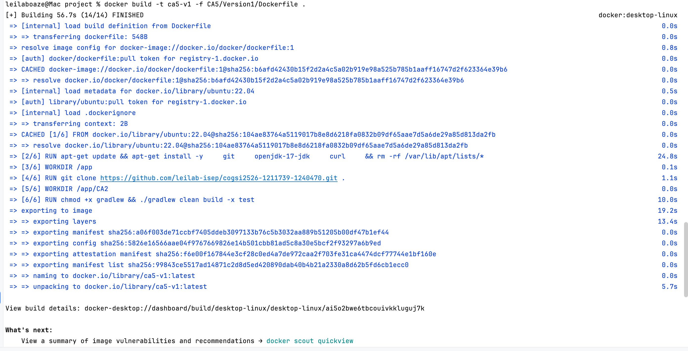
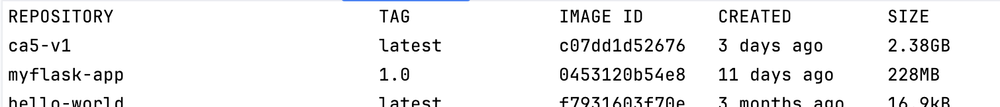
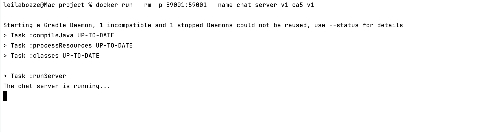
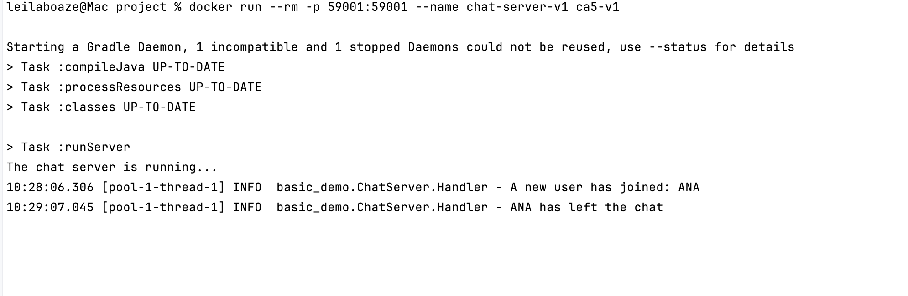
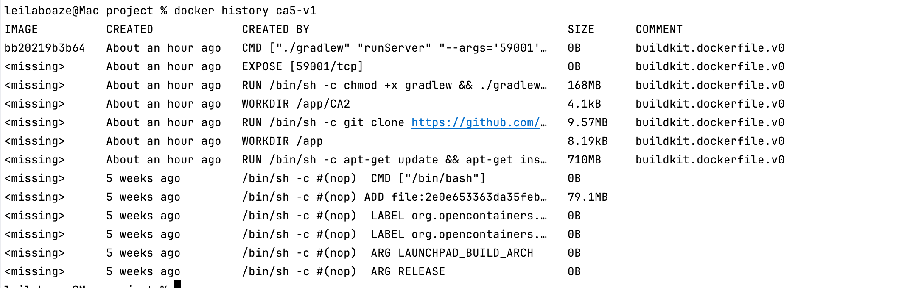
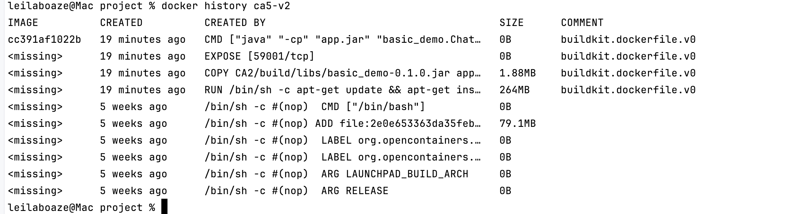
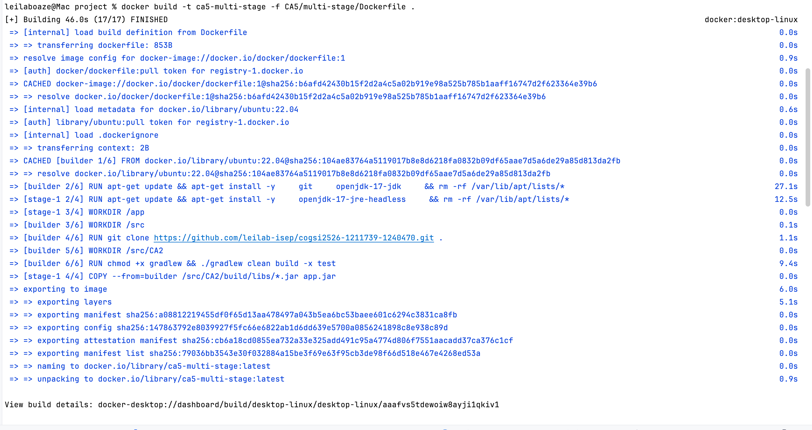
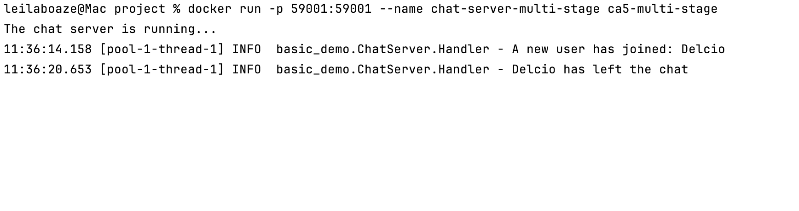
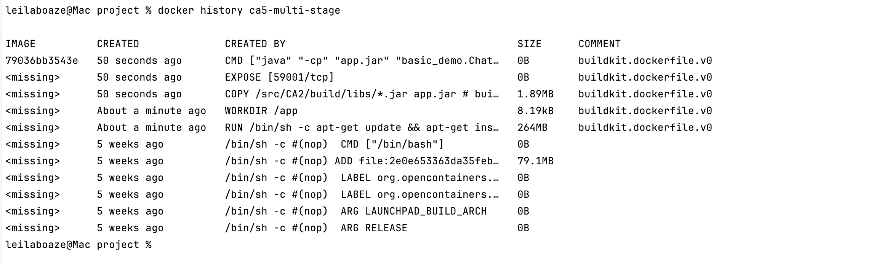
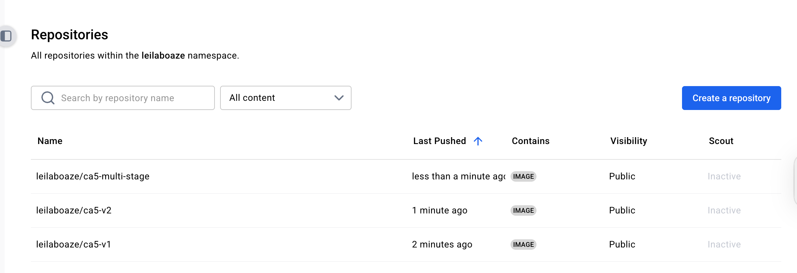

# CA5 Technical Report

## Part 1: Create Docker Images and Containers

For this part we based our image on ubuntu:22.04, following the example used in the lecture slides. Ubuntu provides an
easy package manager (apt-get) for installing Git and OpenJDK. 

The goal is to comparatively analyze two approaches to building and running the CA2 chat application inside a Docker container.
The Version 1 builds the application inside the Docker container, while Version 2 builds the application on the 
host machine and only runs it inside the container.

The CA2 application consists of:

- a Chat Server (`ChatServerApp`) running on TCP port 59001
- a Chat Client (`ChatClientApp`) which connects to that server

Gradle provides custom tasks:

- `./gradlew runServer --args='59001'`→ starts the chat server on port 59001
- `./gradlew runClient` → starts a chat client that connects to the server in the address localhost:59001


### Version1

In this version, the Docker image:

1. Install dependencies: git + JDK + basic tools
2. Clones the repository and goes into the CA2 folder
3. Build inside the container, but SKIP TESTS (ChatClientTest needs GUI)
4. runs the server using the `runServer` Gradle task

```dockerfile
# syntax=docker/dockerfile:1
FROM ubuntu:22.04

RUN apt-get update && apt-get install -y \
    git \
    openjdk-17-jdk \
    curl \
    && rm -rf /var/lib/apt/lists/*

# Workdir for the repo
WORKDIR /app

# Clone your repo
RUN git clone https://github.com/leilab-isep/cogsi2526-1211739-1240470.git .

WORKDIR /app/CA2

RUN chmod +x gradlew && ./gradlew clean build -x test

# The chat server listens on TCP 59001
EXPOSE 59001

# When the container starts, launch the chat server
CMD ["./gradlew", "runServer", "--args='59001'"]
```

We build the image using the following command:

```bash

docker build -t ca5-v1 -f CA5/Version1/Dockerfile .  
```
It ran for 56.7s and produced the following output:

And if we run the command `docker image ls` we can see the image created:



We then run the container using the command:

```bash
 docker run -p 59001:59001 --name chat-server-v1 ca5-v1
```

And this is the output we got:

Now our chat server is listening on:
- inside container: localhost:59001
- on host: localhost:59001 (because of -p 59001:59001)

And if we go to the CA2 folder and run `./gradlew runClient` to connect a chat client to localhost:59001 we can 
see the following output on the container terminal:




### Version 2:
Build the Server JAR on Host Machine
First, we need to build the application using Gradle. Compiling the code and package it into a runnable JAR file.

Inside CA2 folder run the gradle tasks:

```bash
    
    .\gradlew clean build -x test

    
```

This will create the JAR file in the build/libs directory.

Then we create a new Dockerfile to define the steps to build the Docker image.

```dockerfile


# syntax=docker/dockerfile:1
FROM ubuntu:22.04

RUN apt-get update && apt-get install -y \
    openjdk-17-jre-headless \
    && rm -rf /var/lib/apt/lists/* \
    
# Set the working directory inside the container
WORKDIR /app

COPY CA2/build/libs/basic_demo-0.1.0.jar app.jar

# Expose the port the server will listen on
EXPOSE 59001

# Command to run the server application when the container starts
CMD ["java", "-cp", "app.jar", "basic_demo.ChatServerApp", "59001"]


````

* FROM *ubuntu:22.04 : This starts the Dockerfile by specifying the base image. We use Ubuntu 22.04 as the base operating system for our container. 
So, this time we only install the JRE (Java Runtime Environment) since we only need to run the application, not build it.

* WORKDIR /app : This sets the default directory inside the container to /app. All subsequent commands (COPY, CMD) will be run from this location.

* COPY build/libs/basic_demo-0.1.0.jar app.jar  : This is the key step. It copies the JAR built on the host machine from build/libs/basic_demo-0.1.0.jar into the container's /app directory and renames it to app.jar for simplicity.

* EXPOSE 59001: This informs Docker that the container will listen on port 59001 at runtime. 

* CMD ["java", "-cp", "app.jar", "basic_demo.ChatServerApp", "59001"] : This is the command that will execute when the container starts.


Next we run this command to build the image
```bash

    docker build -t ca5-v2 -f CA5/Version2/Dockerfile .
    
```

* -t chat-server: Tags the image as chat-server.
* -f CA5/Version2/Dockerfile: Specifies the path to the Dockerfile.
* .: Sets the build context to the current directory (the project root), which allows the COPY CA2/build/... command to work correctly.

It ran for 19.3s and produced the following output:
````bash 

PS C:\Users\delci\Documents\ISEP\MEI\2oAno\COGSI\Projects\cogsi2526-1211739-1240470> docker build -t ca5-v2 -f CA5/Version2/Dockerfile .
[+] Building 19.3s (12/12) FINISHED                                                                                                                   docker:desktop-linux
 => [internal] load build definition from Dockerfile                                                                                                                  0.0s
 => => transferring dockerfile: 540B                                                                                                                                  0.0s
 => resolve image config for docker-image://docker.io/docker/dockerfile:1                                                                                             1.0s
 => [auth] docker/dockerfile:pull token for registry-1.docker.io                                                                                                      0.0s
 => CACHED docker-image://docker.io/docker/dockerfile:1@sha256:b6afd42430b15f2d2a4c5a02b919e98a525b785b1aaff16747d2f623364e39b6                                       0.0s
 => => resolve docker.io/docker/dockerfile:1@sha256:b6afd42430b15f2d2a4c5a02b919e98a525b785b1aaff16747d2f623364e39b6                                                  0.0s
 => [internal] load metadata for docker.io/library/ubuntu:22.04                                                                                                       0.6s
 => [auth] library/ubuntu:pull token for registry-1.docker.io                                                                                                         0.0s
 => [internal] load .dockerignore                                                                                                                                     0.0s
 => => transferring context: 2B                                                                                                                                       0.0s
 => CACHED [1/3] FROM docker.io/library/ubuntu:22.04@sha256:104ae83764a5119017b8e8d6218fa0832b09df65aae7d5a6de29a85d813da2fb                                          0.0s
 => => resolve docker.io/library/ubuntu:22.04@sha256:104ae83764a5119017b8e8d6218fa0832b09df65aae7d5a6de29a85d813da2fb                                                 0.0s
 => [internal] load build context                                                                                                                                     0.0s
 => => transferring context: 1.88MB                                                                                                                                   0.0s
 => [2/3] RUN apt-get update && apt-get install -y     openjdk-17-jre-headless     && rm -rf /var/lib/apt/lists/* WORKDIR /app                                       11.4s
 => [3/3] COPY CA2/build/libs/basic_demo-0.1.0.jar app.jar                                                                                                            0.0s 
 => exporting to image                                                                                                                                                6.1s 
 => => exporting layers                                                                                                                                               4.7s 
 => => exporting manifest sha256:2ebb76e9f862146d97037a401ce38a23dc771d836029aab081cfb9ff458f5ace                                                                     0.0s 
 => => exporting config sha256:d3780c7dc77a5449d3d607bd547954da55bca07a27c52758719e5bb1d842552d                                                                       0.0s
 => => exporting attestation manifest sha256:b2434e90ec2622127c8b2044b43cf9e4bc9aa87dfd8140bc64e4918dcfe22a92                                                         0.0s
 => => exporting manifest list sha256:825b6df0d1fd86fa9f901ca616f315a59ada045299509a588f85ca46a48d5c83                                                                0.0s
 => => naming to docker.io/library/ca5-v1:latest                                                                                                                      0.0s
 => => unpacking to docker.io/library/ca5-v1:latest                                                                                                                   1.3s

View build details: docker-desktop://dashboard/build/desktop-linux/desktop-linux/og4y0vtc0w76y5q4e0amlw08l

 1 warning found (use docker --debug to expand):
 - NoEmptyContinuation: Empty continuation line (line 9)

What's next:
    View a summary of image vulnerabilities and recommendations → docker scout quickview 


````

we then run the nex command to run the container:

```bash
docker run -p 59001:59001 --name my-chat-server ca5-v2
    
```

that gave the following output:
```bash
PS C:\Users\delci\Documents\ISEP\MEI\2oAno\COGSI\Projects\cogsi2526-1211739-1240470> docker run -p 59001:59001 --name my-chat-server ca5-v2
Starting a Gradle Daemon, 1 incompatible and 1 stopped Daemons could not be reused, use --status for details
> Task :compileJava UP-TO-DATE
> Task :processResources UP-TO-DATE
> Task :classes UP-TO-DATE

> Task :runServer
The chat server is running...
10:55:24.531 [pool-1-thread-1] INFO  basic_demo.ChatServer.Handler - A new user has joined: Johanna
10:55:56.885 [pool-1-thread-1] INFO  basic_demo.ChatServer.Handler - Johanna has left the chat


```

### Image analysis with `docker history`

We compared the images **ca5-v1** and **ca5-v2** using `docker history` and got the following results:
CA5-v1:


This image:
* A **very large layer (710MB)** for installing build tools (JDK, Git, Curl).
* A **layer containing the cloned Git repository** (~9.57MB).
* A **layer containing Gradle’s build output and dependency cache** (~168MB).
* Final layers (EXPOSE, CMD) add **no size**.

Because this image builds the application inside the container:

* it contains **all development tools**
* it stores **all source code + intermediate build files**
* it is the **largest image**
* it behaves like a **development environment**

CA5-v2:


This image:
* Only a **JRE (runtime)** is installed (264MB)
  → no compiler, no Gradle, no Git.
* The only application-specific layer is the **1.88MB JAR file**.
* No source code, no build cache, no repository content.

Because this image uses the **artifact built on the host**:

* it contains **only runtime dependencies**
* it has very **few layers**
* its total size is **much smaller**
* it starts faster
* it is appropriate for **deployment**

> Using `docker history` clearly shows how the build strategy affects both image size and layer composition.
> The `ca5-v1` image includes the full build toolchain (JDK, Git, Gradle) and the source code, creating many large layers.
> In contrast, `ca5-v2` contains only the final JAR and the JRE, resulting in a much smaller and cleaner runtime image.
> This demonstrates that moving the build **outside** the container significantly reduces image size and avoids storing unnecessary development layers inside the final image.

---
### Multi-Stage Build
This version uses two stages:

* **builder stage** → clone repo + build JAR
* **runtime stage** → run only the JAR inside a clean image

```dockerfile
# syntax=docker/dockerfile:1

########## Stage 1 – Builder ##########
FROM ubuntu:22.04 AS builder

RUN apt-get update && apt-get install -y \
    git \
    openjdk-17-jdk \
    && rm -rf /var/lib/apt/lists/*

WORKDIR /src

# Clone the repository
RUN git clone https://github.com/leilab-isep/cogsi2526-1211739-1240470.git .

WORKDIR /src/CA2

# Build JAR (skip GUI tests)
RUN chmod +x gradlew && ./gradlew clean build -x test


########## Stage 2 – Runtime ##########
FROM ubuntu:22.04

RUN apt-get update && apt-get install -y \
    openjdk-17-jre-headless \
    && rm -rf /var/lib/apt/lists/*

WORKDIR /app

# Copy only the final JAR
COPY --from=builder /src/CA2/build/libs/*.jar app.jar

EXPOSE 59001

CMD ["java", "-cp", "app.jar", "basic_demo.ChatServerApp", "59001"]

```
To build the multi-stage image we run the command:

```bash
docker build -t ca5-multi-stage -f CA5/multi-stage/Dockerfile .
```
It ran for 46.0s and produced the following output:


Then we run the container using the command:

```bash
 docker run -p 59001:59001 --name chat-server-multi-stage ca5-multi-stage
```
And this is the output we got:


We then compared the multi-stage image using `docker history` and got the following results:


We effectively have three “families” of images:

* **Version 1 (ca5-v1)** – single-stage “build inside Dockerfile”

    * Includes: JDK, Git, Gradle, repo clone, build cache, plus runtime
    * Very large image (hundreds of MB of tools + cache)

* **Version 2 (ca5-v2)** – single-stage “build on host, copy JAR”

    * Includes: Ubuntu base + JRE + JAR
    * Much smaller than ca5-v1

* **Multi-stage (ca5-multi-stage)** – “build in builder stage, copy JAR into clean runtime stage”

    * Includes: *exactly the same runtime stack as ca5-v2*: Ubuntu base + JRE + JAR
    * Final image size is **similar or identical** to ca5-v2
    * Still much smaller than ca5-v1

So, in this Ubuntu setup:

* The **multi-stage image is dramatically smaller than Version 1 (build inside)**
* The **multi-stage image is roughly the same size as Version 2 (host-built JAR)**, because both contain the same runtime components (Ubuntu + JRE + JAR).

If we switched the runtime stage to **Alpine**, then the multi-stage image would become even smaller, but even with Ubuntu we already see a big gain compared to Version 1.

---


### Monitorization

In order To Monitor the container resource usage in real time, observing CPU, memory, network, and disk I/O activity while the container runs we use the command:

```bash

docker stats my-chat-server

```

that gave the following output:

````bash 

S C:\Users\delci\Documents\ISEP\MEI\2oAno\COGSI\Projects\cogsi2526-1211739-1240470\CA2>     docker stats my-chat-server
CONTAINER ID   NAME             CPU %     MEM USAGE / LIMIT    MEM %     NET I/O       BLOCK I/O   PIDS
57f320406648   my-chat-server   0.30%     64.2MiB / 6.698GiB   0.94%     1.21kB / 0B   0B / 0B     20
CONTAINER ID   NAME             CPU %     MEM USAGE / LIMIT    MEM %     NET I/O       BLOCK I/O   PIDS
57f320406648   my-chat-server   0.19%     64.2MiB / 6.698GiB   0.94%     1.21kB / 0B   0B / 0B     20
CONTAINER ID   NAME             CPU %     MEM USAGE / LIMIT    MEM %     NET I/O       BLOCK I/O   PIDS
57f320406648   my-chat-server   0.19%     64.2MiB / 6.698GiB   0.94%     1.21kB / 0B   0B / 0B     20
CONTAINER ID   NAME             CPU %     MEM USAGE / LIMIT    MEM %     NET I/O       BLOCK I/O   PIDS
57f320406648   my-chat-server   0.19%     64.2MiB / 6.698GiB   0.94%     1.21kB / 0B   0B / 0B     20
CONTAINER ID   NAME             CPU %     MEM USAGE / LIMIT    MEM %     NET I/O       BLOCK I/O   PIDS
57f320406648   my-chat-server   0.17%     64.2MiB / 6.698GiB   0.94%     1.21kB / 0B   0B / 0B     20
CONTAINER ID   NAME             CPU %     MEM USAGE / LIMIT    MEM %     NET I/O       BLOCK I/O   PIDS
57f320406648   my-chat-server   0.17%     64.2MiB / 6.698GiB   0.94%     1.21kB / 0B   0B / 0B     20
CONTAINER ID   NAME             CPU %     MEM USAGE / LIMIT    MEM %     NET I/O       BLOCK I/O   PIDS
57f320406648   my-chat-server   0.17%     64.2MiB / 6.698GiB   0.94%     1.21kB / 0B   0B / 0B     20
CONTAINER ID   NAME             CPU %     MEM USAGE / LIMIT    MEM %     NET I/O       BLOCK I/O   PIDS
57f320406648   my-chat-server   0.17%     64.2MiB / 6.698GiB   0.94%     1.21kB / 0B   0B / 0B     20
CONTAINER ID   NAME             CPU %     MEM USAGE / LIMIT    MEM %     NET I/O       BLOCK I/O   PIDS
57f320406648   my-chat-server   0.20%     64.2MiB / 6.698GiB   0.94%     1.21kB / 0B   0B / 0B     20
CONTAINER ID   NAME             CPU %     MEM USAGE / LIMIT    MEM %     NET I/O       BLOCK I/O   PIDS
57f320406648   my-chat-server   0.20%     64.2MiB / 6.698GiB   0.94%     1.21kB / 0B   0B / 0B     20
CONTAINER ID   NAME             CPU %     MEM USAGE / LIMIT    MEM %     NET I/O       BLOCK I/O   PIDS
57f320406648   my-chat-server   0.17%     64.2MiB / 6.698GiB   0.94%     1.21kB / 0B   0B / 0B     20
CONTAINER ID   NAME             CPU %     MEM USAGE / LIMIT   MEM %     NET I/O   BLOCK I/O   PIDS
57f320406648   my-chat-server   --        -- / --             --        --        --          --
CONTAINER ID   NAME             CPU %     MEM USAGE / LIMIT   MEM %     NET I/O   BLOCK I/O   PIDS
57f320406648   my-chat-server   --        -- / --             --        --        --          --
CONTAINER ID   NAME             CPU %     MEM USAGE / LIMIT   MEM %     NET I/O   BLOCK I/O   PIDS
57f320406648   my-chat-server   --        -- / --             --        --        --          --
CONTAINER ID   NAME             CPU %     MEM USAGE / LIMIT   MEM %     NET I/O   BLOCK I/O   PIDS
57f320406648   my-chat-server   --        -- / --             --        --        --          --

got 3 SIGTERM/SIGINTs, forcefully exiting
PS C:\Users\delci\Documents\ISEP\MEI\2oAno\COGSI\Projects\cogsi2526-1211739-1240470\CA2> 


````

* CONTAINER ID / NAME: The ID and name of your container (my-chat-server).
* CPU %: The percentage of the host machine's CPU that the container is currently using. 
* MEM USAGE / LIMIT: Shows how much memory the container is actively using versus the total amount of memory it is allowed to use from your host machine.
* MEM %: The memory usage as a percentage of the total limit.
* NET I/O: Network activity. It shows the total amount of data the container has received (left) and sent (right) over the network. Changes can be seen as clients connect and chat.
* BLOCK I/O: Disk I/O activity. This shows the total amount of data the container has read from and written to the host's hard drive. 
* PIDS: The number of processes or threads running inside the container.


### Tagging and Upload to Docker Hub

In order to publish the images to docker hub we have to be authenticated on the Docker Hub. 

````bash

docker login

````
And then insert our login credentials.

Docker Hub requires images to be tagged in a specific format: <your-dockerhub-username>/<repository-name>:<tag>.

so we run the followin command:

````bash

docker tag ca5-v1 <username>/ca5-v1:latest
docker tag ca5-v2 <username>/ca5-v1:latest
docker tag ca5-multi-stage <username>/ca5-multi-stage:latest

````

* docker tag: The command to create a new tag for an image.
* chat-server: The source image to be tagged.
* •<username>/chat-server:1.0: The new, fully-qualified tag.


With the image correctly tagged, we can push it to Docker Hub repository.

````bash

docker push <username>/ca5-v1:latest
docker push <username>/ca5-v2:latest
docker push <username>/ca5-multi-stage:latest


````

The images are now available on Docker Hub under leilaboaze account.


