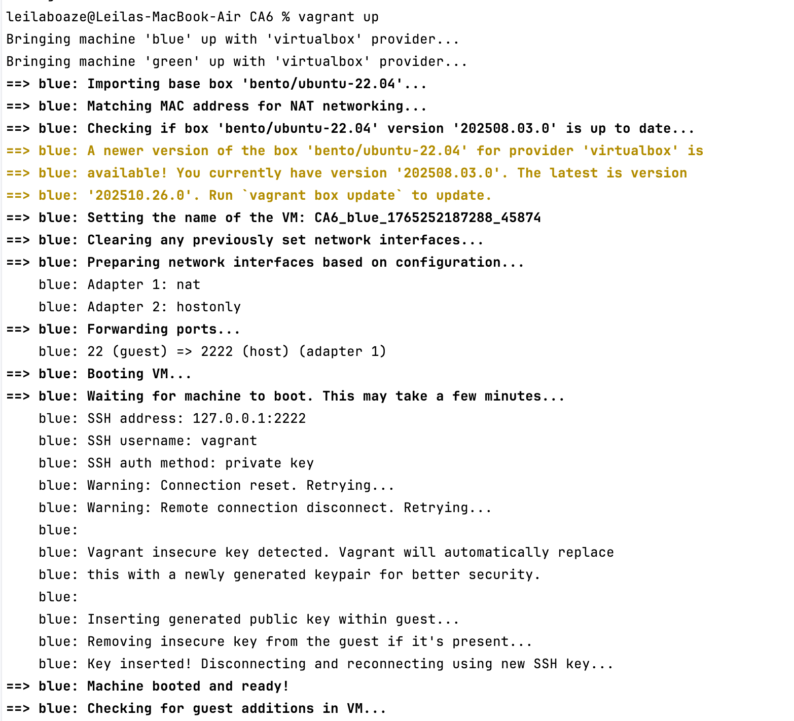
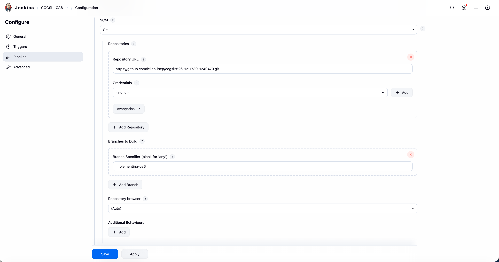

# CA6 Technical Report

## Part 1: Jenkins Pipeline for Blue-Green Deployment with Rollback
The goal of **Part 1** is to build a Jenkins pipeline that:
1. Builds the **Gradle** version of the *Building REST Services with Spring* application  
2. Deploys it to a local VM (blue/green setup)  
3. Supports rollback using artifacts stored in Jenkins  


### Automate infrastructure with Vagrant and Ansible

#### Create blue and green VMs with Vagrant

To create two VMs with Vagrant, a blue and a green one, we define them in a single `Vagrantfile`.

```ruby
Vagrant.configure("2") do |config|
  config.vm.box = "bento/ubuntu-22.04"

  config.vm.define "blue" do |blue|
    blue.vm.hostname = "blue"
    blue.vm.network "private_network", ip: "192.168.56.10"
  end

  config.vm.define "green" do |green|
    green.vm.hostname = "green"
    green.vm.network "private_network", ip: "192.168.56.11"
  end
end
```
The file above will result in two virtual machines: 

* VM **blue** at `192.168.56.10` – current version
* VM **green** at `192.168.56.11` – “production” VM for Jenkins deployments

To start the VMs, we ran CA6 directory:

```bash
vagrant up
```
The output of the command was quite long but it shows the provisioning of both VMs. Here is a snippet of the output:

---

We also need to create an Ansible inventory file to define the two VMs. To do that in the `CA6/ansible` directory, we created the file `inventory.ini` with the following content:

```ini
[blue]
blue ansible_host=192.168.56.10 ansible_user=vagrant ansible_ssh_private_key_file=.vagrant/machines/blue/virtualbox/private_key

[app]
green ansible_host=192.168.56.11 ansible_user=vagrant ansible_ssh_private_key_file=.vagrant/machines/green/virtualbox/private_key
```
---

Then, we deploy the current version of the application on the blue VM. To do that, in the `CA6/ansible/deploy_blue.yml` we will use the jar file generated by Gradle in the `CA2/build/libs` directory.

```yaml
- name: Deploy app to blue VM
  hosts: blue
  become: yes

  vars:
    app_jar_source: "../../CA2/build/libs/*.jar"
    app_jar_dest: "/opt/app/app.jar"

  tasks:
    - name: Ensure Java runtime is installed
      apt:
        name: openjdk-17-jre-headless
        state: present
        update_cache: yes

    - name: Create app directory
      file:
        path: /opt/app
        state: directory
        mode: "0755"

    - name: Copy JAR to blue
      copy:
        src: "{{ app_jar_source }}"
        dest: "{{ app_jar_dest }}"
        mode: "0755"

    - name: Create systemd service for app
      copy:
        dest: /etc/systemd/system/app.service
        content: |
          [Unit]
          Description=Building REST Services App
          After=network.target

          [Service]
          User=root
          ExecStart=/usr/bin/java -jar {{ app_jar_dest }}
          Restart=always

          [Install]
          WantedBy=multi-user.target

    - name: Reload systemd and start app
      systemd:
        name: app.service
        enabled: yes
        state: restarted
        daemon_reload: yes

```
Then we run the playbook:
```bash
ansible-playbook -i inventory deploy_blue.yml
```
The **blue** VM now runs the current version of the Spring Boot app as a `systemd` service (app + embedded H2 DB).

---

### Configure Jenkins on the host and use a Jenkinsfile

The Jenkins was already installed on the host machines and was accessible at `http://localhost:8080`.

### Pipeline-as-code with Jenkinsfile from SCM

In Jenkins UI, we selected "New Item" and then "Pipeline". 
We defined the pipeline logic in a Jenkinsfile stored in your repository by filling in the Repository URL and Script Path fields.

> Note: we did not use any credentials for Git access since the repository is public.



Now any changes to the Jenkinsfile are versioned in Git and automatically used by Jenkins.

---

### Pipeline stages (Checkout, Assemble, Test, Archive, Deploy)

We also defined in our `CA6/jenkins/Jenkinsfile`, the following pipeline stages to implement the tasks from Part 1:

* Checkout – Pull the latest source code from the development branch in your
repository (This stage is by default implemented by Jenkins when using with SCM)
* Assemble – Compile the code and produce the artifact files 
* Test – Run unit tests to verify the application’s correctness. Publish the test results in Jenkins 
* Archive – Archive the artifacts in Jenkins for later use 
* Deploy to Production? – Request manual approval to deploy the application to the production environment. Only proceed if the deployment is approved 
* Deploy – Uses an Ansible playbook to deploy and start the application on the green VM

```groovy
pipeline {
    agent any

    environment {
        APP_JAR   = 'app/build/libs/*.jar'
        INVENTORY = 'CA6/ansible/inventory'
    }

    stages {

        stage('Assemble') {
            steps {
                dir('CA2') {
                    echo 'Building Gradle artifact...'
                    sh './gradlew clean assemble'
                }
            }
        }

        stage('Test') {
            steps {
                dir('CA2') {
                    echo 'Running unit tests...'
                    sh './gradlew test'
                }
            }
            post {
                always {
                    // publish JUnit test results in Jenkins
                    junit 'CA2/build/test-results/test/*.xml'
                }
            }
        }

        stage('Archive') {
            steps {
                echo 'Archiving artifacts...'
                archiveArtifacts artifacts: 'CA2/build/libs/*.jar',
                        fingerprint: true
            }
        }

        stage('Deploy to Production?') {
            steps {
                script {
                    timeout(time: 5, unit: 'MINUTES') {
                        input message: 'Deploy to GREEN (production) VM?',
                                ok: 'Deploy'
                    }
                }
            }
        }

        stage('Deploy') {
            steps {
                echo 'Deploying to GREEN VM via Ansible...'
                dir('CA6/ansible') {
                    sh """
                    ansible-playbook -i inventory deploy_green.yml \
                      --extra-vars "artifact_path=${WORKSPACE}/CA2/build/libs"
                    """
                }
            }
        }
    }

    post {
        success {
            script {
                // Tag stable builds in Jenkins UI
                def tag = "stable-v${env.BUILD_NUMBER}"
                currentBuild.displayName = tag
                echo "Pipeline SUCCESS – tagged build as ${tag}"
            }
        }
        failure {
            echo "Pipeline FAILED."
        }
        always {
            echo "Pipeline finished with status: ${currentBuild.currentResult}"
        }
    }
}
```

Below we explain how each stage implements the corresponding Part 1 task.

---

#### Checkout

**Requirement**: Pull the latest source code from the development branch.

**How it was done**: The job’s SCM configuration points to branch `implementing-CA6`, so everytime we build the pipeline the `checkout scm` always retrieves the latest version of that branch.

---

#### Assemble

**Requirement**: Compile the code and produce the artifact files.

**How it was done**

```groovy
stage('Assemble') {
    steps {
        dir("${APP_DIR}") {
            echo "Assembling Gradle artifact..."
            sh "./gradlew clean assemble"
        }
    }
}
```

* Uses the project’s Gradle wrapper (`./gradlew`).
* Output is a JAR stored in `CA6/app/build/libs`.

---

#### Test

**Requirement**: Run unit tests and publish the test results in Jenkins.

**How it was done**

```groovy
stage('Test') {
    steps {
        dir("${APP_DIR}") {
            echo "Running unit tests..."
            sh "./gradlew test"
        }
    }
    post {
        always {
            junit "${APP_DIR}/build/test-results/test/*.xml"
        }
    }
}
```

* `./gradlew test` runs the JUnit test suite.
* The `junit` step publishes the test results so they appear in the Jenkins build page.

---

#### Archive

**Requirement**: Archive the artifacts in Jenkins for later use (e.g. rollback).

**How it was done**

```groovy
stage('Archive') {
    steps {
        echo "Archiving artifacts..."
        archiveArtifacts artifacts: "${ARTIFACT_GLOB}",
                          fingerprint: true
    }
}
```

* `archiveArtifacts` stores the JAR as a build artifact.
* `fingerprint: true` allows Jenkins to track which build produced which artifact, which is important for rollback.

---

#### Deploy to Production? (manual gate)

**Requirement**: Request manual approval before deploying to production.

**How it was done**

```groovy
stage('Deploy to Production?') {
    steps {
        script {
            timeout(time: 5, unit: 'MINUTES') {
                input message: 'Deploy to GREEN (production) VM?',
                      ok: 'Deploy'
            }
        }
    }
}
```

* The `input` step pauses the pipeline and displays a button in the Jenkins UI.
* Only if the user clicks **Deploy** within 5 minutes will the pipeline continue.

---

#### Deploy (Ansible + green VM)

**Requirement**: Use an Ansible playbook to deploy and start the application on the green VM and verify the deployment.

**Playbook `deploy_green.yml`**

`CA6/ansible/deploy_green.yml`:

```yaml
- name: Deploy app to green VM
  hosts: green
  become: yes

  vars:
    workspace: "{{ workspace | default(lookup('env','WORKSPACE')) }}"
    artifact_glob: "{{ workspace }}/CA6/app/build/libs/*.jar"
    app_jar_dest: "/opt/app/app.jar"
    health_url: "http://localhost:8080/actuator/health"

  tasks:
    - name: Ensure Java runtime is installed
      apt:
        name: openjdk-17-jre-headless
        state: present
        update_cache: yes

    - name: Create app directory
      file:
        path: /opt/app
        state: directory
        mode: "0755"

    - name: Copy JAR from Jenkins workspace
      copy:
        src: "{{ artifact_glob }}"
        dest: "{{ app_jar_dest }}"
        mode: "0755"
        remote_src: no

    - name: Create / update systemd service
      copy:
        dest: /etc/systemd/system/app.service
        content: |
          [Unit]
          Description=Building REST Services App (GREEN)
          After=network.target

          [Service]
          User=root
          ExecStart=/usr/bin/java -jar {{ app_jar_dest }}
          Restart=always

          [Install]
          WantedBy=multi-user.target

    - name: Reload systemd and restart app
      systemd:
        name: app.service
        enabled: yes
        state: restarted
        daemon_reload: yes

    - name: Deployment verification – wait for health endpoint
      uri:
        url: "{{ health_url }}"
        status_code: 200
        validate_certs: no
      register: health
      retries: 10
      delay: 5
      until: health.status == 200
```

**How Jenkins calls the playbook**

```groovy
stage('Deploy') {
    steps {
        echo "Deploying to GREEN VM via Ansible..."
        dir('CA6/ansible') {
            sh """
              ansible-playbook -i inventory deploy_green.yml \
                --extra-vars "workspace=${WORKSPACE}"
            """
        }
    }
}
```

**Result**

* After manual approval, Jenkins runs the playbook.
* The JAR is deployed to the **green** VM, run as a `systemd` service.
* The `uri` task implements **deployment verification** by polling `/actuator/health` until HTTP 200 is returned.

---

### Tag stable builds and notify result

To tag stable builds in Jenkins using a consistent naming convention (only for successful builds) we set a post action in the Jenkinsfile:
```groovy
post {
    success {
        script {
            def tag = "stable-v${env.BUILD_NUMBER}"
            currentBuild.displayName = tag
            echo "Pipeline SUCCESS – tagged build as ${tag}"
        }
        echo "Notification: build succeeded (${env.BUILD_TAG})."
    }
    failure {
        echo "Notification: build FAILED (${env.BUILD_TAG})."
    }
    always {
        echo "Pipeline finished with status: ${currentBuild.currentResult}"
    }
}
```

* The `success` block executes only if all stages pass.
* It sets the build display name to `stable-v<BUILD_NUMBER>`, making stable builds easy to identify.

* **Notification** is implemented using `echo` messages in the `post` section (`build succeeded` / `build FAILED`).
* **Deployment verification** is implemented in `deploy_green.yml` using the health check against `/actuator/health`.


Here is the full console output of a successful pipeline run:
```bash
Started by user Leila Boaze

Obtained CA6/jenkins/Jenkinsfile from git https://github.com/leilab-isep/cogsi2526-1211739-1240470.git
[Pipeline] Start of Pipeline
[Pipeline] node
Running on Jenkins
 in /Users/leilaboaze/.jenkins/workspace/COGSI - CA6
[Pipeline] {
[Pipeline] stage
[Pipeline] { (Declarative: Checkout SCM)
[Pipeline] checkout
Selected Git installation does not exist. Using Default
The recommended git tool is: NONE
No credentials specified
 > git rev-parse --resolve-git-dir /Users/leilaboaze/.jenkins/workspace/COGSI - CA6/.git # timeout=10
Fetching changes from the remote Git repository
 > git config remote.origin.url https://github.com/leilab-isep/cogsi2526-1211739-1240470.git # timeout=10
Fetching upstream changes from https://github.com/leilab-isep/cogsi2526-1211739-1240470.git
 > git --version # timeout=10
 > git --version # 'git version 2.39.5 (Apple Git-154)'
 > git fetch --tags --force --progress -- https://github.com/leilab-isep/cogsi2526-1211739-1240470.git +refs/heads/*:refs/remotes/origin/* # timeout=10
 > git rev-parse origin/implementing-ca6^{commit} # timeout=10
Checking out Revision 296a1bdee8b1ca564a74e1bd5b56547d22cbc49e (origin/implementing-ca6)
 > git config core.sparsecheckout # timeout=10
 > git checkout -f 296a1bdee8b1ca564a74e1bd5b56547d22cbc49e # timeout=10
Commit message: "update Jenkinsfile to reference CA2 directory for build and test stages"
 > git rev-list --no-walk 25a24b97ba0de3670e872e0ce0d7e26f8aa84815 # timeout=10
[Pipeline] }
[Pipeline] // stage
[Pipeline] withEnv
[Pipeline] {
[Pipeline] withEnv
[Pipeline] {
[Pipeline] stage
[Pipeline] { (Assemble)
[Pipeline] dir
Running in /Users/leilaboaze/.jenkins/workspace/COGSI - CA6/CA2
[Pipeline] {
[Pipeline] echo
Building Gradle artifact...
[Pipeline] sh
+ ./gradlew clean assemble
Starting a Gradle Daemon (subsequent builds will be faster)

> Task :clean UP-TO-DATE
> Task :compileJava
> Task :processResources
> Task :classes
> Task :jar

> Task :startScripts
> Task :distTar
> Task :distZip
> Task :assemble

BUILD SUCCESSFUL in 6s
7 actionable tasks: 6 executed, 1 up-to-date
[Pipeline] }
[Pipeline] // dir
[Pipeline] }
[Pipeline] // stage
[Pipeline] stage
[Pipeline] { (Test)
[Pipeline] dir
Running in /Users/leilaboaze/.jenkins/workspace/COGSI - CA6/CA2
[Pipeline] {
[Pipeline] echo
Running unit tests...

[Pipeline] sh
+ ./gradlew test
> Task :compileJava UP-TO-DATE
> Task :processResources UP-TO-DATE
> Task :classes UP-TO-DATE

> Task :compileTestJava
> Task :processTestResources NO-SOURCE
> Task :testClasses

> Task :test

Deprecated Gradle features were used in this build, making it incompatible with Gradle 9.0.

You can use '--warning-mode all' to show the individual deprecation warnings and determine if they come from your own scripts or plugins.

For more on this, please refer to https://docs.gradle.org/8.9/userguide/command_line_interface.html#sec:command_line_warnings in the Gradle documentation.

BUILD SUCCESSFUL in 12s
4 actionable tasks: 2 executed, 2 up-to-date
[Pipeline] }
[Pipeline] // dir
Post stage
[Pipeline] junit
Recording test results
[Checks API] No suitable checks publisher found.
[Pipeline] }
[Pipeline] // stage
[Pipeline] stage
[Pipeline] { (Archive)
[Pipeline] echo
Archiving artifacts...
[Pipeline] archiveArtifacts
Archiving artifacts
Recording fingerprints

[Pipeline] }
[Pipeline] // stage
[Pipeline] stage
[Pipeline] { (Deploy to Production?)
[Pipeline] script
[Pipeline] {
[Pipeline] timeout
Timeout set to expire in 5 min 0 sec
[Pipeline] {
[Pipeline] input
Deploy to GREEN (production) VM?
Deploy or Abort

Approved by Leila Boaze

[Pipeline] }
[Pipeline] // timeout
[Pipeline] }
[Pipeline] // script
[Pipeline] }
[Pipeline] // stage
[Pipeline] stage
[Pipeline] { (Deploy)
[Pipeline] echo
Deploying to GREEN VM via Ansible...
[Pipeline] dir
Running in /Users/leilaboaze/.jenkins/workspace/COGSI - CA6/CA6/ansible
[Pipeline] {
[Pipeline] sh

+ ansible-playbook -i inventory deploy_green.yml --extra-vars 'artifact_path=/Users/leilaboaze/.jenkins/workspace/COGSI - CA6/CA2/build/libs'
[WARNING]: Unable to parse /Users/leilaboaze/.jenkins/workspace/COGSI - CA6/CA6/ansible/inventory as an inventory source
[WARNING]: No inventory was parsed, only implicit localhost is available
[WARNING]: provided hosts list is empty, only localhost is available. Note that the implicit localhost does not match 'all'
[WARNING]: Could not match supplied host pattern, ignoring: green

PLAY [Deploy app to green VM] **************************************************
skipping: no hosts matched

PLAY RECAP *********************************************************************

[Pipeline] }
[Pipeline] // dir
[Pipeline] }
[Pipeline] // stage
[Pipeline] stage
[Pipeline] { (Declarative: Post Actions)
[Pipeline] echo
Pipeline finished with status: SUCCESS
[Pipeline] script
[Pipeline] {
[Pipeline] echo
Pipeline SUCCESS – tagged build as stable-v3
[Pipeline] }
[Pipeline] // script
[Pipeline] }
[Pipeline] // stage
[Pipeline] }
[Pipeline] // withEnv
[Pipeline] }
[Pipeline] // withEnv
[Pipeline] }
[Pipeline] // node
[Pipeline] End of Pipeline

Finished: SUCCESS

```
See the pipeline in jenkins UI:


---

### Rollback playbook based on Jenkins artifacts

To create an Ansible playbook to roll back the green VM to a previous stable version stored in Jenkins:

* Jenkins archives every JAR as an artifact.
* Stable builds are visually tagged as `stable-vN`.
* The rollback playbook:

    * takes `rollback_build` as an extra variable
    * downloads the artifact of that build from Jenkins
    * stops the app service on green
    * replaces `/opt/app/app.jar`
    * restarts the service and reruns the health check.

In the `CA6/ansible/rollback.yml`:

```yaml
- name: Roll back GREEN VM to previous stable build
  hosts: green
  become: yes

  vars:
    jenkins_url: "http://<jenkins-host>:8080"
    job_name: "ca6-pipeline"
    rollback_build: "{{ rollback_build }}"
    artifact_path: "CA6/app/build/libs"
    artifact_name: "app.jar"          # adjust to the real JAR name
    download_path: "/tmp/{{ artifact_name }}"
    app_jar_dest: "/opt/app/app.jar"
    health_url: "http://localhost:8080/actuator/health"

  tasks:
    - name: Download artifact from Jenkins
      get_url:
        url: "{{ jenkins_url }}/job/{{ job_name }}/{{ rollback_build }}/artifact/{{ artifact_path }}/{{ artifact_name }}"
        dest: "{{ download_path }}"

    - name: Stop app service
      systemd:
        name: app.service
        state: stopped

    - name: Replace app JAR with stable artifact
      copy:
        src: "{{ download_path }}"
        dest: "{{ app_jar_dest }}"
        mode: "0755"

    - name: Restart app service
      systemd:
        name: app.service
        state: restarted
        enabled: yes

    - name: Verify rolled-back version
      uri:
        url: "{{ health_url }}"
        status_code: 200
        validate_certs: no
      register: health
      retries: 10
      delay: 5
      until: health.status == 200
```
To run the rollback playbook from the command line, specify the build number to roll back to:
```bash
cd CA6/ansible
ansible-playbook -i inventory rollback.yml --extra-vars "rollback_build=5"
```

This rolls back the **green** VM to the artifact produced by build 5.

---
